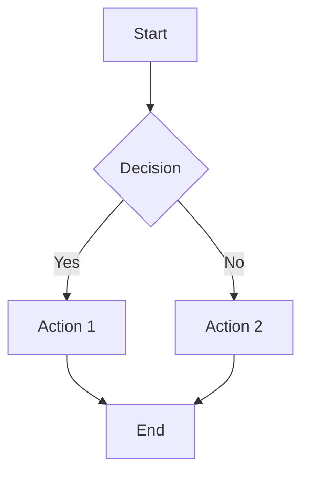

# Gition User Guide

Welcome to Gition! This comprehensive guide will help you master documentation and task management with Gition's powerful features.

## Table of Contents

1. [Getting Started](#getting-started)
2. [CLI Commands](#cli-commands)
3. [Configuration](#configuration)
4. [Documentation Features](#documentation-features)
5. [Task Management](#task-management)
6. [MDX Tips and Tricks](#mdx-tips-and-tricks)
7. [Advanced Features](#advanced-features)
8. [Troubleshooting](#troubleshooting)

---

## Getting Started

### Installation

Gition works as a global CLI tool that you can run in any directory:

```bash
# No installation needed! Run directly with npx
npx gition

# Or install globally
npm install -g gition
gition
```

### Quick Start

1. **Initialize a new workspace:**

   ```bash
   npx gition init
   ```

   Follow the interactive wizard to set up your workspace with custom settings.

2. **Start the server:**

   ```bash
   npx gition
   ```

   Your browser will automatically open to `http://localhost:3000`

3. **Create your first document:**

   ```bash
   # Create a markdown file in your docs directory
   echo "# My First Document" > docs/getting-started.md
   ```

4. **Create your first task:**

   ```bash
   # Create a task file
   cat > tasks/stories/my-first-task.md << 'EOF'
   ---
   title: My First Task
   status: todo
   priority: medium
   ---

   # My First Task

   This is my first task in Gition!

   ## Subtasks

   - [ ] Learn about Gition
   - [ ] Create more tasks
   - [ ] Organize my work
   EOF
   ```

### Directory Structure

After initialization, your workspace will look like this:

```
your-workspace/
├── .gitionrc/
│   └── config.yaml          # Configuration file
├── docs/                    # Documentation files
│   └── welcome.md           # Auto-generated welcome doc
├── tasks/                   # Task management files
│   ├── epics/              # Large initiatives
│   ├── stories/            # User stories and features
│   ├── tasks/              # Individual tasks
│   └── bugs/               # Bug reports
└── assets/                 # Images and other assets
```

---

## CLI Commands

### Basic Commands

#### `npx gition [directory]`

Start the Gition server for a directory.

```bash
# Start in current directory
npx gition

# Start in specific directory
npx gition /path/to/workspace

# Use custom port
npx gition --port 3001

# Don't auto-open browser
npx gition --no-open
```

#### `npx gition init [directory]`

Initialize a new Gition workspace with interactive configuration.

```bash
# Initialize in current directory
npx gition init

# Initialize in specific directory
npx gition init /path/to/new/workspace
```

### Environment Variables

Override configuration with environment variables:

```bash
# Custom target directory
GITION_TARGET_DIR=/path/to/workspace npx gition

# Custom docs directory
GITION_DOCS_DIR=documentation npx gition

# Custom tasks directory
GITION_TASKS_DIR=todos npx gition

# Custom port
PORT=3001 npx gition
```

---

## Configuration

### Configuration File

Gition uses `.gitionrc/config.yaml` for configuration:

```yaml
# Basic Settings
name: "My Workspace"
description: "Documentation and task management"
docsDir: "docs"
tasksDir: "tasks"

# Theme Customization
theme:
  primaryColor: "hsl(210, 100%, 50%)"
  backgroundColor: "hsl(0, 0%, 100%)"
  fontFamily: "Inter, sans-serif"
  borderRadius: "0.75rem"
  fontSize:
    small: "0.875rem"
    medium: "1rem"
    large: "1.125rem"

# Custom Task Types
taskTypes:
  - name: "Epic"
    folder: "epics"
    icon: "Target"
    color: "purple"
    description: "Large features or initiatives"
    defaultPriority: "high"
  - name: "Story"
    folder: "stories"
    icon: "Archive"
    color: "blue"
    description: "User stories and features"
    defaultPriority: "medium"

# Feature Flags
features:
  hotReload: true
  darkMode: true
  search: true
  analytics: false
  collaboration: false

# Internationalization
defaultLanguage: "en"
supportedLanguages: ["en", "fr", "es"]

# Users (for collaboration)
users:
  - id: "john"
    name: "John Doe"
    email: "john@example.com"
    role: "editor"
  - id: "jane"
    name: "Jane Smith"
    email: "jane@example.com"
    role: "admin"

# Environment Variables
env:
  NODE_ENV: "development"
  DEBUG: "true"
```

### Configuration API

Update configuration programmatically:

```javascript
// Get current configuration
const response = await fetch("/api/config");
const config = await response.json();

// Update specific values
await fetch("/api/config", {
  method: "POST",
  headers: { "Content-Type": "application/json" },
  body: JSON.stringify({
    theme: {
      primaryColor: "hsl(250, 100%, 60%)",
    },
  }),
});

// Replace entire configuration
await fetch("/api/config", {
  method: "PUT",
  headers: { "Content-Type": "application/json" },
  body: JSON.stringify(newConfig),
});
```

---

## Documentation Features

### Frontmatter Metadata

Use YAML frontmatter to add metadata to your documents:

```markdown
---
title: "Advanced Configuration Guide"
description: "Learn how to customize Gition for your workflow"
tags: ["configuration", "advanced", "guide"]
author: "John Doe"
date: "2024-01-15"
status: "published"
priority: "high"
category: "guides"
related: ["getting-started", "cli-reference"]
language: "en"
readingTime: "10 minutes"
toc: true
---

# Advanced Configuration Guide

Your document content here...
```

### Supported Metadata Fields

| Field         | Type    | Description                                |
| ------------- | ------- | ------------------------------------------ |
| `title`       | string  | Document title                             |
| `description` | string  | Brief description                          |
| `tags`        | array   | Category tags                              |
| `author`      | string  | Document author                            |
| `date`        | string  | Creation/publication date                  |
| `status`      | enum    | `draft`, `review`, `published`, `archived` |
| `priority`    | enum    | `low`, `medium`, `high`, `critical`        |
| `category`    | string  | Primary category                           |
| `related`     | array   | Related document slugs                     |
| `language`    | string  | ISO language code                          |
| `readingTime` | string  | Estimated reading time                     |
| `toc`         | boolean | Show table of contents                     |

### MDX Components

Gition supports rich MDX components:

```mdx
import { Badge } from "@/components/ui/badge";
import { Card, CardContent, CardHeader, CardTitle } from "@/components/ui/card";
import { Tabs, TabsContent, TabsList, TabsTrigger } from "@/components/ui/tabs";

# My Document

<Badge variant="outline">Version 1.0</Badge>

## Interactive Examples

<Tabs defaultValue="example1">
  <TabsList>
    <TabsTrigger value="example1">Example 1</TabsTrigger>
    <TabsTrigger value="example2">Example 2</TabsTrigger>
  </TabsList>

  <TabsContent value="example1">
    <Card>
      <CardHeader>
        <CardTitle>Example 1</CardTitle>
      </CardHeader>
      <CardContent>Content for example 1</CardContent>
    </Card>
  </TabsContent>
</Tabs>
```

### Hot-Reload

Gition automatically reloads content when you edit files:

- ✅ **Content updates** - See changes instantly
- ✅ **Scroll preservation** - Maintains reading position
- ✅ **Metadata updates** - Frontmatter changes reflect immediately
- ✅ **Structure updates** - Sidebar updates when files are added/removed

---

## Task Management

### Task File Structure

Tasks are markdown files with frontmatter metadata:

```markdown
---
title: "Implement User Authentication"
description: "Add login/logout functionality with JWT tokens"
status: "in-progress"
priority: "high"
assignee: "john"
due: "2024-02-01T10:00:00Z"
tags: ["authentication", "security", "backend"]
estimatedHours: 8
---

# Implement User Authentication

## Description

Add secure user authentication system with the following features:

- JWT token-based authentication
- Password hashing with bcrypt
- Session management
- Role-based access control

## Acceptance Criteria

- [ ] User can register with email/password
- [ ] User can login with valid credentials
- [ ] JWT tokens expire after 24 hours
- [~] Password reset functionality
- [x] Input validation for forms

## Technical Notes

\`\`\`javascript
// Example JWT implementation
const jwt = require('jsonwebtoken');

function generateToken(user) {
return jwt.sign(
{ userId: user.id, email: user.email },
process.env.JWT_SECRET,
{ expiresIn: '24h' }
);
}
\`\`\`

## Related Tasks

- Link to other relevant tasks
- Dependencies and blockers
```

### Task Status Types

| Status      | Syntax  | Description               |
| ----------- | ------- | ------------------------- |
| Todo        | `- [ ]` | Not started               |
| In Progress | `- [~]` | Currently being worked on |
| Done        | `- [x]` | Completed                 |

### Task Metadata Fields

| Field            | Type   | Description                                           |
| ---------------- | ------ | ----------------------------------------------------- |
| `title`          | string | Task title                                            |
| `description`    | string | Brief description                                     |
| `status`         | enum   | `todo`, `in-progress`, `done`, `blocked`, `cancelled` |
| `priority`       | enum   | `low`, `medium`, `high`, `critical`                   |
| `assignee`       | string | Assigned user ID                                      |
| `due`            | string | Due date (ISO 8601)                                   |
| `tags`           | array  | Category tags                                         |
| `estimatedHours` | number | Time estimate                                         |
| `actualHours`    | number | Actual time spent                                     |
| `parentTask`     | string | Parent task ID                                        |
| `blockedBy`      | array  | Blocking task IDs                                     |

### Task Organization

Organize tasks using the directory structure:

```
tasks/
├── epics/              # Large initiatives (months)
│   └── user-system.md
├── stories/            # Features (weeks)
│   ├── authentication.md
│   └── user-profile.md
├── tasks/              # Individual tasks (days)
│   ├── setup-database.md
│   └── create-login-form.md
└── bugs/               # Bug reports
    └── login-redirect-issue.md
```

### Kanban Board

Use the visual kanban board for task management:

- **Drag and drop** tasks between columns
- **Filter by status**, priority, or assignee
- **Real-time updates** across all views
- **Quick status changes** with right-click menu

---

## MDX Tips and Tricks

### Code Blocks with Syntax Highlighting

```javascript
// JavaScript example
function calculateTotal(items) {
  return items.reduce((sum, item) => sum + item.price, 0);
}
```

```python
# Python example
def calculate_total(items):
    return sum(item.price for item in items)
```

```bash
# Bash example
find . -name "*.md" -exec wc -l {} +
```

### Tables

| Feature         | Status      | Priority |
| --------------- | ----------- | -------- |
| Hot-reload      | ✅ Complete | High     |
| Task management | ✅ Complete | High     |
| Configuration   | ✅ Complete | Medium   |
| Collaboration   | ⏳ Planned  | Low      |

### Callouts and Alerts

> **💡 Pro Tip:** Use consistent naming conventions for your files to improve organization and searchability.

> **⚠️ Warning:** Always backup your workspace before making major configuration changes.

> **ℹ️ Note:** Hot-reload works best with files under 1MB. Larger files may have slower update times.

### Images and Assets

```markdown


```

### Links and Cross-References

```markdown
<!-- Link to other documents -->

[Getting Started Guide](./getting-started.md)

<!-- Link to tasks -->

[Authentication Task](../tasks/stories/authentication.md)

<!-- External links -->

[Gition GitHub](https://github.com/yourusername/gition)
```

### Mermaid Diagrams (Coming Soon)



---

## Advanced Features

### Search Functionality

Use the global search to find content across all documents and tasks:

- **Full-text search** in document content
- **Metadata search** by tags, author, status
- **File name search** with fuzzy matching
- **Keyboard shortcuts** - `Ctrl+K` (Windows/Linux) or `Cmd+K` (Mac)

### Multi-language Support

Gition supports multiple languages:

```yaml
# Configuration
defaultLanguage: "en"
supportedLanguages: ["en", "fr", "es"]
```

Set document language in frontmatter:

```yaml
---
title: "Guide d'utilisation"
language: "fr"
---
```

### Dark Mode

Toggle between light and dark themes:

- **Auto-detection** based on system preference
- **Manual toggle** in the header
- **Custom theme colors** via configuration

### Real-time Collaboration (Coming Soon)

- **Multi-user editing** with conflict resolution
- **User presence indicators**
- **Comment system** for reviews
- **Version history** and change tracking

---

## Troubleshooting

### Common Issues

#### Port Already in Use

```bash
# Error: Port 3000 is already in use
npx gition --port 3001
```

#### Configuration Validation Errors

```bash
# Check configuration file
cat .gitionrc/config.yaml

# Reset to defaults
rm .gitionrc/config.yaml
npx gition init
```

#### Hot-reload Not Working

1. Check file permissions
2. Verify file watcher is running (check console)
3. Try manual refresh (Ctrl+R)
4. Restart the server

#### Files Not Appearing

1. Verify file extensions are `.md` or `.mdx`
2. Check directory structure matches configuration
3. Ensure files have valid frontmatter
4. Check file encoding (should be UTF-8)

### Performance Tips

#### Large Workspaces

- Keep individual files under 1MB for best performance
- Use subdirectories to organize content
- Limit the number of files in a single directory

#### Memory Usage

- Restart the server periodically for long sessions
- Close unused browser tabs
- Use system monitoring to check memory usage

### Debug Mode

Enable debug logging:

```bash
DEBUG=gition* npx gition
```

Check browser console for additional debugging information.

### Getting Help

1. **Documentation**: Check this user guide and README
2. **Issues**: Report bugs on [GitHub Issues](https://github.com/yourusername/gition/issues)
3. **Discussions**: Join community discussions
4. **Console logs**: Check browser console for error messages

---

## Best Practices

### File Organization

1. **Use descriptive names**: `user-authentication.md` instead of `auth.md`
2. **Consistent structure**: Follow the same frontmatter pattern
3. **Logical hierarchy**: Group related content in subdirectories
4. **Version control**: Use Git to track changes

### Content Writing

1. **Clear titles**: Make document purpose obvious
2. **Good metadata**: Use tags and descriptions effectively
3. **Cross-references**: Link related content
4. **Regular updates**: Keep content current

### Task Management

1. **Atomic tasks**: Keep tasks focused and specific
2. **Clear acceptance criteria**: Define "done" explicitly
3. **Regular grooming**: Update status and priorities
4. **Use hierarchy**: Break large work into smaller pieces

### Configuration

1. **Backup configs**: Keep configuration files in version control
2. **Document changes**: Note why configuration was changed
3. **Test thoroughly**: Verify changes don't break functionality
4. **Gradual rollout**: Test configuration changes in development first

---

## Keyboard Shortcuts

| Shortcut           | Action              |
| ------------------ | ------------------- |
| `Ctrl+K` / `Cmd+K` | Open search         |
| `Ctrl+R` / `Cmd+R` | Refresh page        |
| `Ctrl+D` / `Cmd+D` | Toggle dark mode    |
| `Ctrl+/` / `Cmd+/` | Show help           |
| `Esc`              | Close modals/search |

---

_This user guide covers the core functionality of Gition. For the latest features and updates, check the [GitHub repository](https://github.com/yourusername/gition) and release notes._
