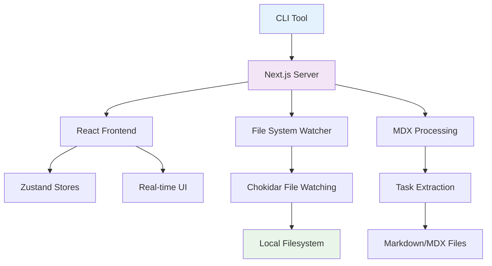

# Gition Documentation

Welcome to the Gition documentation! This directory contains comprehensive guides and references for using and developing Gition - a zero-configuration local documentation and task management system.

## 📚 Documentation Structure

### 🚀 Getting Started

- [**Getting Started**](./getting-started.mdx) - Quick start guide and basic usage
- [**Configuration**](./configuration.mdx) - Complete configuration reference
- [**Best Practices**](./best-practices.mdx) - Recommended practices and patterns

### 🏗️ Technical Architecture

- [**Technical Architecture**](./technical-architecture.mdx) - Complete system architecture overview with diagrams
- [**Data Flow & Processing**](./data-flow.mdx) - How data flows through the system from filesystem to UI
- [**File System Integration**](./file-system-integration.mdx) - Real-time file watching and synchronization
- [**Component Architecture**](./component-architecture.mdx) - React component patterns and UI design

### 🔧 Development

- [**Development Guide**](./development.mdx) - Setting up development environment
- [**Contributing**](./contributing.mdx) - How to contribute to Gition
- [**API Reference**](./api-reference.mdx) - Complete REST API documentation

### 📋 Content Management

- [**Task Management**](./content/task-management.mdx) - Advanced task management features
- [**Document Metadata**](./data/doc-metadata.mdx) - MDX frontmatter specification

## 🎯 Quick Navigation

### For Users

1. **Start Here**: [Getting Started](./getting-started.mdx) - Get up and running in 5 minutes
2. **Configure**: [Configuration](./configuration.mdx) - Customize your workspace
3. **Optimize**: [Best Practices](./best-practices.mdx) - Effective usage patterns

### For Developers & Contributors

1. **Understand the System**: [Technical Architecture](./technical-architecture.mdx) - System design overview
2. **Deep Dive**: [Data Flow](./data-flow.mdx) & [File System Integration](./file-system-integration.mdx) - Core mechanics
3. **Frontend Development**: [Component Architecture](./component-architecture.mdx) - React patterns
4. **Setup Development**: [Development Guide](./development.mdx) - Local development setup
5. **Contribute**: [Contributing](./contributing.mdx) - Contribution guidelines

### For Integrators & API Users

1. **REST API**: [API Reference](./api-reference.mdx) - Complete API documentation
2. **Real-time Integration**: [File System Integration](./file-system-integration.mdx) - File watching patterns
3. **Configuration**: [Configuration](./configuration.mdx) - Deployment options
4. **Best Practices**: [Best Practices](./best-practices.mdx) - Performance optimization

## 🏛️ System Overview

Gition is built with modern web technologies and follows these key architectural principles:

**Core Features:**

- 🔄 **Real-time Updates**: File changes reflected instantly in UI
- 📝 **MDX Support**: Rich documentation with React components
- 📋 **Task Management**: Kanban boards from markdown checkboxes
- 🎨 **Modern UI**: Beautiful interface with dark/light themes
- 🌐 **Zero Config**: Works out of the box with any directory
- 🔌 **Extensible**: Plugin architecture for customization

## 🔗 Related Resources

- [**Tasks**](../tasks/) - Development roadmap and current priorities
- [**Examples**](../examples/) - Real-world usage examples and templates
- [**Main README**](../README.md) - Project overview and quick start
- [**GitHub Repository**](https://github.com/romainframe/gition) - Source code and issues

## 🤝 Contributing to Documentation

Documentation improvements are always welcome! To contribute:

1. Edit the relevant `.mdx` file
2. Follow our [writing guidelines](./best-practices.mdx#documentation-writing)
3. Submit a pull request with your changes

## 📧 Support

Need help? Reach out through:

- [GitHub Issues](https://github.com/romainframe/gition/issues)
- [Community Discussions](https://github.com/romainframe/gition/discussions)
- Email: support@gition.dev
