# Component Architecture

Gition's frontend is built using React with Next.js App Router, following modern component patterns and best practices. This document outlines the component architecture, design patterns, and composition strategies.

## Component Hierarchy Overview

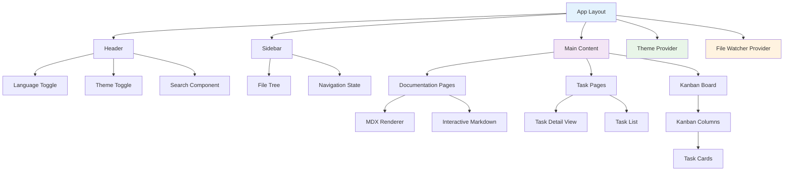

## Core Layout Components

### App Layout Structure

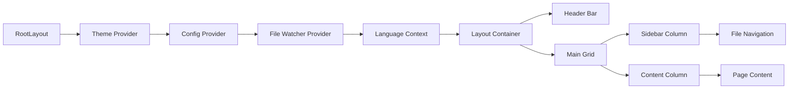

**Root Layout (`src/app/layout.tsx`):**

```typescript
export default function RootLayout({
  children,
}: {
  children: React.ReactNode;
}) {
  return (
    <html lang="en">
      <body>
        <ThemeProvider>
          <ConfigProvider>
            <FileWatcherProvider>
              <LanguageProvider>
                <div className="min-h-screen bg-background">
                  <Header />
                  <div className="flex">
                    <Sidebar />
                    <main className="flex-1">
                      {children}
                    </main>
                  </div>
                </div>
              </LanguageProvider>
            </FileWatcherProvider>
          </ConfigProvider>
        </ThemeProvider>
      </body>
    </html>
  );
}
```

### Provider Architecture

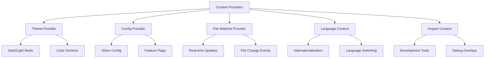

## Page-Level Components

### Documentation Pages

```mermaid
graph TB
    A[docs/page.tsx] --> B[Document List View]
    B --> C[Document Cards]
    B --> D[Search Results]
    B --> E[Category Filters]

    F[docs/[slug]/page.tsx] --> G[Document Detail View]
    G --> H[MDX Renderer]
    G --> I[Table of Contents]
    G --> J[Navigation Links]
    G --> K[Metadata Display]

    H --> L[Interactive Markdown]
    L --> M[Task Checkboxes]
    L --> N[Code Syntax Highlighting]
    L --> O[Link Processing]
```

### Task Management Pages

```mermaid
graph TB
    A[tasks/page.tsx] --> B[Task Overview]
    B --> C[Task Groups List]
    B --> D[Progress Statistics]
    B --> E[Quick Actions]

    F[tasks/[...slug]/page.tsx] --> G[Task Detail View]
    G --> H[Task Metadata Editor]
    G --> I[Subtask List]
    G --> J[File Content View]
    G --> K[Status Management]

    L[tasks/kanban/page.tsx] --> M[Kanban Board]
    M --> N[Column Layout]
    N --> O[Todo Column]
    N --> P[In Progress Column]
    N --> Q[Done Column]

    O --> R[Task Cards]
    P --> R
    Q --> R
```

## UI Component Library

### shadcn/ui Integration

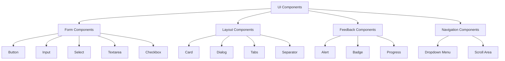

### Custom Interactive Components

```typescript
// Interactive Markdown Component
interface InteractiveMarkdownProps {
  content: string;
  taskGroupId?: string;
  tasks?: TaskItem[];
  className?: string;
}

// Interactive Checkbox Component
interface InteractiveCheckboxProps {
  taskId: string;
  checked: boolean;
  onChange: (checked: boolean) => void;
  disabled?: boolean;
}

// Task Metadata Editor
interface TaskMetadataEditorProps {
  taskId: string;
  metadata: TaskMetadata;
  onSave: (metadata: TaskMetadata) => void;
}
```

## State Management Patterns

### Zustand Store Integration

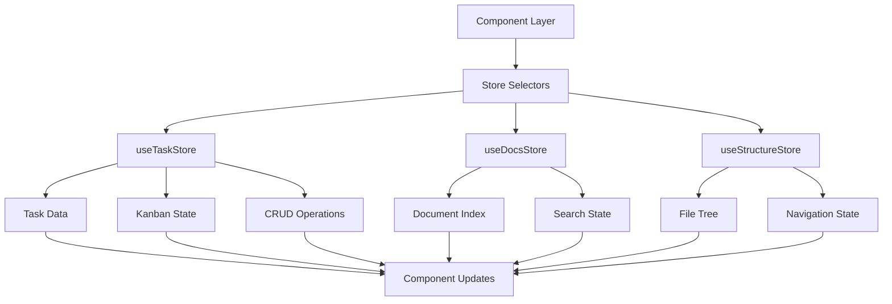

### Component-Store Connection Patterns

```typescript
// Store subscription with selectors
function TaskListComponent() {
  const tasks = useTaskStore((state) => state.taskGroups);
  const loading = useTaskStore((state) => state.loading);
  const refresh = useTaskStore((state) => state.refresh);

  // Component renders tasks...
}

// Optimized subscriptions to prevent unnecessary re-renders
const taskSelector = (state: TaskState) => ({
  tasks: state.taskGroups,
  loading: state.loading,
});

function OptimizedComponent() {
  const { tasks, loading } = useTaskStore(taskSelector, shallow);
  // Component only re-renders when tasks or loading change
}
```

## Component Design Patterns

### Composition over Inheritance

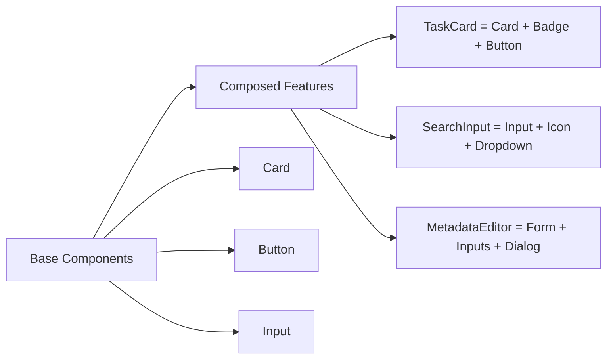

### Render Props Pattern

```typescript
// File Tree Component with render props
interface FileTreeProps {
  renderFile: (file: FileNode) => React.ReactNode;
  renderDirectory: (dir: DirectoryNode) => React.ReactNode;
  onSelect: (path: string) => void;
}

function FileTree({ renderFile, renderDirectory, onSelect }: FileTreeProps) {
  // Tree traversal logic
  return (
    <div>
      {structure.map(node =>
        node.type === 'file'
          ? renderFile(node)
          : renderDirectory(node)
      )}
    </div>
  );
}
```

### Higher-Order Components

```typescript
// With file watching capabilities
function withFileWatcher<T>(Component: React.ComponentType<T>) {
  return function WrappedComponent(props: T) {
    useFileWatcher(); // Hook that manages file watching
    return <Component {...props} />;
  };
}

// With loading states
function withLoading<T>(Component: React.ComponentType<T>) {
  return function LoadingWrapper(props: T & { loading?: boolean }) {
    if (props.loading) {
      return <div>Loading...</div>;
    }
    return <Component {...props} />;
  };
}
```

## Event Handling Architecture

### File Change Event Flow

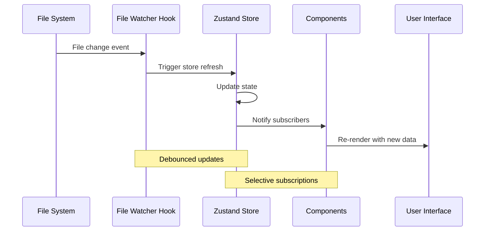

### User Interaction Patterns

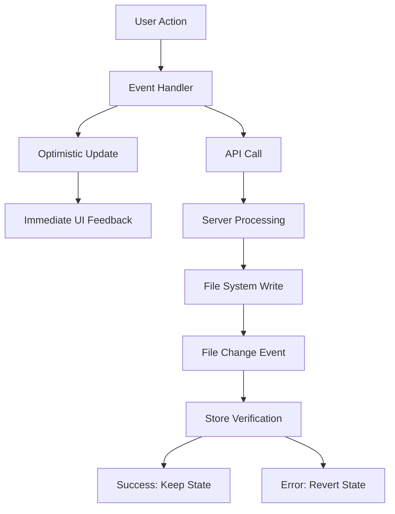

## Performance Optimization Strategies

### Memoization Patterns

```typescript
// Component memoization
const TaskCard = React.memo(({ task, onUpdate }) => {
  // Only re-render when task changes
  return <Card>...</Card>;
}, (prevProps, nextProps) => {
  return prevProps.task.id === nextProps.task.id &&
         prevProps.task.status === nextProps.task.status;
});

// Callback memoization
function TaskList() {
  const handleTaskUpdate = useCallback((taskId: string, updates: any) => {
    updateTask(taskId, updates);
  }, [updateTask]);

  // Stable reference prevents child re-renders
  return tasks.map(task =>
    <TaskCard key={task.id} task={task} onUpdate={handleTaskUpdate} />
  );
}
```

### Virtual Scrolling (Future Enhancement)

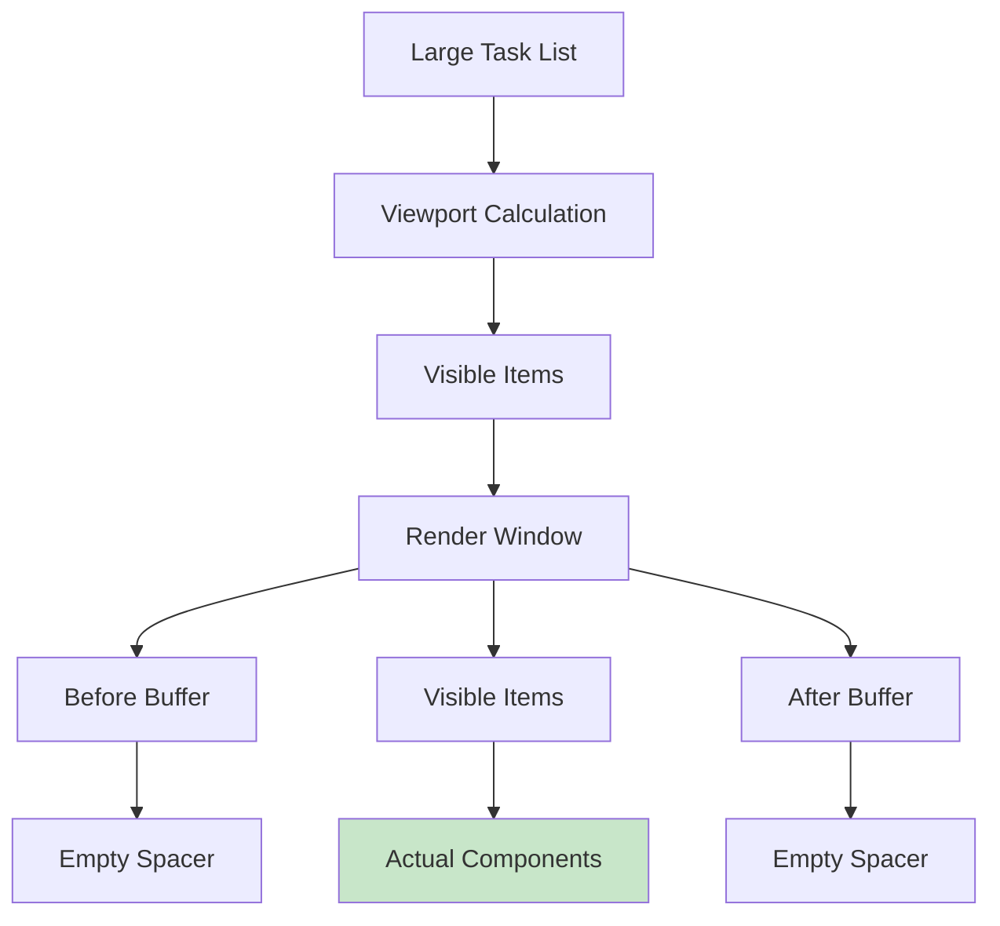

### Code Splitting Strategy

```typescript
// Page-level code splitting
const KanbanBoard = dynamic(() => import('./kanban-board'), {
  loading: () => <div>Loading kanban...</div>
});

// Component-level splitting for heavy features
const TaskMetadataEditor = dynamic(() => import('./task-metadata-editor'), {
  ssr: false // Client-side only
});

// Route-based splitting with Next.js App Router
// Automatic for page components
```

## Responsive Design Architecture

### Breakpoint System

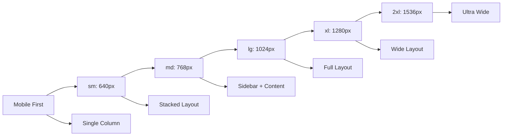

### Adaptive Component Patterns

```typescript
// Responsive sidebar
function Sidebar() {
  const [isOpen, setIsOpen] = useState(false);
  const isMobile = useMediaQuery('(max-width: 768px)');

  return (
    <>
      {isMobile ? (
        <Sheet open={isOpen} onOpenChange={setIsOpen}>
          <SidebarContent />
        </Sheet>
      ) : (
        <aside className="w-64 border-r">
          <SidebarContent />
        </aside>
      )}
    </>
  );
}
```

## Accessibility Architecture

### ARIA Integration

```typescript
// Accessible task management
function TaskCard({ task, onToggle }) {
  return (
    <div
      role="listitem"
      aria-labelledby={`task-${task.id}`}
      aria-describedby={`task-desc-${task.id}`}
    >
      <button
        onClick={() => onToggle(task.id)}
        aria-label={`Mark ${task.title} as ${task.completed ? 'incomplete' : 'complete'}`}
        aria-pressed={task.completed}
      >
        <Checkbox checked={task.completed} />
      </button>
      <h3 id={`task-${task.id}`}>{task.title}</h3>
      <p id={`task-desc-${task.id}`}>{task.description}</p>
    </div>
  );
}
```

### Keyboard Navigation

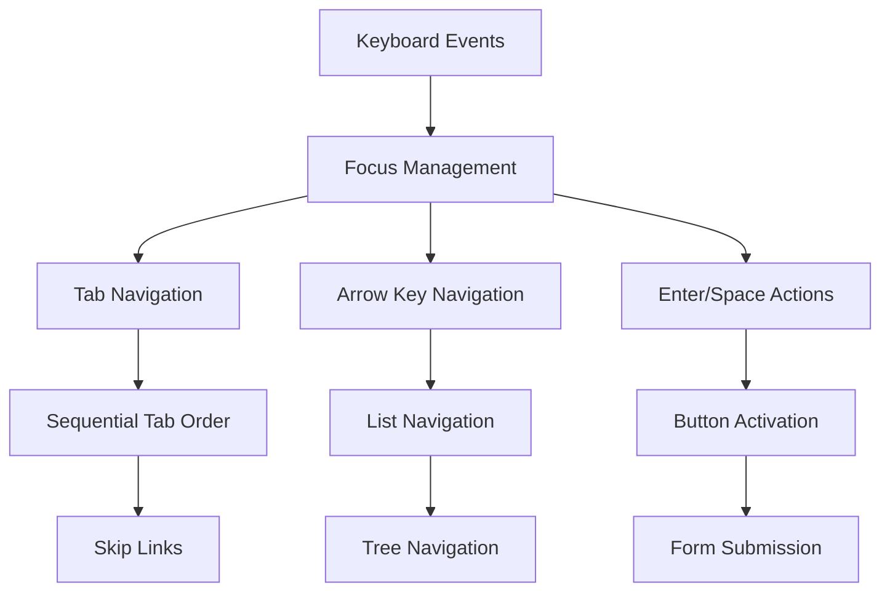

## Testing Architecture

### Component Testing Strategy

```typescript
// Unit tests for components
describe('TaskCard', () => {
  it('renders task information correctly', () => {
    const task = createMockTask();
    render(<TaskCard task={task} onUpdate={jest.fn()} />);

    expect(screen.getByText(task.title)).toBeInTheDocument();
    expect(screen.getByRole('checkbox')).toHaveAttribute('aria-checked', 'false');
  });

  it('handles status toggle', async () => {
    const onUpdate = jest.fn();
    const task = createMockTask();
    render(<TaskCard task={task} onUpdate={onUpdate} />);

    await user.click(screen.getByRole('checkbox'));
    expect(onUpdate).toHaveBeenCalledWith(task.id, { completed: true });
  });
});
```

### Integration Testing

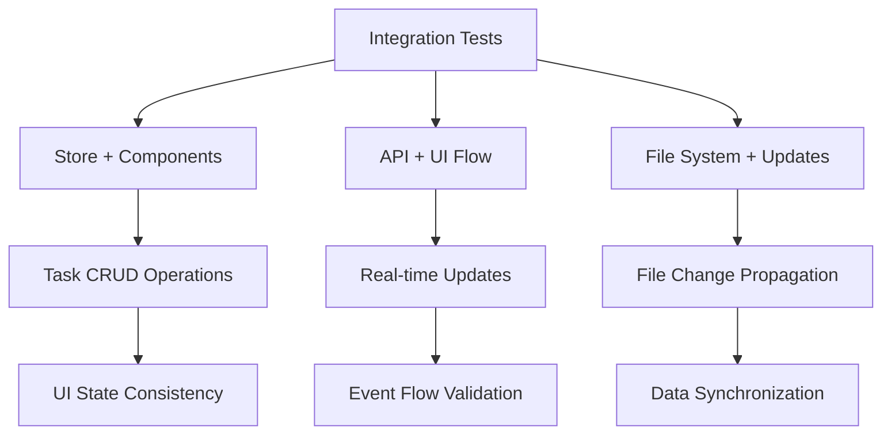

## Development Tools Integration

### React DevTools

```typescript
// Component debugging
if (process.env.NODE_ENV === "development") {
  // Enable additional debugging
  window.__GITION_DEBUG__ = {
    stores: { useTaskStore, useDocsStore, useStructureStore },
    utils: { refreshAll, clearCache },
  };
}
```

### Hot Module Replacement

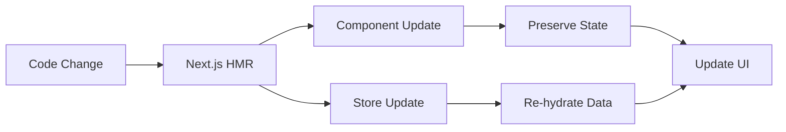

This component architecture provides:

- **Scalable organization** with clear separation of concerns
- **Reusable patterns** for consistent development
- **Performance optimization** through memoization and code splitting
- **Accessibility** built into core components
- **Testing strategy** for reliable component behavior
- **Development experience** with hot reloading and debugging tools
