# Data Flow & Processing

This document explains how data flows through Gition's system, from raw files on disk to rendered UI components. Understanding these flows is crucial for debugging, optimization, and extending the system.

## Overview: File-to-UI Pipeline

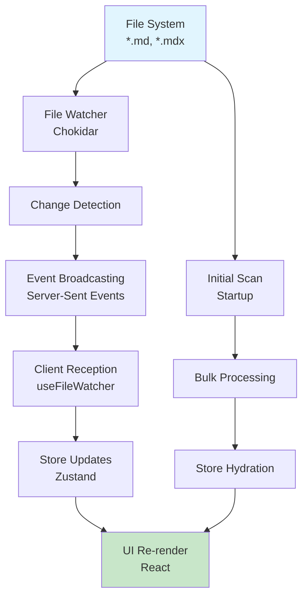

## File System Layer

### Directory Structure Processing

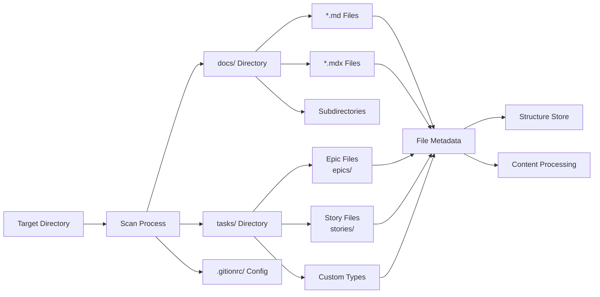

### File Reading & Parsing

```typescript
// File processing pipeline
interface FileProcessingPipeline {
  1: "Read file from disk";
  2: "Parse frontmatter (YAML)";
  3: "Extract document metadata";
  4: "Parse task checkboxes";
  5: "Compile MDX content";
  6: "Generate derived data";
  7: "Update stores";
  8: "Trigger UI updates";
}
```

## Content Processing Pipeline

### 1. Frontmatter Extraction

```mermaid
graph TB
    A[Raw File Content] --> B[Split at '---']
    B --> C[YAML Section]
    B --> D[Markdown Content]

    C --> E[yaml.parse()]
    E --> F[Frontmatter Object]

    D --> G[Content String]

    F --> H[Document Metadata]
    G --> I[Task Extraction]
    G --> J[MDX Processing]
```

**Code Flow:**

```typescript
// src/lib/mdx.ts - parseFrontmatter()
const sections = content.split('---').filter(Boolean);
if (sections.length >= 2) {
  const frontmatter = yaml.parse(sections[0]);
  const markdown = sections.slice(1).join('---');
  return { frontmatter, content: markdown };
}
```

### 2. Task Extraction Process

```mermaid
graph TB
    A[Markdown Content] --> B[Line-by-Line Scan]
    B --> C[Checkbox Pattern<br/>^\s*-\s*\[([ xX~])\]\s*(.+)$]

    C --> D[Parse Task Status]
    C --> E[Extract Task Text]

    D --> F[Status Mapping<br/>[ ]=todo, [x]=done, [~]=in_progress]
    E --> G[Metadata Parsing]

    G --> H[Priority: (high), (medium), (low)]
    G --> I[Assignee: +username]
    G --> J[Due Date: @2024-01-15]
    G --> K[References: ref:epics/epic-01]
    G --> L[Tags: #frontend #ui]

    F --> M[TaskItem Object]
    H --> M
    I --> M
    J --> M
    K --> M
    L --> M
```

**Advanced Task Syntax:**

```markdown
- [ ] Basic task
- [x] Completed task
- [~] In progress task
- [ ] Complex task (high) +john @2024-02-01 #frontend ref:epics/auth-system
```

### 3. MDX Compilation

```mermaid
graph LR
    A[Markdown + JSX] --> B[@next/mdx Compiler]
    B --> C[React Components]
    C --> D[Custom Components<br/>InteractiveMarkdown]
    D --> E[Rendered Output]

    B --> F[Syntax Highlighting]
    B --> G[Link Processing]
    B --> H[Image Optimization]

    F --> E
    G --> E
    H --> E
```

## Real-Time Update Flow

### File Change Detection

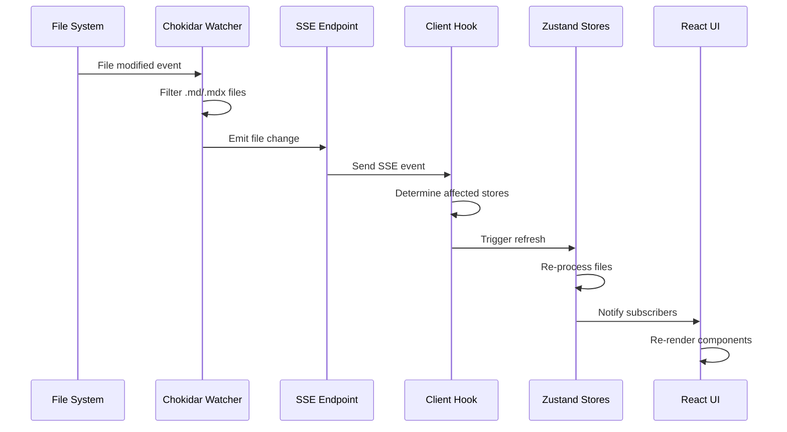

### Store Update Cascade

```mermaid
graph TB
    A[File Change Event] --> B[Path Analysis]

    B --> C[/docs/ path?]
    B --> D[/tasks/ path?]
    B --> E[Other path?]

    C --> F[Docs Store Refresh]
    D --> G[Task Store Refresh]
    E --> H[All Stores Refresh]

    F --> I[Re-parse Documents]
    G --> J[Re-extract Tasks]
    H --> I
    H --> J

    I --> K[Update Document Index]
    J --> L[Update Task Groups]

    K --> M[Trigger UI Updates]
    L --> M

    M --> N[Preserve Scroll Position]
    M --> O[Maintain State]
```

### Debouncing Strategy

```typescript
// Prevent excessive updates during rapid file changes
interface DebouncingConfig {
  taskRefresh: 300; // ms - Task store updates
  docsRefresh: 150; // ms - Docs store updates
  uiUpdates: 100; // ms - UI re-renders
  scrollPreserve: 50; // ms - Scroll position
}
```

## Store Management

### Task Store Data Flow

```mermaid
graph TB
    A[File Changes] --> B[extractTasks()]
    B --> C[Task Objects Array]

    C --> D[Group by File]
    D --> E[TaskGroup Objects]

    E --> F[Calculate Statistics]
    F --> G[Total/Completed/Pending]

    G --> H[Kanban Organization]
    H --> I[Todo Column]
    H --> J[In Progress Column]
    H --> K[Done Column]

    E --> L[Store State Update]
    I --> L
    J --> L
    K --> L

    L --> M[Notify Subscribers]
    M --> N[Component Re-render]
```

### Docs Store Data Flow

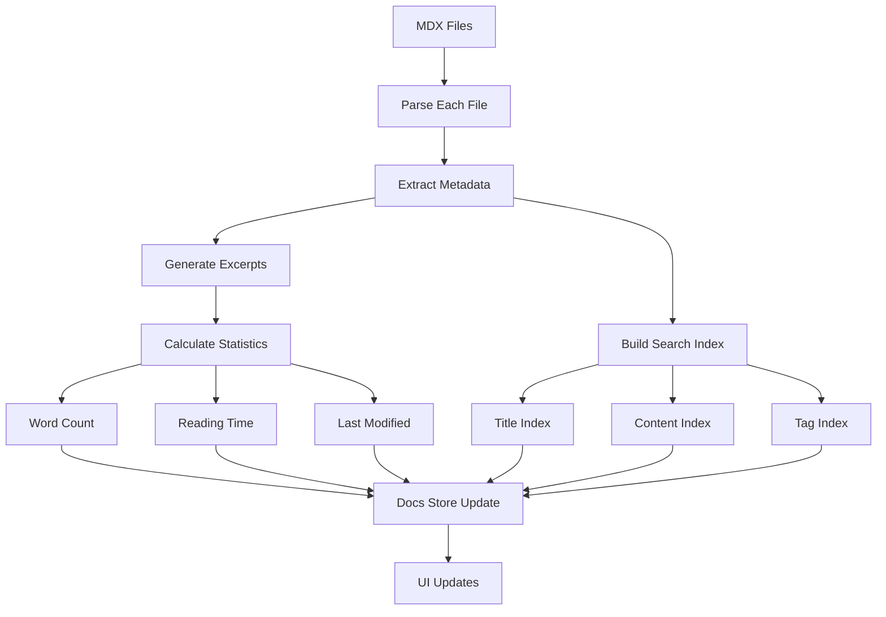

### Structure Store Data Flow

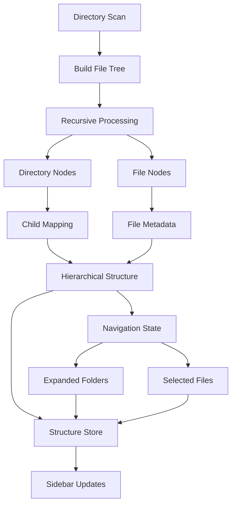

## UI Update Propagation

### Component Subscription Model

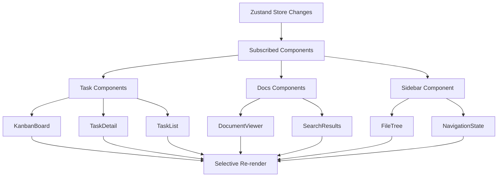

### Optimization Strategies

```typescript
// Memoization patterns for performance
const optimizations = {
  // Prevent unnecessary re-renders
  useMemo: ['Expensive calculations', 'Filtered data', 'Derived state'],

  // Stable references for callbacks
  useCallback: ['Event handlers', 'Store selectors', 'API calls'],

  // Component-level optimization
  React.memo: ['Pure components', 'List items', 'Static content'],

  // Store-level optimization
  shallowEqual: ['Store subscriptions', 'Prop comparisons']
};
```

## Error Handling & Recovery

### File Processing Errors

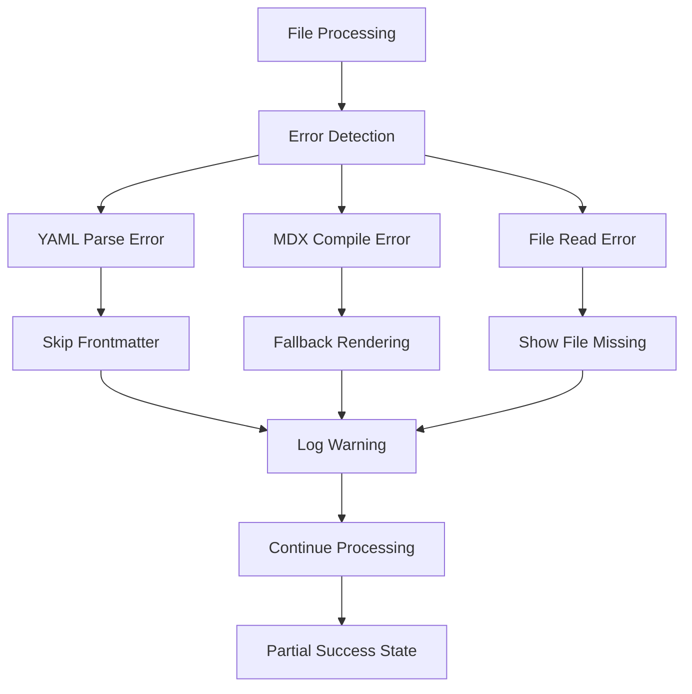

### Store Recovery Patterns

```typescript
// Error boundaries and recovery
interface ErrorRecovery {
  parseError: "Continue with default values";
  networkError: "Retry with exponential backoff";
  storeError: "Reset to last known good state";
  renderError: "Show error boundary component";
}
```

## Performance Monitoring

### Data Flow Metrics

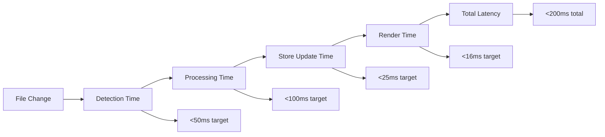

### Bottleneck Identification

```typescript
// Performance monitoring points
const performanceTracking = {
  fileWatch: "Time from file change to detection",
  parsing: "MDX/YAML parsing duration",
  extraction: "Task extraction time",
  storeUpdate: "Zustand state update time",
  uiRender: "React render cycle time",
  scrollPreserve: "Scroll position maintenance",
};
```

## Data Persistence

### Configuration Flow

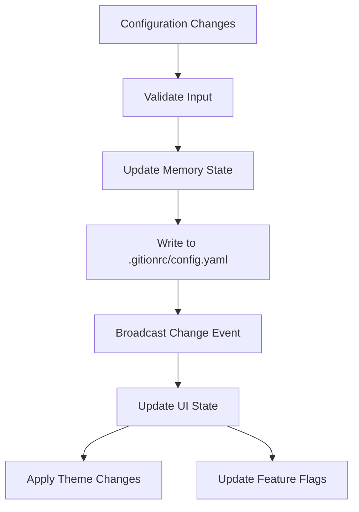

### File System Synchronization

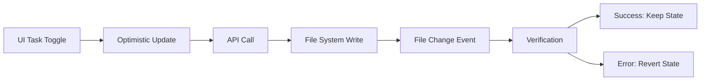

## Integration Points

### External Tool Integration

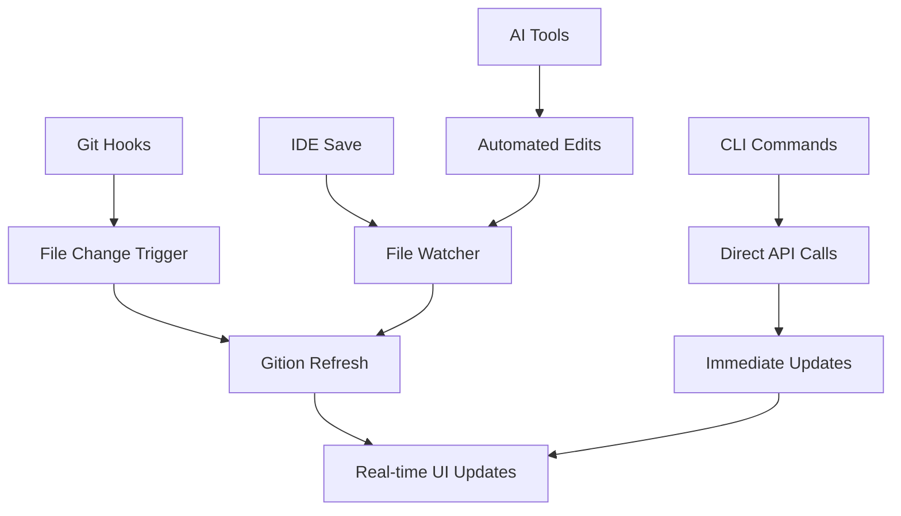

### Plugin Data Flow (Future)

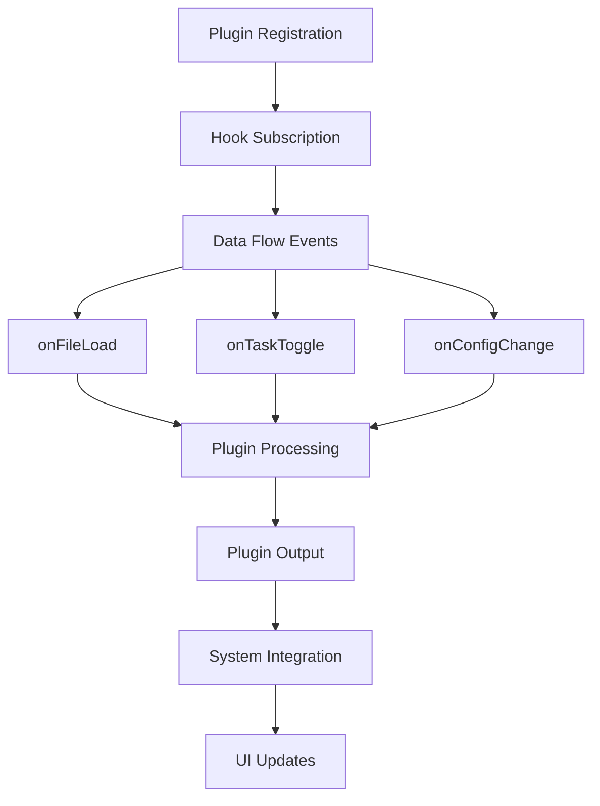

This data flow architecture ensures:

- **Consistency**: All data changes flow through well-defined pipelines
- **Performance**: Optimized update cycles with minimal overhead
- **Reliability**: Error handling and recovery at each stage
- **Extensibility**: Clear integration points for future enhancements
- **Debuggability**: Observable data transformations throughout the system
