# Gition Data Schema

This document provides a comprehensive specification of the data models, entities, and relationships within the Gition system - a local, zero-configuration web UI for managing Markdown/MDX documentation and tasks.

## Overview

Gition's data architecture is built around **local filesystem integration** with **type-safe TypeScript interfaces**. The system operates entirely client-side with Next.js SSR, requiring no external APIs or databases. All data is stored as Markdown/MDX files with YAML frontmatter, enabling both human readability and programmatic access.

### Key Design Principles

- **🏠 Local-First**: All data resides in the local filesystem
- **📝 Markdown-Native**: Documents and tasks stored as `.md`/`.mdx` files
- **🔒 Type-Safe**: Full TypeScript interfaces with Zod validation
- **🔄 Real-Time Sync**: Two-way binding between UI and filesystem via file watchers
- **🎯 Zero-Config**: Works out-of-the-box with sensible defaults
- **🔌 Extensible**: Plugin-friendly architecture with clear data contracts

### Data Flow Architecture


## Principal Entities

The Gition system revolves around five core entities that represent different aspects of the documentation and task management workflow:

### Core Entity Relationships


1. **📄 MarkdownFile** - The fundamental document entity (MDX/Markdown files)
2. **📋 TaskGroup** - MDX files that contain task items (file-level tasks)
3. **✅ TaskItem** - Individual checkbox items within files (subtasks)
4. **📁 DirectoryStructure** - File system organization and navigation
5. **⚙️ GitionConfig** - System configuration and customization

<details>
<summary><strong>Entity Overview Table</strong></summary>

| Entity               | Purpose                       | Storage                      | Key Relationships                                |
| -------------------- | ----------------------------- | ---------------------------- | ------------------------------------------------ |
| `MarkdownFile`       | Document content and metadata | `.md`/`.mdx` files           | Contains TaskItems, has FileMetadata             |
| `TaskGroup`          | File-level task organization  | MDX files in `tasks/`        | Represents MarkdownFile, groups TaskItems        |
| `TaskItem`           | Individual checkbox tasks     | Markdown checkboxes in files | Belongs to TaskGroup, references other TaskItems |
| `DirectoryStructure` | File system navigation        | Computed from filesystem     | Contains DirectoryNodes                          |
| `GitionConfig`       | System settings               | `.gitionrc` file             | Defines TaskTypes and Users                      |

</details>

## Entity Specifications

<details>
<summary><strong>📄 MarkdownFile (Documents)</strong></summary>

Represents individual `.md` or `.mdx` files containing documentation or task content.

### Interface Definition

```typescript
interface MarkdownFile {
  slug: string; // path-based identifier
  filename: string; // file basename
  filepath: string; // absolute path
  content: string; // parsed markdown content
  metadata: FileMetadata; // frontmatter data
  excerpt?: string; // auto-generated excerpt
}
```

### Fields Reference

| Field      | Type           | Required | Description                              | Example                                         |
| ---------- | -------------- | -------- | ---------------------------------------- | ----------------------------------------------- |
| `slug`     | `string`       | ✅       | URL-safe identifier derived from path    | `"docs/getting-started"`                        |
| `filename` | `string`       | ✅       | File basename with extension             | `"getting-started.mdx"`                         |
| `filepath` | `string`       | ✅       | Absolute filesystem path                 | `"/users/dev/project/docs/getting-started.mdx"` |
| `content`  | `string`       | ✅       | Parsed markdown content (no frontmatter) | `"# Getting Started\n\nWelcome to..."`          |
| `metadata` | `FileMetadata` | ✅       | Frontmatter and derived metadata         | See FileMetadata below                          |
| `excerpt`  | `string`       | ❌       | Auto-generated excerpt for previews      | `"Welcome to Gition..."`                        |

### Usage Context

- Primary entity for documentation viewing
- Source container for TaskItems (subtasks)
- Indexed for search functionality
- Displayed in sidebar navigation

</details>

<details>
<summary><strong>📋 TaskGroup (Task Files)</strong></summary>

Represents MDX files that serve as task containers, appearing as primary items in kanban boards.

### Interface Definition

```typescript
interface TaskGroup {
  id: string; // unique identifier
  name: string; // display name
  type: "doc" | "epic" | "story" | "custom";
  file: string; // source file path
  folder?: string; // organizing folder
  subtasks: TaskItem[]; // contained subtasks
  totalTasks: number; // total subtask count
  completedTasks: number; // completed subtask count
  pendingTasks: number; // pending subtask count
  content?: string; // file content
  metadata?: FileMetadata; // frontmatter metadata
}
```

### Fields Reference

| Field            | Type           | Required | Description                         | Example                        |
| ---------------- | -------------- | -------- | ----------------------------------- | ------------------------------ |
| `id`             | `string`       | ✅       | Unique identifier                   | `"epics/user-authentication"`  |
| `name`           | `string`       | ✅       | Display name (usually filename)     | `"user-authentication"`        |
| `type`           | `TaskType`     | ✅       | Task category from folder structure | `"epic"`                       |
| `file`           | `string`       | ✅       | Source file path                    | `"/tasks/epics/user-auth.mdx"` |
| `folder`         | `string`       | ❌       | Organizing folder                   | `"epics"`                      |
| `subtasks`       | `TaskItem[]`   | ✅       | Array of contained subtasks         | `[TaskItem, ...]`              |
| `totalTasks`     | `number`       | ✅       | Total number of subtasks            | `12`                           |
| `completedTasks` | `number`       | ✅       | Number of completed subtasks        | `8`                            |
| `pendingTasks`   | `number`       | ✅       | Number of pending subtasks          | `4`                            |
| `content`        | `string`       | ❌       | Full markdown content               | `"# Epic: User Auth\n\n..."`   |
| `metadata`       | `FileMetadata` | ❌       | Frontmatter metadata                | See FileMetadata               |

### Task Types by Folder Structure

| Folder     | Type       | Description                   | Default Priority |
| ---------- | ---------- | ----------------------------- | ---------------- |
| `epics/`   | `"epic"`   | Large features or initiatives | `"high"`         |
| `stories/` | `"story"`  | User stories and features     | `"medium"`       |
| `bugs/`    | `"bug"`    | Bug reports and fixes         | `"high"`         |
| `docs/`    | `"doc"`    | Documentation tasks           | `"medium"`       |
| _other_    | `"custom"` | Custom task categories        | `"medium"`       |

</details>

<details>
<summary><strong>✅ TaskItem (Subtasks)</strong></summary>

Individual checkbox items within markdown files, representing actionable subtasks.

### Interface Definition

```typescript
interface TaskItem {
  id: string; // unique identifier
  title: string; // task description
  completed: boolean; // checkbox state
  status: "todo" | "in_progress" | "done";
  line: number; // line number in source
  file: string; // source file path
  type: "doc" | "epic" | "story" | "custom";
  folder?: string; // parent folder
  references?: string[]; // cross-references
  metadata?: TaskItemMetadata; // inline metadata
}
```

### Fields Reference

| Field        | Type               | Required | Description                     | Example                             |
| ------------ | ------------------ | -------- | ------------------------------- | ----------------------------------- |
| `id`         | `string`           | ✅       | Unique identifier (file + line) | `"user-auth.mdx-15"`                |
| `title`      | `string`           | ✅       | Task description text           | `"Implement OAuth 2.0 integration"` |
| `completed`  | `boolean`          | ✅       | Checkbox completion state       | `false`                             |
| `status`     | `TaskStatus`       | ✅       | Current task status             | `"in_progress"`                     |
| `line`       | `number`           | ✅       | Line number in source file      | `15`                                |
| `file`       | `string`           | ✅       | Source file path                | `"/tasks/epics/user-auth.mdx"`      |
| `type`       | `TaskType`         | ✅       | Inherited from parent file      | `"epic"`                            |
| `folder`     | `string`           | ❌       | Parent folder name              | `"epics"`                           |
| `references` | `string[]`         | ❌       | References to other tasks       | `["stories/login-form"]`            |
| `metadata`   | `TaskItemMetadata` | ❌       | Inline task metadata            | See below                           |

### TaskItem Metadata Structure

```typescript
interface TaskItemMetadata {
  priority?: "low" | "medium" | "high";
  due_date?: string; // ISO date string
  assignee?: string; // assigned person
  tags?: string[]; // categorization tags
  estimate?: number; // time estimate (hours)
  status?: "blocked" | "waiting" | "review";
}
```

### Subtask Syntax Examples

```markdown
- [ ] Basic task
- [x] Completed task
- [~] In progress task
- [ ] Task with metadata {priority: "high", assignee: "john", due: "2024-02-01"}
- [ ] Task with reference ref:epics/user-authentication
- [ ] Complex task {priority: "high", tags: ["backend", "auth"], estimate: 8}
```

</details>

<details>
<summary><strong>📁 DirectoryStructure & DirectoryNode</strong></summary>

Represents the filesystem organization for navigation and file browsing.

### DirectoryStructure Interface

```typescript
interface DirectoryStructure {
  root: DirectoryNode[]; // root directory contents
  docs: DirectoryNode[]; // docs directory tree
  tasks: DirectoryNode[]; // tasks directory tree
  paths: {
    target: string; // target directory path
    docs: string; // docs directory path
    tasks: string; // tasks directory path
  };
}
```

### DirectoryNode Interface

```typescript
interface DirectoryNode {
  name: string; // file/folder name
  path: string; // full path
  type: "file" | "directory"; // node type
  children?: DirectoryNode[]; // child nodes (if directory)
  isMarkdown?: boolean; // true if .md/.mdx file
}
```

### Fields Reference

#### DirectoryStructure

| Field          | Type              | Required | Description             | Example                      |
| -------------- | ----------------- | -------- | ----------------------- | ---------------------------- |
| `root`         | `DirectoryNode[]` | ✅       | Root directory contents | `[DirectoryNode, ...]`       |
| `docs`         | `DirectoryNode[]` | ✅       | Documentation tree      | `[DirectoryNode, ...]`       |
| `tasks`        | `DirectoryNode[]` | ✅       | Tasks directory tree    | `[DirectoryNode, ...]`       |
| `paths.target` | `string`          | ✅       | Target directory path   | `"/users/dev/project"`       |
| `paths.docs`   | `string`          | ✅       | Docs directory path     | `"/users/dev/project/docs"`  |
| `paths.tasks`  | `string`          | ✅       | Tasks directory path    | `"/users/dev/project/tasks"` |

#### DirectoryNode

| Field        | Type                    | Required | Description                    | Example                              |
| ------------ | ----------------------- | -------- | ------------------------------ | ------------------------------------ |
| `name`       | `string`                | ✅       | File or directory name         | `"getting-started.mdx"`              |
| `path`       | `string`                | ✅       | Full filesystem path           | `"/docs/guides/getting-started.mdx"` |
| `type`       | `"file" \| "directory"` | ✅       | Node type                      | `"file"`                             |
| `children`   | `DirectoryNode[]`       | ❌       | Child nodes (directories only) | `[DirectoryNode, ...]`               |
| `isMarkdown` | `boolean`               | ❌       | Whether file is .md/.mdx       | `true`                               |

</details>

<details>
<summary><strong>📝 FileMetadata (Document Frontmatter)</strong></summary>

YAML frontmatter and computed metadata for documents and task files.

### Interface Definition

```typescript
interface FileMetadata {
  // Core fields
  title?: string; // document title
  description?: string; // document description
  tags?: string[]; // categorization tags
  date?: string; // creation/publication date
  author?: string; // document author
  status?: "draft" | "published" | "archived";

  // Organization
  type?: string; // document type
  category?: string; // high-level category
  section?: string; // section within category
  order?: number; // sort order

  // Task-specific (for TaskGroups)
  priority?: "low" | "medium" | "high" | "critical";
  assignee?: string; // assigned person/team
  due?: string; // due date (ISO)
  completedDate?: string; // completion date
  valueScore?: number; // business value (1-100)
  estimateScore?: number; // effort estimate (1-100)
  parent?: string; // parent task reference
  version?: string; // version string

  // Extended metadata
  [key: string]: unknown; // flexible additional fields
}
```

### Standard Frontmatter Fields

| Field           | Type       | Used In | Description             | Example                           |
| --------------- | ---------- | ------- | ----------------------- | --------------------------------- |
| `title`         | `string`   | All     | Document title          | `"API Authentication Guide"`      |
| `description`   | `string`   | All     | Brief description       | `"Learn API authentication"`      |
| `type`          | `string`   | All     | Document/task type      | `"guide"`, `"epic"`, `"story"`    |
| `tags`          | `string[]` | All     | Categorization tags     | `["auth", "security", "api"]`     |
| `status`        | `string`   | All     | Document/task status    | `"published"`, `"todo"`, `"done"` |
| `priority`      | `string`   | Tasks   | Task priority level     | `"high"`                          |
| `assignee`      | `string`   | Tasks   | Assigned person/team    | `"backend-team"`                  |
| `due`           | `string`   | Tasks   | Due date (ISO format)   | `"2024-02-15"`                    |
| `valueScore`    | `number`   | Tasks   | Business value (1-100)  | `85`                              |
| `estimateScore` | `number`   | Tasks   | Effort estimate (1-100) | `60`                              |
| `parent`        | `string`   | Tasks   | Parent task reference   | `"ref:epics/platform"`            |

</details>

<details>
<summary><strong>⚙️ GitionConfig (System Configuration)</strong></summary>

System-wide configuration and customization settings.

### Interface Definition

```typescript
interface GitionConfig {
  // Basic settings
  name?: string; // workspace name
  description?: string; // workspace description
  version?: string; // version string

  // Directories
  docsDir?: string; // docs directory name
  tasksDir?: string; // tasks directory name
  outputDir?: string; // build output directory

  // Theme customization
  theme?: GitionThemeConfig; // theme settings

  // Task management
  taskTypes?: GitionTaskType[]; // task type definitions
  defaultTaskType?: string; // default task type

  // Users and collaboration
  users?: GitionUser[]; // user definitions
  defaultAssignee?: string; // default assignee

  // Feature flags
  features?: {
    hotReload?: boolean; // file watching
    darkMode?: boolean; // dark mode support
    search?: boolean; // search functionality
    analytics?: boolean; // usage analytics
    collaboration?: boolean; // collaboration features
  };

  // Internationalization
  defaultLanguage?: "en" | "fr" | "es";
  supportedLanguages?: ("en" | "fr" | "es")[];

  // Advanced settings
  markdown?: {
    enableMermaid?: boolean; // Mermaid diagrams
    enableCodeHighlighting?: boolean;
    enableTables?: boolean; // table support
    enableMath?: boolean; // math rendering
  };
}
```

### Configuration Fields

| Field                    | Type               | Default              | Description               | Example                             |
| ------------------------ | ------------------ | -------------------- | ------------------------- | ----------------------------------- |
| `name`                   | `string`           | `"Gition Workspace"` | Workspace display name    | `"My Project Docs"`                 |
| `docsDir`                | `string`           | `"docs"`             | Documentation directory   | `"documentation"`                   |
| `tasksDir`               | `string`           | `"tasks"`            | Tasks directory           | `"project-tasks"`                   |
| `defaultLanguage`        | `string`           | `"en"`               | Default UI language       | `"fr"`                              |
| `taskTypes`              | `GitionTaskType[]` | See defaults         | Custom task types         | `[{name: "Epic", folder: "epics"}]` |
| `users`                  | `GitionUser[]`     | `[]`                 | Project users             | `[{id: "1", name: "John"}]`         |
| `features.darkMode`      | `boolean`          | `true`               | Dark mode support         | `false`                             |
| `markdown.enableMermaid` | `boolean`          | `true`               | Mermaid diagram rendering | `false`                             |

### GitionTaskType

```typescript
interface GitionTaskType {
  name: string; // display name
  folder: string; // directory name
  icon?: string; // icon identifier
  color?: string; // color theme
  description?: string; // type description
  defaultPriority?: "low" | "medium" | "high" | "critical";
}
```

### GitionUser

```typescript
interface GitionUser {
  id: string; // unique identifier
  name: string; // display name
  email?: string; // email address
  avatar?: string; // avatar URL
  role?: "viewer" | "editor" | "admin";
}
```

</details>

## Complete Entity Relationship Diagram


## Data Validation & Constraints

Gition uses **Zod schemas** for runtime validation and type safety:

### Core Validation Rules

```typescript
// File path validation
const filePathSchema = z
  .string()
  .min(1)
  .max(1000)
  .refine((path) => !path.includes(".."))
  .refine((path) => /^[a-zA-Z0-9-_/\\.]+$/.test(path));

// Task validation
const taskStatusSchema = z.enum(["todo", "in_progress", "done"]);
const taskPrioritySchema = z.enum(["low", "medium", "high"]);
const taskTypeSchema = z.enum(["epic", "story", "bug", "task"]);

// Metadata validation
const taskMetadataSchema = z.object({
  title: z.string().min(1).max(200),
  type: taskTypeSchema,
  status: taskStatusSchema,
  priority: taskPrioritySchema,
  assignee: z.string().optional(),
  tags: z.array(z.string().max(50)).max(10).optional(),
});
```

### Security Constraints

- **Path Traversal Protection**: File paths validated against `../` patterns
- **Content Sanitization**: HTML and script tag removal from user input
- **Length Limits**: Maximum lengths enforced on text fields
- **Character Validation**: Restricted character sets for identifiers

## State Management Architecture

Gition uses **Zustand** for state management with three primary stores:

```mermaid
graph TB
    subgraph "State Stores"
        DOCS_STORE["useDocsStore<br/>📚 MarkdownFile[]"]
        TASKS_STORE["useTaskStore<br/>📋 TaskGroup[]"]
        STRUCT_STORE["useStructureStore<br/>📁 DirectoryStructure"]
    end

    subgraph "API Layer"
        DOCS_API["/api/docs"]
        TASKS_API["/api/tasks"]
        STRUCT_API["/api/structure"]
        WATCH_API["/api/files/watch"]
    end

    subgraph "File System"
        FS_DOCS["docs/ files"]
        FS_TASKS["tasks/ files"]
        FS_CONFIG[".gitionrc"]
    end

    DOCS_API --> DOCS_STORE
    TASKS_API --> TASKS_STORE
    STRUCT_API --> STRUCT_STORE
    WATCH_API --> DOCS_STORE
    WATCH_API --> TASKS_STORE
    WATCH_API --> STRUCT_STORE

    FS_DOCS --> DOCS_API
    FS_TASKS --> TASKS_API
    FS_CONFIG --> STRUCT_API
```



### Store Capabilities

| Store               | Purpose              | Key Actions                               | Real-time Updates |
| ------------------- | -------------------- | ----------------------------------------- | ----------------- |
| `useDocsStore`      | Document management  | `fetchDocs()`, `getDocBySlug()`           | ✅ File watcher   |
| `useTaskStore`      | Task management      | `updateSubtaskStatus()`, `saveTaskFile()` | ✅ File watcher   |
| `useStructureStore` | Directory navigation | `fetchStructure()`, `refreshStructure()`  | ✅ File watcher   |

## API Contracts

### REST Endpoints

| Endpoint               | Method   | Purpose                  | Response Type                 |
| ---------------------- | -------- | ------------------------ | ----------------------------- |
| `/api/docs`            | GET      | Fetch all documents      | `MarkdownFile[]`              |
| `/api/tasks`           | GET      | Fetch tasks/groups       | `TaskItem[]` or `TaskGroup[]` |
| `/api/tasks/[...slug]` | GET      | Fetch specific task file | `TaskGroup` with relations    |
| `/api/structure`       | GET      | Get directory structure  | `DirectoryStructure`          |
| `/api/config`          | GET/POST | Configuration management | `GitionConfig`                |
| `/api/files/watch`     | GET      | File watcher events      | SSE stream                    |

### WebSocket Events (File Watcher)

```typescript
interface FileWatchEvent {
  type: "add" | "change" | "unlink";
  path: string;
  isDirectory: boolean;
  timestamp: number;
}
```

## Migration & Versioning

### Schema Evolution

- **Backward Compatibility**: New fields are optional with sensible defaults
- **Migration Scripts**: Automated frontmatter migration for schema changes
- **Version Detection**: Schema version tracking in configuration
- **Graceful Degradation**: Unknown fields preserved during parsing

### File Format Stability

- **Markdown Compatibility**: All content remains valid Markdown/MDX
- **Frontmatter Flexibility**: Additional fields don't break existing tools
- **Export Capability**: Clean export to standard Markdown format

This schema specification serves as the authoritative reference for Gition's data architecture, ensuring consistency across development, integration, and extension efforts.
