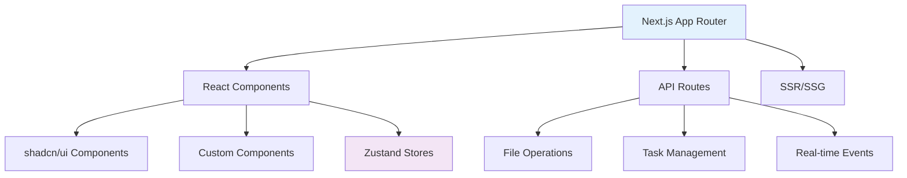
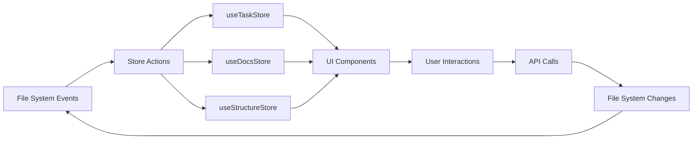
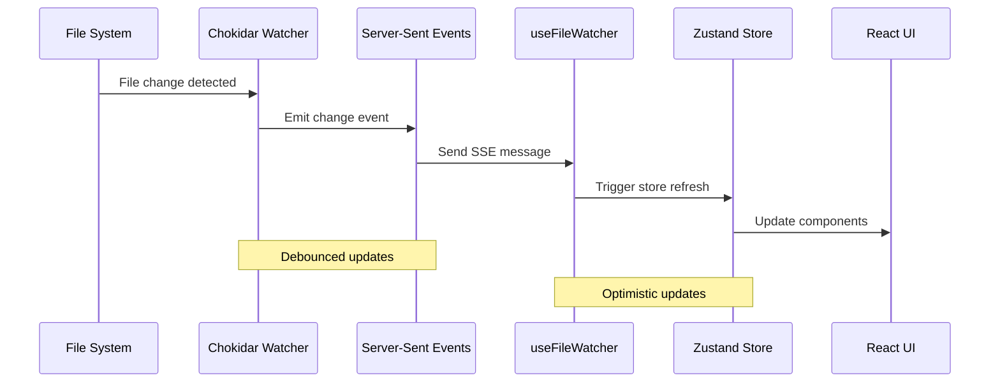

# Development Guide

This guide covers how to contribute to Gition development and set up your local development environment.

## Prerequisites

- Node.js 18+ and pnpm
- Git
- [Just](https://github.com/casey/just) (recommended)

## Development Setup

### 1. Clone and Install

```bash
# Clone the repository
git clone https://github.com/romainframe/gition.git
cd gition

# Install dependencies
pnpm install

# Or using just
just install
```

### 2. Development Commands

Using pnpm:

```bash
# Start development server
pnpm dev

# Run linting
pnpm lint

# Build for production
pnpm build

# Start production server
pnpm start
```

Using just (recommended):

```bash
# Show all available commands
just

# Start development server
just dev

# Run all checks
just check

# Test CLI locally
just test-cli

# Build for production
just build
```

### 3. Testing the CLI

Test the CLI during development:

```bash
# Test CLI with current directory
just test-cli

# Test CLI with specific directory
just test-cli-dir ./test-docs

# Initialize a test project
just test-init
```

## Project Structure

```
gition/
├── bin/                  # CLI entry point
│   └── gition.js
├── src/
│   ├── app/             # Next.js app router
│   │   ├── api/         # API routes
│   │   ├── docs/        # Documentation pages
│   │   └── tasks/       # Task management pages
│   ├── components/      # React components
│   │   └── ui/          # shadcn/ui components
│   ├── hooks/           # Custom React hooks
│   ├── lib/             # Utility libraries
│   ├── store/           # Zustand state management
│   └── types/           # TypeScript type definitions
├── docs/                # Self-documentation
├── tasks/               # Development tasks
└── .gitionrc/           # Gition configuration
```

## Development Workflow

### 1. Feature Development

```bash
# Create a feature branch
just feature my-new-feature

# Make your changes
# Run checks frequently
just check

# Test your changes
just test-cli

# Commit your work
just commit "Add new feature"

# Push to remote
just push
```

### 2. Code Quality

We use several tools to maintain code quality:

- **ESLint**: JavaScript/TypeScript linting
- **Prettier**: Code formatting
- **Husky**: Git hooks for pre-commit checks
- **TypeScript**: Type checking

```bash
# Run all quality checks
just check

# Fix linting issues
just lint-fix

# Format code
just format

# Run pre-commit checks
just precommit
```

### 3. Testing

```bash
# Run unit tests (when available)
just test

# Test CLI functionality
just test-cli

# Run CI simulation
just ci

# Verify build works
just verify
```

## Architecture

For complete architectural details, see our [Technical Architecture Documentation](./technical-architecture.mdx).

### Frontend Architecture



**Key Technologies:**

- **Next.js 15**: React framework with App Router for optimal performance
- **TypeScript**: Type safety and enhanced developer experience
- **Tailwind CSS v4**: Utility-first styling with CSS custom properties
- **shadcn/ui**: High-quality, accessible component library
- **Zustand**: Lightweight state management with minimal boilerplate

### State Management Architecture



**Store Responsibilities:**

- **useTaskStore**: Task data, kanban state, CRUD operations, progress tracking
- **useDocsStore**: Document metadata, search functionality, content indexing
- **useStructureStore**: File system tree, navigation state, folder expansion
- **React Context**: Configuration, theming, language settings

### Real-time Data Flow



**Real-time Features:**

- **File Watching**: Cross-platform file system monitoring with chokidar
- **Server-Sent Events**: Efficient real-time communication
- **Debounced Updates**: Prevent excessive re-renders during rapid file changes
- **Scroll Preservation**: Maintain user context during content updates
- **Optimistic Updates**: Immediate UI feedback with server verification

### API Design Patterns

RESTful API with real-time enhancements:

```typescript
// Task management endpoints
GET    /api/tasks                    # List all task groups
GET    /api/tasks/[...slug]          # Get specific task group
PATCH  /api/task-management/[id]/status     # Update task status
PATCH  /api/task-management/[id]/metadata   # Update task metadata
PATCH  /api/subtasks/[taskId]/[subtaskId]   # Update subtask

// File operations
GET    /api/files/watch              # Server-sent events for changes
GET    /api/structure                # File system structure
GET    /api/docs                     # Document listing

// Real-time kanban
GET    /api/tasks/kanban             # Kanban board data

// Configuration
GET    /api/config                   # Get current configuration
POST   /api/config                   # Update configuration
```

## Contributing Guidelines

### 1. Code Style

- Use TypeScript for all new code
- Follow existing naming conventions
- Add JSDoc comments for complex functions
- Keep components focused and single-purpose

### 2. Commit Messages

Follow conventional commit format:

```bash
feat: add new task filtering feature
fix: resolve file watching memory leak
docs: update configuration guide
refactor: simplify task state management
test: add unit tests for MDX parsing
```

### 3. Pull Requests

- Create focused PRs that address single issues
- Include tests for new functionality
- Update documentation as needed
- Ensure all checks pass

### 4. Issue Reporting

When reporting bugs:

- Include reproduction steps
- Specify environment (OS, Node version, etc.)
- Provide sample files if relevant
- Check existing issues first

## Debugging

### 1. Development Debugging

```bash
# Run with debug output
just debug

# Watch TypeScript compilation
just typecheck-watch

# Monitor file changes
# Check browser DevTools console
```

### 2. Common Issues

**Port already in use:**

```bash
# Kill process on port 3000
npx kill-port 3000

# Or use different port
just test-cli-dir . --port 3001
```

**Module resolution errors:**

```bash
# Clean and reinstall
just reset

# Or fresh install
just fresh
```

**TypeScript errors:**

```bash
# Check types with strict mode
just check-strict

# Watch for type errors
just typecheck-watch
```

## Performance Optimization

### 1. Bundle Analysis

```bash
# Analyze bundle size
just analyze
```

### 2. Memory Management

- Use `useCallback` for stable function references
- Implement proper cleanup in `useEffect`
- Avoid memory leaks in file watchers

### 3. File Processing

- Debounce file change events
- Implement efficient file parsing
- Cache processed results when possible

## Release Process

### 1. Version Management

```bash
# Bump patch version (0.1.4 -> 0.1.5)
just release-patch

# Bump minor version (0.1.4 -> 0.2.0)
just release-minor

# Manual version bump
just bump-patch
just publish
```

### 2. Pre-release Checklist

- [ ] All tests pass
- [ ] Documentation updated
- [ ] CHANGELOG.md updated
- [ ] Version numbers consistent
- [ ] No TypeScript errors
- [ ] CLI tested manually

### 3. Publishing

```bash
# Dry run to check what will be published
just publish-dry

# Publish to npm
just publish
```

## IDE Setup

### VS Code (Recommended)

Install these extensions:

- TypeScript and JavaScript Language Features
- Tailwind CSS IntelliSense
- ESLint
- Prettier
- MDX

### Settings

```json
{
  "editor.formatOnSave": true,
  "editor.codeActionsOnSave": {
    "source.fixAll.eslint": true
  },
  "typescript.preferences.importModuleSpecifier": "relative"
}
```

## Troubleshooting Development

### Environment Issues

1. **Node version**: Ensure Node.js 18+
2. **pnpm version**: Use latest stable version
3. **Git hooks**: Ensure Husky is properly installed

### Build Issues

1. **Clear caches**: `just clean`
2. **Fresh install**: `just fresh`
3. **Check dependencies**: `just outdated`

### Runtime Issues

1. **Check logs**: Browser DevTools console
2. **Network tab**: API request/response inspection
3. **React DevTools**: Component state inspection

## Getting Help

- **GitHub Issues**: Report bugs and request features
- **Discussions**: Ask questions and share ideas
- **Discord**: Real-time chat with the community
- **Documentation**: Check existing guides first
