# File System Integration

Gition's core strength lies in its seamless integration with the local file system. This document explains how the system watches, processes, and synchronizes with your Markdown and MDX files in real-time.

## File System Architecture

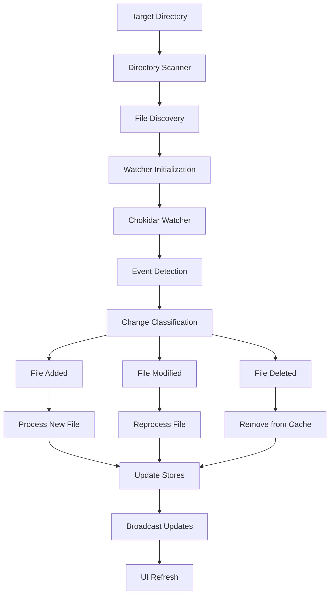

## Directory Structure Conventions

### Standard Layout

```
project/
├── docs/                    # Documentation files
│   ├── guides/             # Organized in subdirectories
│   │   ├── getting-started.mdx
│   │   └── advanced.mdx
│   ├── api/
│   │   └── reference.mdx
│   └── README.md
├── tasks/                   # Task management files
│   ├── epics/              # Epic-level tasks
│   │   ├── user-auth.mdx
│   │   └── api-design.mdx
│   ├── stories/            # Story-level tasks
│   │   ├── login-form.mdx
│   │   └── user-profile.mdx
│   └── bugs.mdx
└── .gitionrc/              # Configuration directory
    └── config.yaml
```

### File Discovery Process

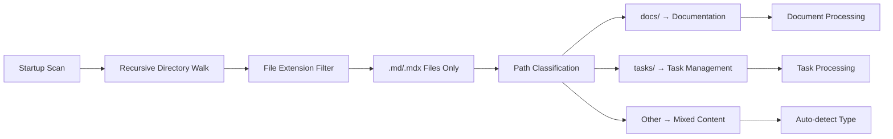

**Supported File Extensions:**

- `.md` - Standard Markdown files
- `.mdx` - MDX files with React components
- Frontmatter in both formats using YAML

## File Watching Implementation

### Chokidar Configuration

```typescript
// File watcher setup
const watcherConfig = {
  ignored: /node_modules|\.git|\.next/,
  persistent: true,
  ignoreInitial: true,
  recursive: true,
  awaitWriteFinish: {
    stabilityThreshold: 100,
    pollInterval: 50,
  },
};

// Watch specific directories
const watchPaths = [
  path.join(targetDir, "docs"),
  path.join(targetDir, "tasks"),
].filter(fs.existsSync);
```

### Event Handling Pipeline

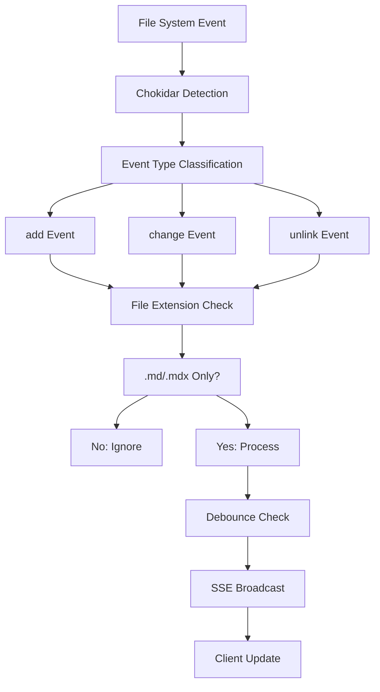

### Real-Time Communication

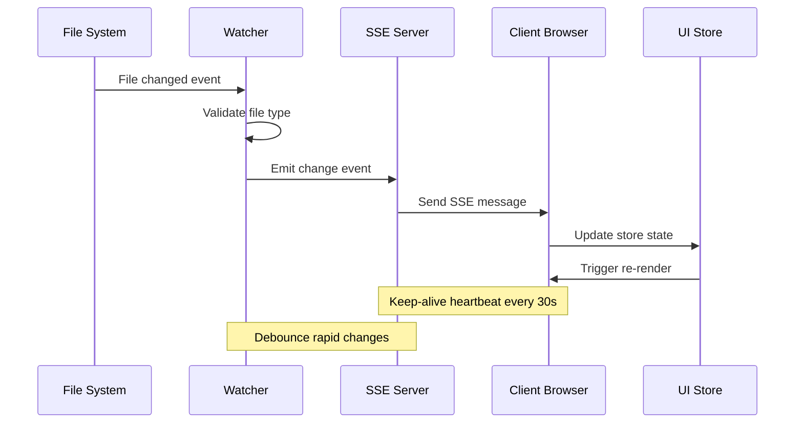

## File Processing Pipeline

### Content Parsing Stages

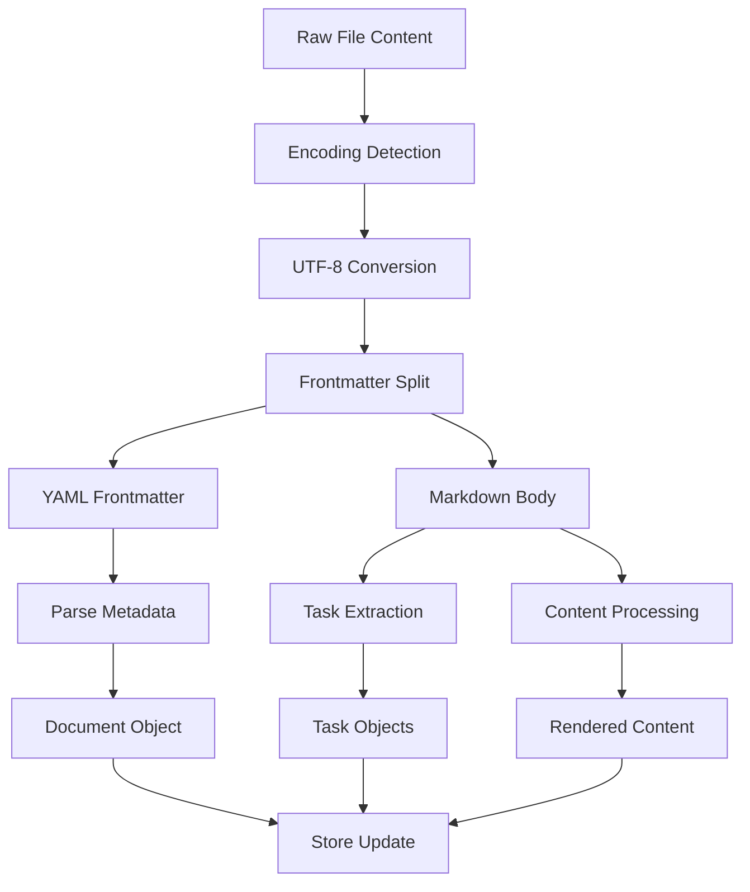

### Frontmatter Processing

```typescript
// Frontmatter extraction and validation
interface FrontmatterProcessor {
  detect: "Check for --- delimiters";
  extract: "Split YAML from content";
  parse: "yaml.parse() with error handling";
  validate: "Schema validation against known fields";
  merge: "Combine with defaults";
  normalize: "Convert to internal format";
}
```

**Example Processing:**

```yaml
---
title: "API Documentation"
type: "reference"
tags: ["api", "backend"]
priority: "high"
updated: "2024-01-15"
---
# API Documentation

Content goes here...
```

### Task Extraction Algorithm

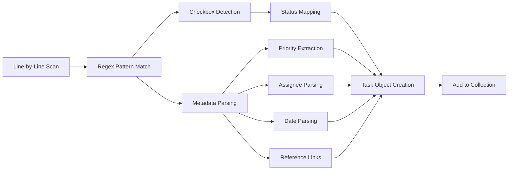

**Advanced Task Syntax:**

```markdown
- [ ] Simple task
- [x] Completed task {priority: high}
- [~] In progress task +john @2024-02-01
- [ ] Complex task (high) +jane @next-week #frontend ref:epics/auth
```

**Parsing Rules:**

- `{metadata}` - JSON-like metadata block
- `(priority)` - Priority shorthand: (low), (medium), (high)
- `+username` - Assignee designation
- `@date` - Due date (ISO format or natural language)
- `#tag` - Tags for categorization
- `ref:path` - Cross-references to other files

## File System Operations

### Read Operations

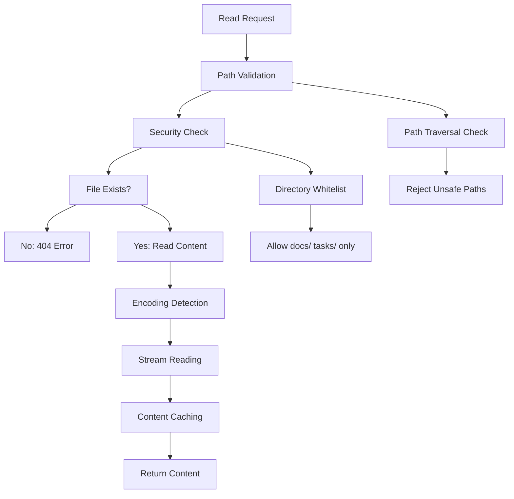

### Write Operations

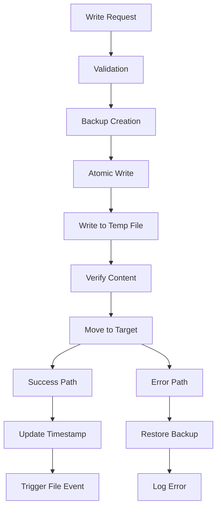

**Write Safety Measures:**

- Atomic operations using temporary files
- Automatic backup creation before changes
- Content validation before committing
- Rollback capability on errors

### File Synchronization

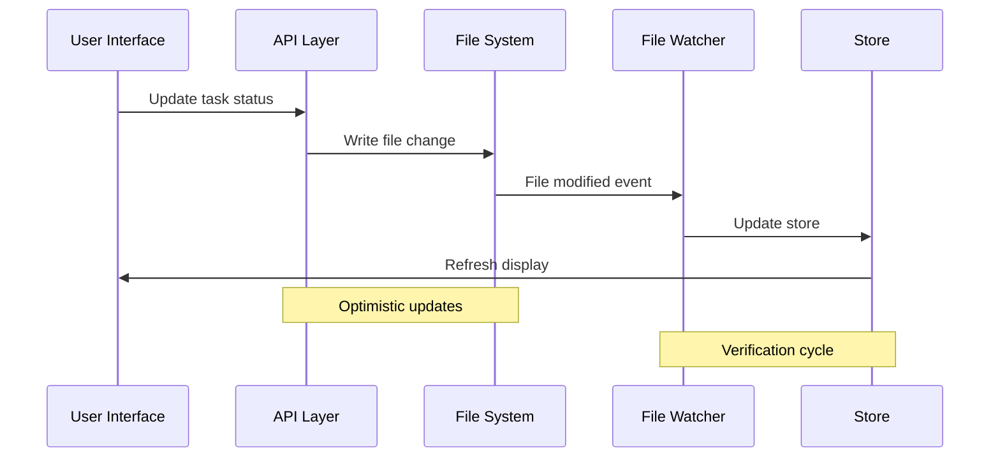

## Error Handling & Recovery

### File System Errors

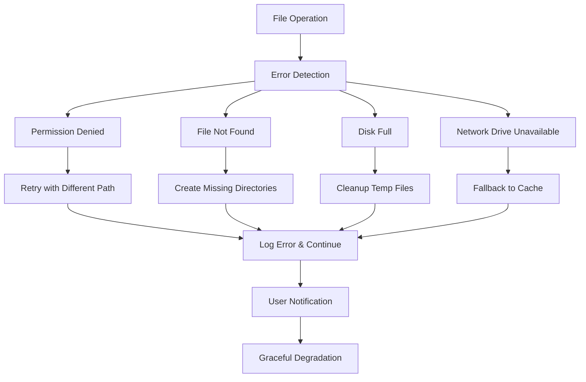

### Content Parsing Errors

```typescript
// Error recovery strategies
interface ErrorRecovery {
  yamlError: "Skip frontmatter, use filename as title";
  mdxError: "Fall back to plain markdown rendering";
  taskParseError: "Skip malformed tasks, continue processing";
  encodingError: "Try different encodings, default to UTF-8";
  memoryError: "Process files in smaller batches";
}
```

### Recovery Mechanisms

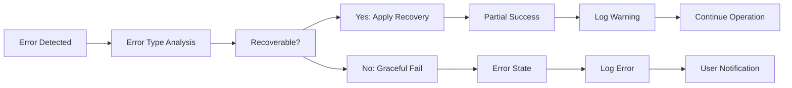

## Performance Optimization

### File Watching Performance

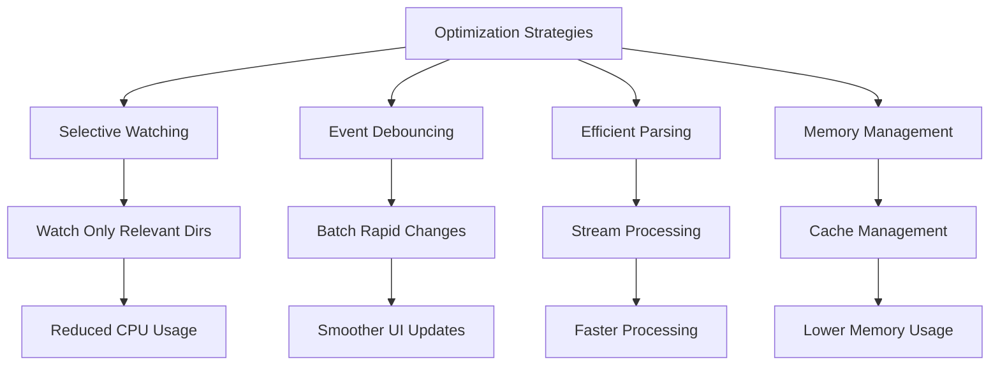

### Caching Strategy

```typescript
// Multi-level caching approach
interface CacheStrategy {
  parsed: "Cache parsed frontmatter and content";
  tasks: "Cache extracted task objects";
  rendered: "Cache compiled MDX components";
  metadata: "Cache file statistics and timestamps";
  invalidation: "Clear cache on file change";
}
```

### Batching Operations

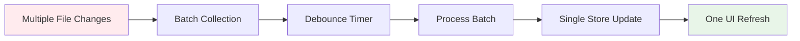

## Platform Considerations

### Cross-Platform File Watching

```typescript
// Platform-specific optimizations
const platformOptimizations = {
  windows: {
    usePolling: false,
    binaryInterval: 300,
    stabilityThreshold: 2000,
  },
  macos: {
    usePolling: false,
    useFsEvents: true,
    atomic: true,
  },
  linux: {
    usePolling: false,
    useInotify: true,
    atomic: true,
  },
};
```

### Path Handling

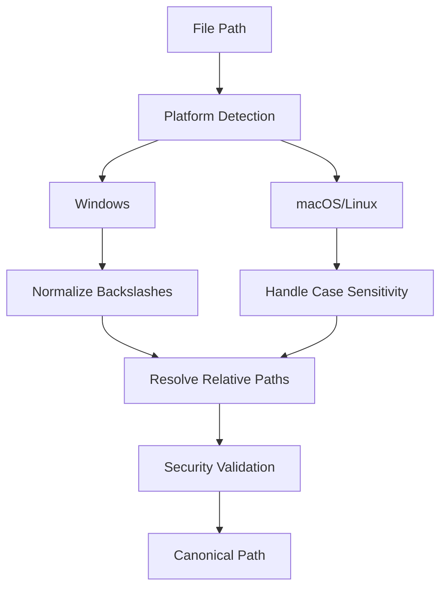

## Security Considerations

### Path Traversal Prevention

```typescript
// Security validation
function validatePath(requestedPath: string, baseDir: string): boolean {
  const resolved = path.resolve(baseDir, requestedPath);
  const relative = path.relative(baseDir, resolved);

  // Prevent directory traversal
  return !relative.startsWith("..") && !path.isAbsolute(relative);
}
```

### File Access Control

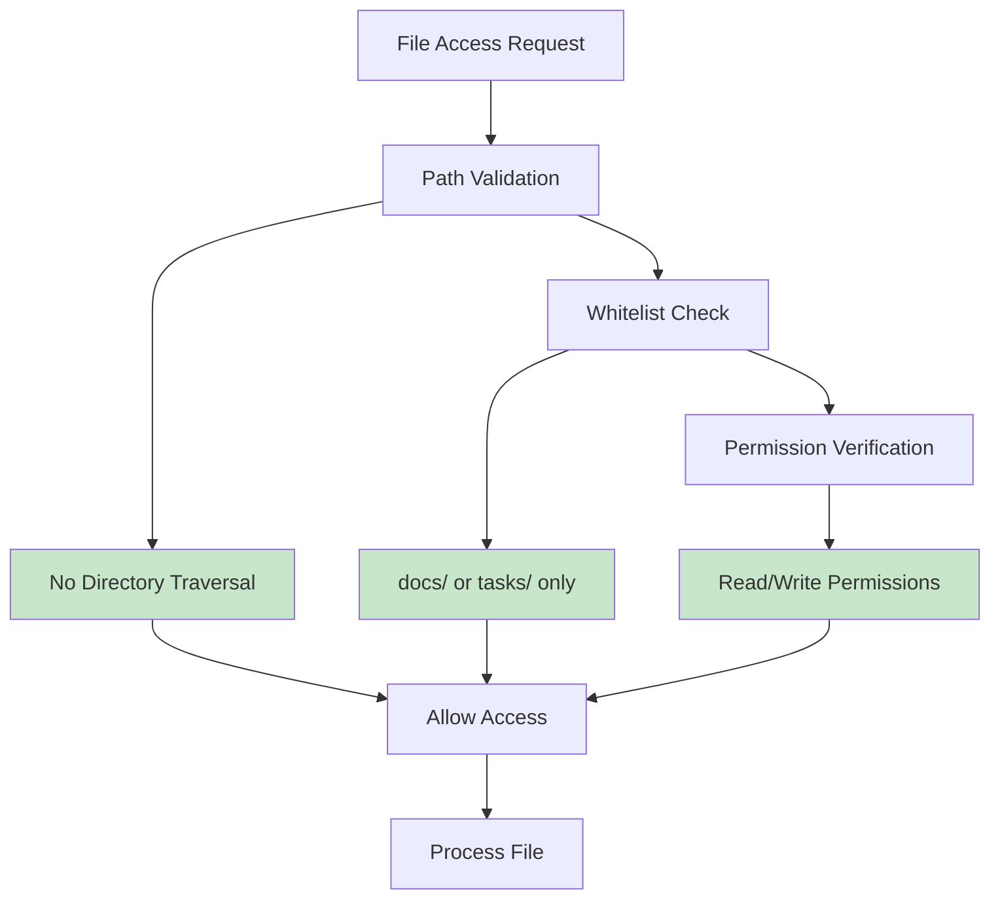

## Integration with Development Tools

### Git Integration

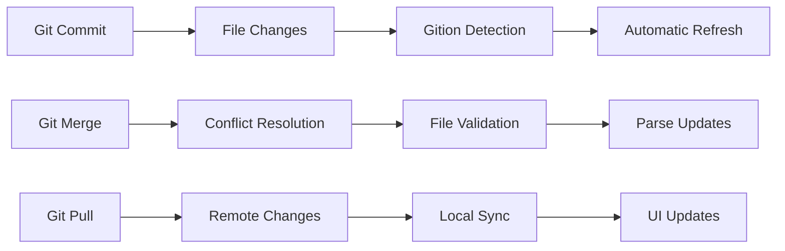

### IDE Integration

```typescript
// IDE file save detection
interface IDEIntegration {
  vscode: "Automatic save detection via file watcher";
  webstorm: "Safe write detection with stabilityThreshold";
  vim: "Multiple event detection for swap files";
  emacs: "Backup file filtering and main file detection";
}
```

### Build Tool Integration

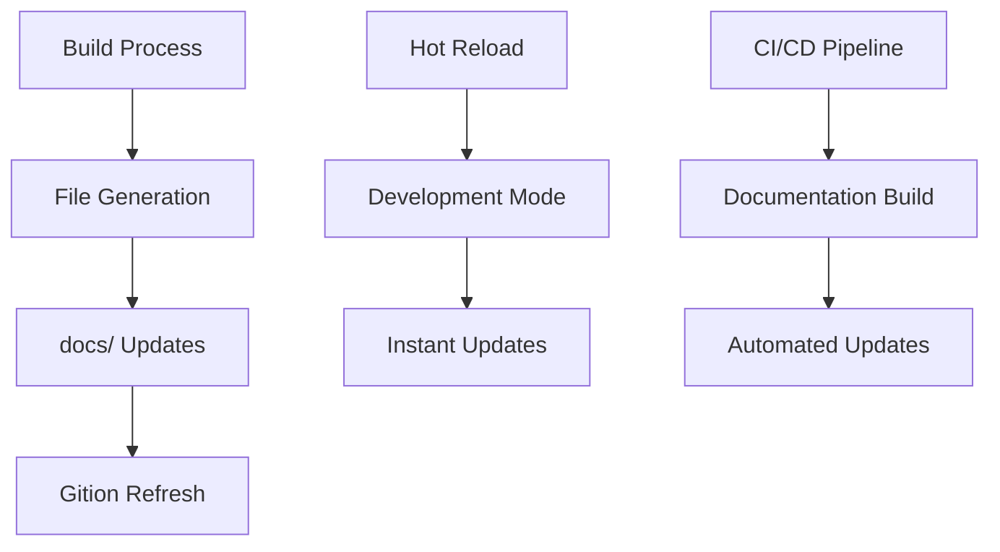

This file system integration ensures:

- **Real-time responsiveness** with sub-100ms update latency
- **Data integrity** through atomic operations and validation
- **Cross-platform compatibility** with optimized file watching
- **Security** through path validation and access control
- **Performance** via intelligent caching and batching
- **Reliability** with comprehensive error handling and recovery
