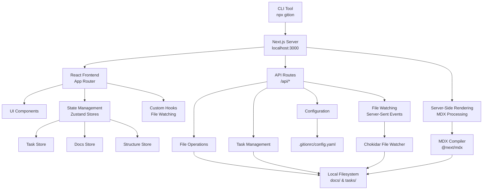
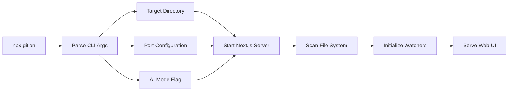
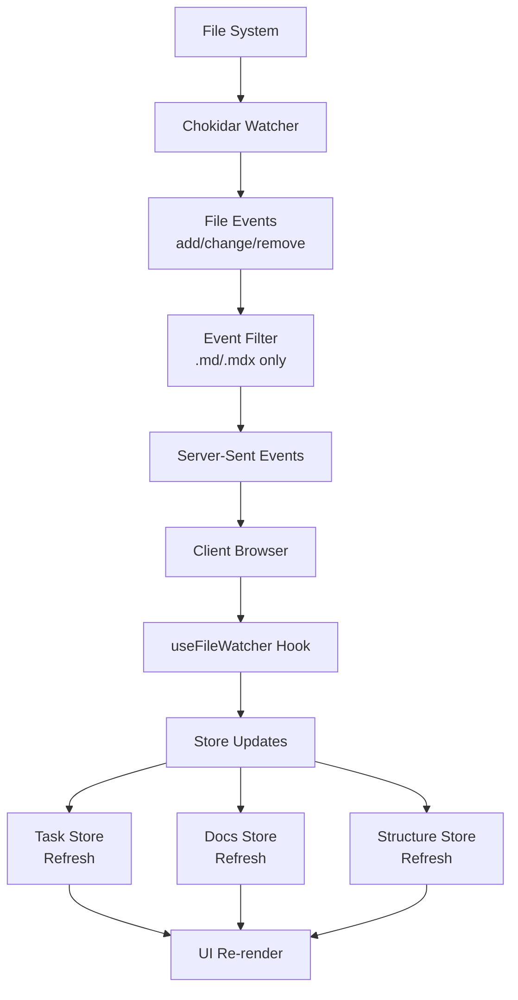
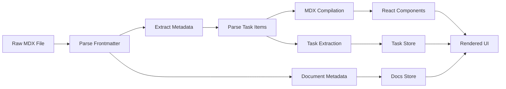
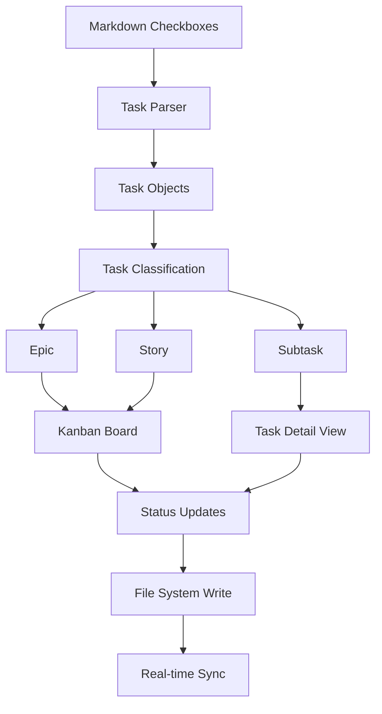
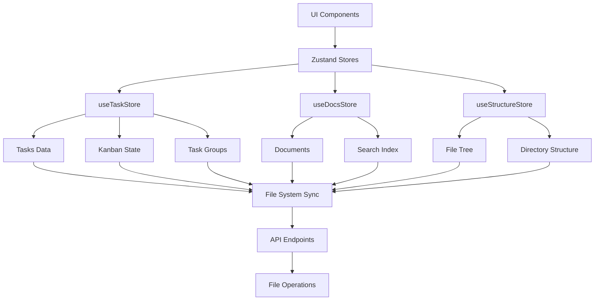
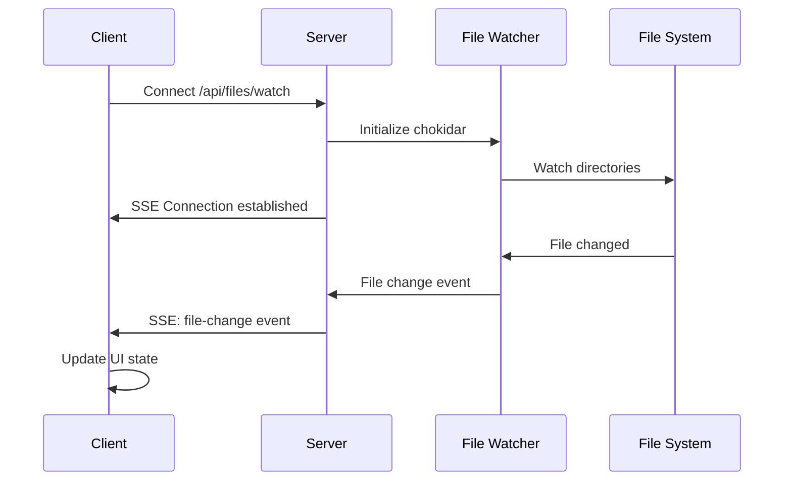
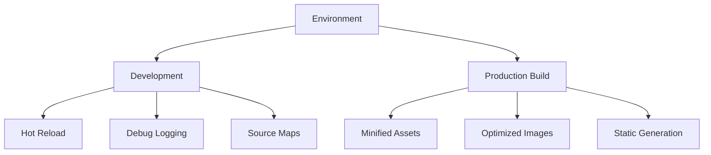
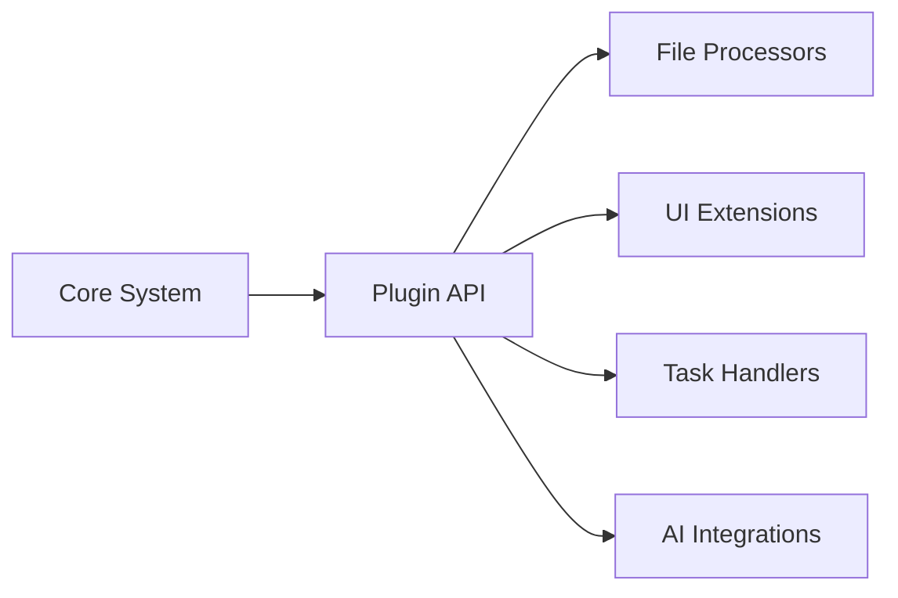

# Technical Architecture

Gition is a zero-configuration local web application that serves Markdown/MDX files directly from your filesystem with real-time task management capabilities. This document provides a comprehensive technical overview of the system architecture.

## System Overview



## Core Components

### 1. CLI Tool & Server



**Key Features:**

- Zero-configuration startup
- Automatic directory scanning for `.md` and `.mdx` files
- Configurable port binding
- AI-mode hooks for automation

### 2. File System Integration



**Implementation Details:**

- **Watcher**: Uses `chokidar` for cross-platform file watching
- **Events**: Real-time updates via Server-Sent Events (SSE)
- **Filtering**: Only processes `.md` and `.mdx` files
- **Debouncing**: Prevents excessive updates during rapid file changes

### 3. MDX Processing Pipeline



**Processing Steps:**

1. **Frontmatter Parsing**: Extract YAML metadata
2. **Task Extraction**: Parse checkbox items with advanced syntax
3. **MDX Compilation**: Convert to React components
4. **State Hydration**: Update Zustand stores
5. **UI Rendering**: Display in browser

### 4. Task Management System



**Task Syntax Support:**

```markdown
- [ ] Todo item
- [x] Completed item
- [~] In progress item
- [ ] Task with metadata {priority: high, assignee: "john", due: "2024-02-01"}
- [ ] Task with reference ref:epics/user-authentication
```

## Data Models

### Document Structure

```typescript
interface DocMeta {
  id: string; // Unique identifier
  title: string; // From frontmatter or H1
  slug: string; // URL-safe identifier
  path: string; // File system path
  frontmatter: Record<string, any>; // YAML frontmatter
  content: string; // Raw markdown content
  excerpt?: string; // Auto-generated excerpt
  lastModified: Date; // File modification time
  wordCount: number; // Content statistics
  readingTime: number; // Estimated reading time
}
```

### Task Structure

```typescript
interface TaskItem {
  id: string; // Unique task identifier
  title: string; // Task description
  completed: boolean; // Checkbox state
  status: "todo" | "in_progress" | "done";
  line: number; // Line number in file
  file: string; // Source file path
  type: "doc" | "epic" | "story" | "custom";
  folder?: string; // Organizing folder
  references?: string[]; // Cross-references
  metadata?: {
    // Extended metadata
    priority?: "low" | "medium" | "high";
    assignee?: string;
    due_date?: string;
    tags?: string[];
    estimate?: number;
  };
}
```

### Configuration Schema

```typescript
interface GitionConfig {
  name: string;
  description?: string;
  docsDir: string; // Documentation directory
  tasksDir: string; // Tasks directory
  theme: {
    primaryColor: string;
    darkMode: boolean;
  };
  features: {
    taskManagement: boolean;
    realTimeUpdates: boolean;
    search: boolean;
  };
  taskTypes: Array<{
    name: string;
    folder: string;
    icon: string;
  }>;
  users?: Array<{
    name: string;
    email: string;
  }>;
  defaultLanguage: string;
}
```

## State Management Architecture



**Store Responsibilities:**

- **Task Store**: Task data, kanban state, CRUD operations
- **Docs Store**: Document metadata, search functionality
- **Structure Store**: File system tree, navigation state

## API Architecture

### RESTful Endpoints

```mermaid
graph LR
    A[Frontend] --> B[API Routes]

    B --> C[/api/tasks]
    B --> D[/api/docs]
    B --> E[/api/config]
    B --> F[/api/files/watch]

    C --> G[Task CRUD]
    D --> H[Doc Retrieval]
    E --> I[Config Management]
    F --> J[Real-time Events]

    G --> K[File System]
    H --> K
    I --> L[Config Files]
    J --> M[Chokidar Watcher]
```

### Real-time Communication



## Performance Optimizations

### 1. File Processing

- **Debounced Updates**: Prevent excessive re-renders during file changes
- **Selective Parsing**: Only process relevant file types
- **Caching**: Cache processed MDX content
- **Lazy Loading**: Load documents on demand

### 2. UI Rendering

- **React Server Components**: Reduce client-side JavaScript
- **Memoization**: Prevent unnecessary re-renders
- **Virtual Scrolling**: Handle large document lists
- **Scroll Preservation**: Maintain user context during updates

### 3. Memory Management

- **Connection Cleanup**: Properly close SSE connections
- **Watcher Lifecycle**: Clean up file watchers when unused
- **Store Optimization**: Efficient state updates

## Security Considerations

### Local-First Design

- **No External APIs**: All data stays on local machine
- **File System Sandbox**: Restricted to specified directories
- **Path Validation**: Prevent directory traversal attacks
- **Content Sanitization**: Safe MDX rendering

### Development vs Production



## Extensibility Points

### 1. Plugin Architecture (Planned)



### 2. Hook System

```typescript
interface PluginHooks {
  onFileLoad?: (doc: DocMeta) => void;
  onFileChange?: (path: string) => void;
  onTaskToggle?: (task: TaskItem) => void;
  onTaskCreate?: (task: TaskItem) => void;
  onTaskUpdate?: (task: TaskItem) => void;
}
```

### 3. Configuration Extensions

- Custom task types and workflows
- Theme customization
- Feature toggles
- Directory structure overrides

## Deployment Patterns

### Local Development

```bash
# Standard development
pnpm dev

# CLI testing
npx gition ./my-docs --port 3001
```

### Production Usage

```bash
# Global installation
npm install -g gition-ui

# Project-specific usage
npx gition-ui ./project-docs
```

### Docker Integration (Future)

```dockerfile
FROM node:18-alpine
COPY . /app
WORKDIR /app
RUN npm install -g gition-ui
EXPOSE 3000
CMD ["gition-ui", "/docs", "--port", "3000"]
```

## Monitoring & Debugging

### Development Tools

- **React DevTools**: Component state inspection
- **Network Tab**: API request monitoring
- **Console Logging**: File watcher events
- **TypeScript**: Compile-time error checking

### Performance Monitoring

```typescript
// Built-in performance tracking
interface PerformanceMetrics {
  fileWatchLatency: number;
  mdxParseTime: number;
  taskExtractionTime: number;
  uiRenderTime: number;
}
```

## Future Architecture Enhancements

### Planned Features

- **Collaboration Support**: Multi-user editing with conflict resolution
- **Plugin Ecosystem**: Third-party extensions
- **Enhanced Search**: Full-text search with indexing
- **AI Integration**: Smart content suggestions and automation
- **Cloud Sync**: Optional cloud backup and sync

### Scalability Considerations

- **Large File Sets**: Efficient handling of 1000+ documents
- **Memory Usage**: Optimized for long-running sessions
- **Network Efficiency**: Minimal bandwidth usage for updates
- **Cross-Platform**: Consistent behavior across operating systems
