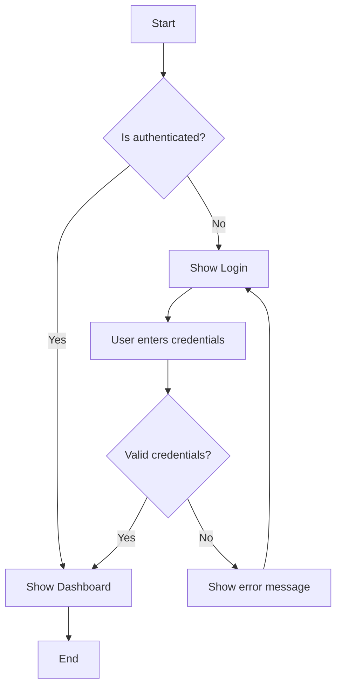
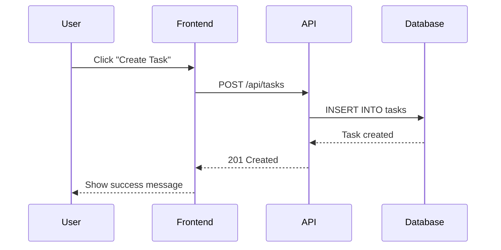
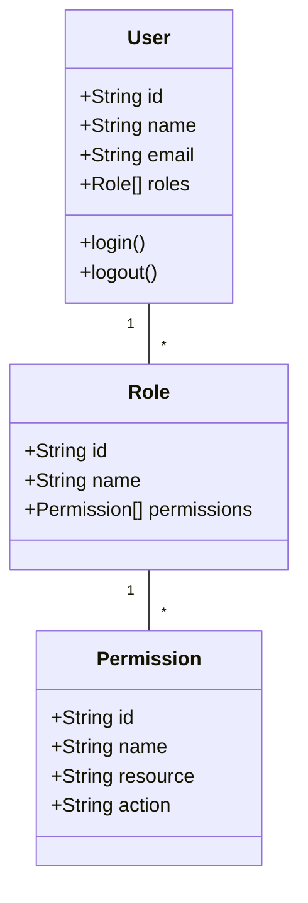

# Enhanced Rendering Test

This document tests all the enhanced features of our new markdown renderer.

## Code Blocks with Syntax Highlighting

Here are some examples of syntax highlighted code blocks:

### JavaScript
```javascript
const greetings = {
  english: "Hello World!",
  french: "Bonjour le monde!",
  spanish: "¡Hola mundo!"
};

function greet(language = 'english') {
  return greetings[language] || greetings.english;
}

console.log(greet('french')); // Bonjour le monde!
```

### TypeScript
```typescript
interface User {
  id: number;
  name: string;
  email: string;
  roles: Role[];
}

interface Role {
  id: number;
  name: string;
  permissions: Permission[];
}

class UserService {
  private users: User[] = [];

  async createUser(userData: Omit<User, 'id'>): Promise<User> {
    const newUser: User = {
      id: Date.now(),
      ...userData
    };
    this.users.push(newUser);
    return newUser;
  }
}
```

### Python
```python
import asyncio
from typing import List, Optional

class TaskManager:
    def __init__(self):
        self.tasks: List[str] = []
    
    async def add_task(self, task: str) -> None:
        """Add a new task to the list"""
        self.tasks.append(task)
        print(f"Added task: {task}")
    
    async def complete_task(self, task_index: int) -> Optional[str]:
        """Mark a task as completed"""
        if 0 <= task_index < len(self.tasks):
            completed_task = self.tasks.pop(task_index)
            print(f"Completed task: {completed_task}")
            return completed_task
        return None

# Usage example
async def main():
    manager = TaskManager()
    await manager.add_task("Review documentation")
    await manager.complete_task(0)

if __name__ == "__main__":
    asyncio.run(main())
```

### Shell/Bash
```bash
#!/bin/bash

# Build and deploy script
set -e

echo "🚀 Starting deployment..."

# Install dependencies
npm install --production

# Build the application
npm run build

# Run tests
npm test

# Deploy to server
scp -r dist/ user@server:/var/www/app/

echo "✅ Deployment completed successfully!"
```

## Mermaid Diagrams

Here are some Mermaid diagram examples:

### Flowchart


### Sequence Diagram


### Class Diagram


## Enhanced Typography

### Headings
# Heading 1
## Heading 2
### Heading 3
#### Heading 4
##### Heading 5
###### Heading 6

### Lists

**Unordered list:**
- First item
- Second item with **bold text**
- Third item with *italic text*
- Nested list:
  - Nested item 1
  - Nested item 2
    - Deeply nested item

**Ordered list:**
1. First step
2. Second step
3. Third step with `inline code`
4. Final step

### Blockquotes

> This is a blockquote with some important information.
> 
> It can span multiple paragraphs and contain **formatted text**.

> **Important Note:** This is a special blockquote with emphasis.

### Tables

| Feature | Status | Priority | Assignee |
|---------|--------|----------|----------|
| Syntax Highlighting | ✅ Complete | High | Claude |
| Mermaid Diagrams | ✅ Complete | High | Claude |
| Custom Components | ✅ Complete | Medium | Claude |
| Enhanced Typography | ✅ Complete | Low | Claude |

### Links and References

Here are some example links:
- [External link to GitHub](https://github.com)
- [Internal documentation](./best-practices)
- [Email link](mailto:example@test.com)

### Horizontal Rules

Content above the rule.

---

Content below the rule.

## Custom Components

### Callouts (if implemented)

<div class="callout callout-info">
This is an info callout with important information.
</div>

<div class="callout callout-warning">
This is a warning callout - please pay attention!
</div>

<div class="callout callout-error">
This is an error callout indicating something went wrong.
</div>

<div class="callout callout-success">
This is a success callout celebrating an achievement!
</div>

### Custom Details/Summary

<details>
<summary>Click to expand this section</summary>

This content is hidden by default and can be expanded by clicking the summary.

It can contain:
- Multiple paragraphs
- Code blocks
- Lists
- Any other markdown content

```javascript
console.log("Hidden code example!");
```

</details>

## Advanced Features

### Inline Code
You can use `inline code` anywhere in your text, including variables like `const myVariable = 'value'`.

### Math (if supported)
Some mathematical expressions: E = mc²

### Emoji Support
🚀 📚 💻 ✅ ⚠️ ❌ 🎉

### Task Lists
- [x] Implement syntax highlighting
- [x] Add Mermaid diagram support
- [x] Create enhanced typography
- [ ] Add math equation support
- [ ] Implement custom React components
- [ ] Add image optimization

---

This completes our enhanced rendering test. All features should be properly displayed with improved styling and functionality!