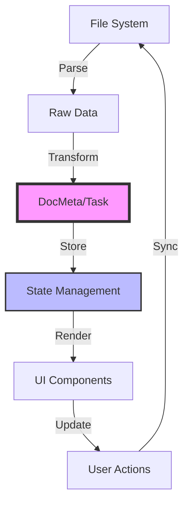
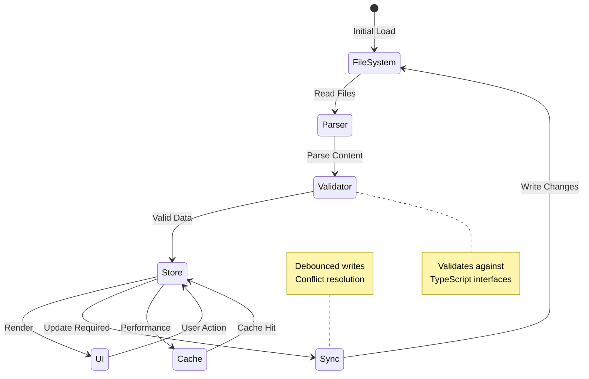

import { Badge } from "@/components/ui/badge";
import { Card, CardContent, CardHeader, CardTitle } from "@/components/ui/card";
import { Tabs, TabsContent, TabsList, TabsTrigger } from "@/components/ui/tabs";

# Data Models & Interfaces

<Badge variant="outline" className="mb-4">
  Version 1.2
</Badge>

This document defines the core data structures and TypeScript interfaces used throughout the gition system. Understanding these models is essential for plugin development and system integration.

## Overview

gition's data architecture follows a **type-safe**, **extensible** design pattern that enables:

- 🔒 **Type Safety**: Full TypeScript support with strict typing
- 🔄 **Real-time Sync**: Two-way binding between UI and filesystem
- 🎯 **Performance**: Optimized in-memory structures
- 🔌 **Extensibility**: Plugin-friendly interfaces



## Core Interfaces

<Tabs defaultValue="document" className="mb-6">
  <TabsList>
    <TabsTrigger value="document">Document</TabsTrigger>
    <TabsTrigger value="task">Task</TabsTrigger>
    <TabsTrigger value="plugin">Plugin</TabsTrigger>
  </TabsList>
  
  <TabsContent value="document">
    <Card>
      <CardHeader>
        <CardTitle>Document Metadata Interface</CardTitle>
      </CardHeader>
      <CardContent>
        ```typescript
        interface DocMeta {
          // Core identifiers
          slug: string;              // path-based identifier (e.g., "docs/architecture/system-overview")
          title: string;             // frontmatter title or derived from filename
          filePath: string;          // absolute path to source file
          
          // Content metadata
          description?: string;      // optional description from frontmatter
          excerpt?: string;          // auto-generated excerpt from content
          content?: string;          // parsed MDX content (optional for performance)
          
          // Categorization
          tags?: string[];           // ["architecture", "overview", "system-design"]
          category?: string;         // primary category
          related?: string[];        // related document slugs
          
          // Status and workflow
          status?: DocumentStatus;   // "draft" | "review" | "published" | "archived"
          priority?: Priority;       // "low" | "medium" | "high" | "critical"
          
          // Attribution
          author?: string;           // document author
          reviewers?: string[];      // list of reviewers
          contributors?: string[];   // additional contributors
          
          // Temporal data
          date?: string;             // creation or publication date (ISO 8601)
          lastModified?: string;     // last modification timestamp (ISO 8601)
          version?: string;          // semantic version (e.g., "1.2.0")
          
          // Analytics
          readingTime?: string;      // estimated reading time
          wordCount?: number;        // total word count
          viewCount?: number;        // number of views (plugin-managed)
          
          // System metadata
          updatedAt: Date;           // last filesystem modification
          createdAt?: Date;          // file creation timestamp
          size?: number;             // file size in bytes
          
          // Localization
          language?: string;         // ISO 639-1 language code
          translations?: Record<string, string>; // slug mappings for other languages
          
          // Search optimization
          searchKeywords?: string[]; // additional keywords for search
          seoTitle?: string;         // SEO-optimized title
          seoDescription?: string;   // SEO meta description
          
          // UI hints
          toc?: boolean;             // show table of contents
          wide?: boolean;            // use wide layout
          hero?: string;             // hero image URL
        }
        ```
      </CardContent>
    </Card>
  </TabsContent>
  
  <TabsContent value="task">
    <Card>
      <CardHeader>
        <CardTitle>Task Schema Interface</CardTitle>
      </CardHeader>
      <CardContent>
        ```typescript
        interface Task {
          // Identification
          id: string;                // unique identifier: `${filePath}:${lineNumber}`
          title: string;             // task description text
          
          // Status tracking
          status: TaskStatus;        // "todo" | "in-progress" | "done" | "blocked" | "cancelled"
          priority?: Priority;       // "low" | "medium" | "high" | "critical"
          
          // Source reference
          filePath: string;          // source file path
          lineNumber: number;        // line number in source file
          indentLevel?: number;      // nesting level (0 = root)
          
          // Task metadata
          labels?: string[];         // ["frontend", "bug", "enhancement"]
          assignee?: string;         // assigned person or team
          reporter?: string;         // task creator
          
          // Time management
          due?: string;              // due date (ISO 8601: "2024-02-01T10:00:00Z")
          scheduled?: string;        // scheduled start (ISO 8601)
          estimatedHours?: number;   // time estimate in hours
          actualHours?: number;      // actual time spent
          
          // Relationships
          parentTask?: string;       // parent task ID for subtasks
          subtasks?: string[];       // child task IDs
          blockedBy?: string[];      // blocking task IDs
          blocks?: string[];         // tasks this blocks
          relatedTasks?: string[];   // related but not dependent
          
          // Progress tracking
          progress?: number;         // percentage complete (0-100)
          completedAt?: string;      // completion timestamp (ISO 8601)
          
          // Additional context
          description?: string;      // extended description
          acceptanceCriteria?: string[]; // definition of done
          comments?: Comment[];      // discussion thread
          attachments?: Attachment[]; // related files
          
          // Workflow
          workflow?: string;         // custom workflow identifier
          stage?: string;            // current workflow stage
          transitions?: string[];    // allowed status transitions
          
          // Timestamps
          createdAt: Date;           // task creation timestamp
          updatedAt: Date;           // last modification timestamp
          
          // Analytics
          cycleTime?: number;        // time in current status (ms)
          leadTime?: number;         // total time from creation (ms)
          
          // Integration
          externalId?: string;       // ID in external system
          externalUrl?: string;      // link to external system
          syncStatus?: SyncStatus;   // sync state with external
        }
        ```
      </CardContent>
    </Card>
  </TabsContent>
  
  <TabsContent value="plugin">
    <Card>
      <CardHeader>
        <CardTitle>Plugin System Interfaces</CardTitle>
      </CardHeader>
      <CardContent>
        ```typescript
        interface PluginHooks {
          // Document lifecycle
          onFileLoad?: (doc: DocMeta) => void | Promise<void>;
          onFileChange?: (event: FileChangeEvent) => void | Promise<void>;
          onDocumentCreate?: (doc: DocMeta) => void | Promise<void>;
          onDocumentDelete?: (path: string) => void | Promise<void>;
          onDocumentRender?: (doc: DocMeta, content: string) => string | Promise<string>;
          
          // Task lifecycle
          onTaskCreate?: (task: Task) => void | Promise<void>;
          onTaskToggle?: (task: Task, previousStatus: TaskStatus) => void | Promise<void>;
          onTaskUpdate?: (task: Task, changes: Partial<Task>) => void | Promise<void>;
          onTaskDelete?: (taskId: string) => void | Promise<void>;
          
          // System events
          onStartup?: (config: GitionConfig) => void | Promise<void>;
          onShutdown?: () => void | Promise<void>;
          onConfigChange?: (newConfig: GitionConfig, oldConfig: GitionConfig) => void | Promise<void>;
          
          // UI extensions
          onRouteChange?: (route: string) => void | Promise<void>;
          registerComponents?: () => Record<string, React.ComponentType>;
          registerCommands?: () => Command[];
        }
        ```
      </CardContent>
    </Card>
  </TabsContent>
</Tabs>

## Enums & Type Definitions

### Status Types

<div className="grid grid-cols-1 md:grid-cols-2 gap-4 my-6">
  <Card>
    <CardHeader>
      <CardTitle>Document Status</CardTitle>
    </CardHeader>
    <CardContent>
      ```typescript type DocumentStatus = | "draft" // Work in progress |
      "review" // Ready for review | "published" // Published and current |
      "archived"; // No longer current ```
    </CardContent>
  </Card>

  <Card>
    <CardHeader>
      <CardTitle>Task Status</CardTitle>
    </CardHeader>
    <CardContent>
      ```typescript type TaskStatus = | "todo" // Not started | "in-progress" //
      Being worked on | "done" // Completed | "blocked" // Cannot proceed |
      "cancelled"; // No longer needed ```
    </CardContent>
  </Card>
</div>

### Priority Levels

```typescript
type Priority = "low" | "medium" | "high" | "critical";

// Visual mapping
const priorityConfig = {
  low: { color: "blue", icon: "○", weight: 1 },
  medium: { color: "yellow", icon: "◐", weight: 2 },
  high: { color: "orange", icon: "●", weight: 3 },
  critical: { color: "red", icon: "⚠", weight: 4 },
};
```

## Implementation Examples

### Task Extraction from Markdown

Here's how tasks are parsed from MDX content:

```typescript
// Example MDX content
const mdxContent = `
## Project Setup

- [x] Initialize repository @john due:2024-01-15T10:00:00Z
- [ ] Configure CI/CD pipeline @sarah #devops priority:high
  - [ ] Set up GitHub Actions
  - [ ] Configure test runners
- [~] Design system architecture #blocked
`;

// Parsed result
const extractedTasks: Task[] = [
  {
    id: "project-setup.mdx:5",
    title: "Initialize repository",
    status: "done",
    assignee: "john",
    due: "2024-01-15T10:00:00Z",
    filePath: "project-setup.mdx",
    lineNumber: 5,
  },
  {
    id: "project-setup.mdx:6",
    title: "Configure CI/CD pipeline",
    status: "todo",
    assignee: "sarah",
    labels: ["devops"],
    priority: "high",
    filePath: "project-setup.mdx",
    lineNumber: 6,
    subtasks: ["project-setup.mdx:7", "project-setup.mdx:8"],
  },
];
```

## State Management Architecture



## Real-time Sync Implementation

### Debounced File Writing

```typescript
class SyncManager {
  private writeQueue = new Map<string, NodeJS.Timeout>();

  async updateTask(task: Task): Promise<void> {
    // Cancel pending write for this file
    const existing = this.writeQueue.get(task.filePath);
    if (existing) clearTimeout(existing);

    // Schedule new write with 500ms debounce
    const timeout = setTimeout(async () => {
      await this.writeTaskToFile(task);
      this.writeQueue.delete(task.filePath);
    }, 500);

    this.writeQueue.set(task.filePath, timeout);
  }
}
```

## Performance Considerations

### Memory Optimization

- [ ] Implement lazy loading for document content
- [ ] Use WeakMap for temporary caches
- [ ] Paginate large task lists
- [ ] Virtual scrolling for UI components

### Query Performance

```typescript
// Optimized task query with indexing
class TaskIndex {
  private byStatus = new Map<TaskStatus, Set<string>>();
  private byAssignee = new Map<string, Set<string>>();
  private byPriority = new Map<Priority, Set<string>>();

  query(filters: TaskFilters): Task[] {
    let resultIds = new Set<string>();

    // Intersection of all filters
    if (filters.status) {
      resultIds = this.byStatus.get(filters.status) || new Set();
    }

    // ... additional filter logic

    return Array.from(resultIds).map((id) => this.tasks.get(id));
  }
}
```

## Migration Guide

### v1.0 to v1.2 Migration

Major changes in v1.2:

1. **New Fields**: Added `readingTime`, `wordCount`, `viewCount`
2. **ISO 8601 Dates**: All timestamps now use ISO format
3. **Extended Task Relations**: Added `blockedBy`, `blocks` arrays

```typescript
// Migration script example
function migrateToV12(oldTask: TaskV10): Task {
  return {
    ...oldTask,
    // Convert date strings to ISO 8601
    due: oldTask.dueDate ? new Date(oldTask.dueDate).toISOString() : undefined,
    // Add new relationship fields
    blockedBy: [],
    blocks: [],
    // Ensure timestamps exist
    createdAt: oldTask.createdAt || new Date(oldTask.updatedAt),
    updatedAt: new Date(oldTask.updatedAt),
  };
}
```

## Testing Strategies

### Type Safety Testing

```typescript
import { expectType } from "tsd";

// Compile-time type checking
expectType<DocMeta>({
  slug: "test-doc",
  title: "Test Document",
  filePath: "/path/to/test.mdx",
  updatedAt: new Date(),
});

// Runtime validation
const validateDocMeta = (data: unknown): data is DocMeta => {
  return (
    typeof data === "object" &&
    data !== null &&
    "slug" in data &&
    "title" in data &&
    "filePath" in data &&
    "updatedAt" in data
  );
};
```

## Related Resources

- [ ] [System Architecture Overview](./system-overview.mdx) - High-level system design
- [ ] [Plugin Development Guide](../general/plugin-development.mdx) - Build custom plugins
- [ ] [API Reference](../general/api-reference.mdx) - Complete API documentation
- [ ] [Performance Guide](../general/performance.mdx) - Optimization strategies

---

<Card className="mt-8 bg-gradient-to-r from-blue-50 to-indigo-50 dark:from-blue-950 dark:to-indigo-950">
  <CardContent className="pt-6">
    <div className="flex items-center space-x-2">
      <Badge>Pro Tip</Badge>
      <span className="text-sm">
        Use TypeScript's strict mode and enable all compiler checks to catch
        interface violations at build time.
      </span>
    </div>
  </CardContent>
</Card>
🔥 HOT RELOAD TEST - UPDATED TIMESTAMP: Sam 26 jul 2025 00:26:24 CEST
