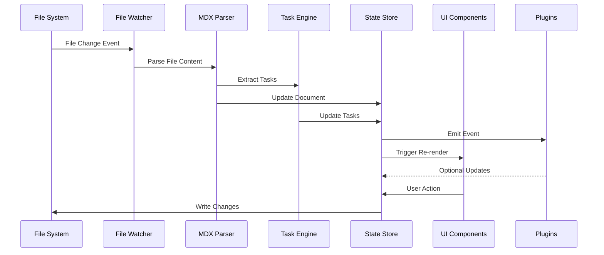
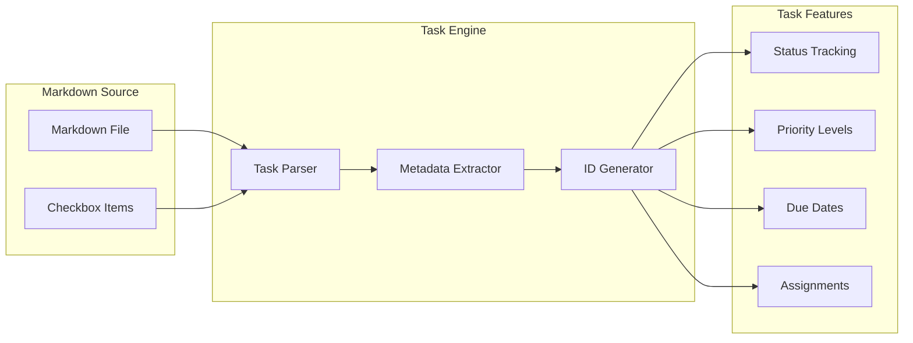
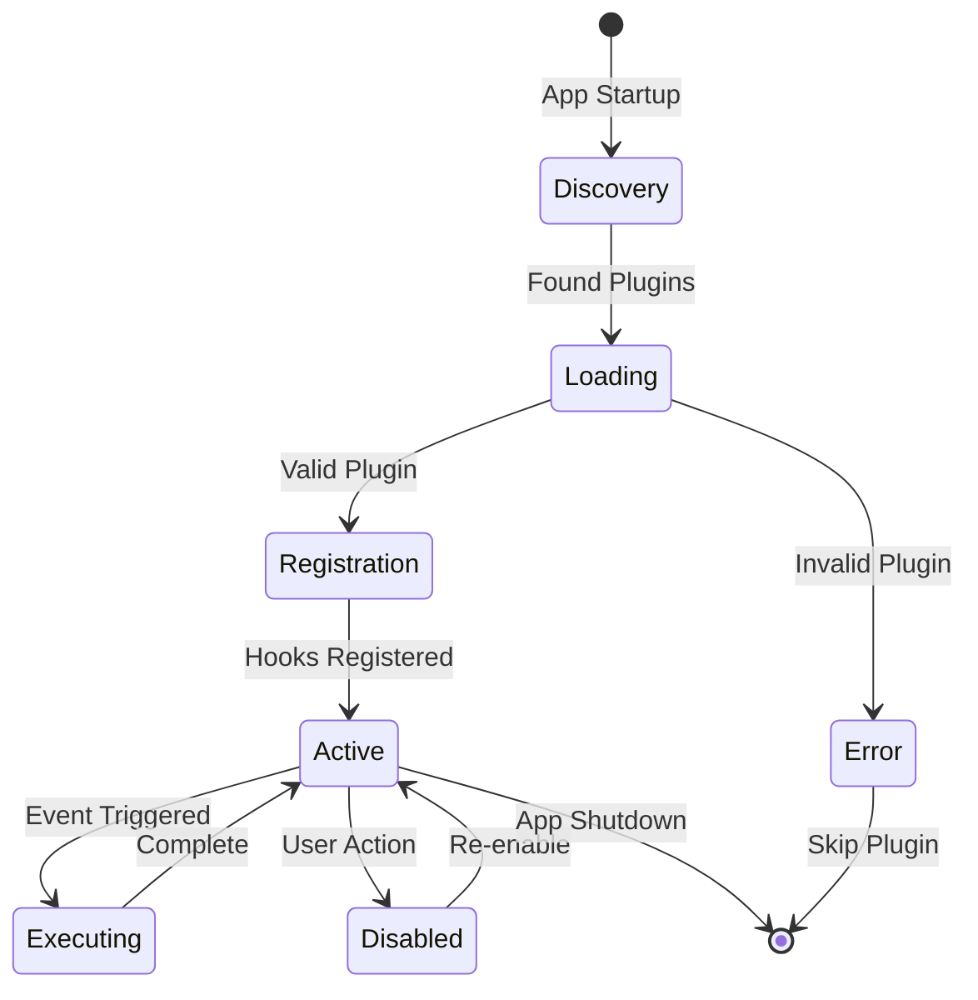
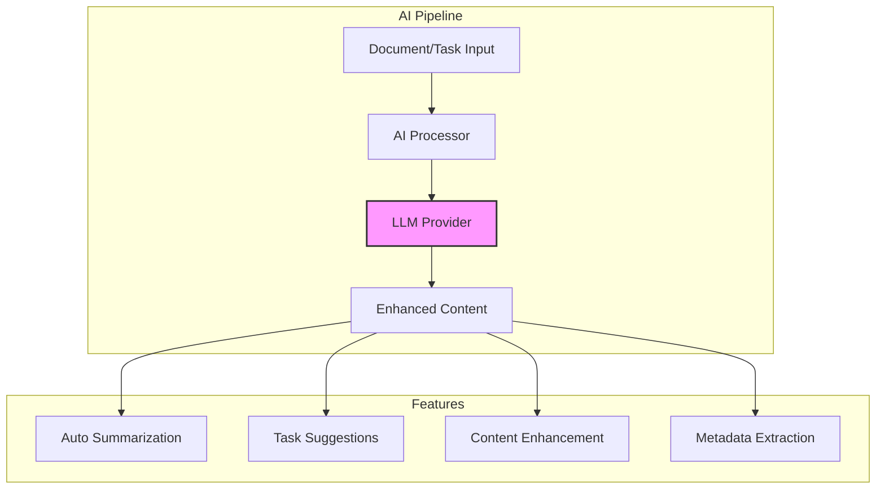

import { Alert, AlertDescription, AlertTitle } from "@/components/ui/alert";
import { Badge } from "@/components/ui/badge";
import { Card, CardContent, CardHeader, CardTitle } from "@/components/ui/card";
import { Tabs, TabsContent, TabsList, TabsTrigger } from "@/components/ui/tabs";

# System Architecture Overview

<div className="flex items-center gap-4 mb-6">
  <Badge variant="default">Core</Badge>
  <Badge variant="secondary">v2.0</Badge>
  <Badge variant="outline">Last Updated: Jan 20, 2024</Badge>
</div>

gition is designed as a **local-first** documentation and task management system that runs entirely on your machine. This document outlines the core architectural decisions and component interactions that make gition fast, reliable, and extensible.

<Alert className="mb-6">
  <AlertTitle>Architecture Principles</AlertTitle>
  <AlertDescription>
    Our architecture follows three core principles: **Local-First** (no cloud
    dependencies), **Real-Time** (instant file sync), and **Extensible**
    (plugin-friendly design).
  </AlertDescription>
</Alert>

## System Overview

```mermaid
graph TB
    subgraph "Local Machine"
        CLI[CLI Interface]
        Server[Next.js Server]
        FS[File System]
        FW[File Watcher]

        subgraph "Core Services"
            Parser[MDX Parser]
            TaskEngine[Task Engine]
            StateStore[State Store]
            PluginMgr[Plugin Manager]
        end

        subgraph "UI Layer"
            DocViewer[Document Viewer]
            Kanban[Kanban Board]
            Sidebar[File Explorer]
            Search[Search Engine]
        end
    end

    CLI -->|starts| Server
    Server -->|serves| UI Layer
    FW -->|monitors| FS
    FW -->|notifies| StateStore
    Parser -->|processes| FS
    TaskEngine -->|extracts from| Parser
    StateStore -->|updates| UI Layer
    PluginMgr -->|hooks into| StateStore

    style Server fill:#f9f,stroke:#333,stroke-width:4px
    style StateStore fill:#bbf,stroke:#333,stroke-width:2px
```

## Core Architecture Components

<Tabs defaultValue="server" className="mb-6">
  <TabsList className="grid w-full grid-cols-4">
    <TabsTrigger value="server">Server</TabsTrigger>
    <TabsTrigger value="filesystem">File System</TabsTrigger>
    <TabsTrigger value="state">State</TabsTrigger>
    <TabsTrigger value="plugins">Plugins</TabsTrigger>
  </TabsList>
  
  <TabsContent value="server">
    <Card>
      <CardHeader>
        <CardTitle>Next.js Local Server</CardTitle>
      </CardHeader>
      <CardContent>
        <div className="space-y-4">
          <div>
            <h4 className="font-semibold mb-2">Purpose</h4>
            <p>Serves the UI and handles MDX rendering with zero external dependencies.</p>
          </div>
          
          <div>
            <h4 className="font-semibold mb-2">Key Features</h4>
            <ul className="list-disc list-inside space-y-1">
              <li>Server-side rendering for MDX content</li>
              <li>File-based routing with App Router</li>
              <li>Hot reload during development</li>
              <li>Static optimization where possible</li>
            </ul>
          </div>
          
          <div>
            <h4 className="font-semibold mb-2">Implementation Tasks</h4>
            <div className="space-y-2 mt-2">
              - [x] Configure Next.js 14 with App Router
              - [x] Set up MDX processing pipeline
              - [x] Implement file-based routing
              - [ ] Add performance monitoring @high due:2024-02-01T10:00:00Z
              - [ ] Optimize bundle size @medium
            </div>
          </div>
        </div>
      </CardContent>
    </Card>
  </TabsContent>
  
  <TabsContent value="filesystem">
    <Card>
      <CardHeader>
        <CardTitle>File System Integration</CardTitle>
      </CardHeader>
      <CardContent>
        <div className="space-y-4">
          <div>
            <h4 className="font-semibold mb-2">Components</h4>
            <ul className="list-disc list-inside space-y-1">
              <li><strong>File Watcher</strong>: Uses `chokidar` for real-time monitoring</li>
              <li><strong>Document Scanner</strong>: Recursively scans for `.md` and `.mdx` files</li>
              <li><strong>Two-way Sync</strong>: Updates both UI state and file system</li>
            </ul>
          </div>
          
          <div>
            <h4 className="font-semibold mb-2">Performance Targets</h4>
            <div className="grid grid-cols-2 gap-4 mt-2">
              <div className="p-3 bg-gray-50 dark:bg-gray-900 rounded">
                <div className="text-sm text-gray-600 dark:text-gray-400">File Detection</div>
                <div className="text-2xl font-bold">&lt; 50ms</div>
              </div>
              <div className="p-3 bg-gray-50 dark:bg-gray-900 rounded">
                <div className="text-sm text-gray-600 dark:text-gray-400">UI Update</div>
                <div className="text-2xl font-bold">&lt; 100ms</div>
              </div>
            </div>
          </div>
          
          <div>
            <h4 className="font-semibold mb-2">Integration Tasks</h4>
            <div className="space-y-2 mt-2">
              - [x] Implement file watcher with chokidar
              - [x] Create document scanner service
              - [ ] Add debouncing for rapid changes @critical due:2024-01-25T09:00:00Z
              - [ ] Handle symlinks and permissions @high
              - [~] Optimize for large directories @blocked
            </div>
          </div>
        </div>
      </CardContent>
    </Card>
  </TabsContent>
  
  <TabsContent value="state">
    <Card>
      <CardHeader>
        <CardTitle>State Management</CardTitle>
      </CardHeader>
      <CardContent>
        <div className="space-y-4">
          <div>
            <h4 className="font-semibold mb-2">Architecture</h4>
            <p>In-memory store using Zustand for React state management with persistence.</p>
          </div>
          
          <div>
            <h4 className="font-semibold mb-2">State Structure</h4>
            ```typescript
            interface AppState {
              documents: Map<string, DocMeta>;
              tasks: Map<string, Task>;
              directoryTree: DirectoryNode;
              currentDocument?: string;
              filters: FilterState;
              ui: UIState;
            }
            ```
          </div>
          
          <div>
            <h4 className="font-semibold mb-2">State Tasks</h4>
            <div className="space-y-2 mt-2">
              - [x] Design state structure
              - [x] Implement Zustand store
              - [ ] Add state persistence @high
              - [ ] Implement undo/redo @medium due:2024-02-15T12:00:00Z
              - [ ] Add state debugging tools @low
            </div>
          </div>
        </div>
      </CardContent>
    </Card>
  </TabsContent>
  
  <TabsContent value="plugins">
    <Card>
      <CardHeader>
        <CardTitle>Plugin Architecture</CardTitle>
      </CardHeader>
      <CardContent>
        <div className="space-y-4">
          <div>
            <h4 className="font-semibold mb-2">Hook System</h4>
            <p>Event-driven architecture allows plugins to react to system events.</p>
          </div>
          
          <div>
            <h4 className="font-semibold mb-2">Available Hooks</h4>
            <ul className="list-disc list-inside space-y-1">
              <li><code>onFileLoad</code> - Document loaded</li>
              <li><code>onFileChange</code> - File modified</li>
              <li><code>onTaskToggle</code> - Task status changed</li>
              <li><code>onDocumentCreate</code> - New document</li>
              <li><code>onDocumentDelete</code> - Document removed</li>
            </ul>
          </div>
          
          <div>
            <h4 className="font-semibold mb-2">Plugin Development</h4>
            <div className="space-y-2 mt-2">
              - [ ] Design plugin API @critical due:2024-01-30T14:00:00Z
              - [ ] Implement plugin loader @high
              - [ ] Create plugin sandbox @high
              - [ ] Build plugin marketplace @medium
              - [ ] Add plugin versioning @low
            </div>
          </div>
        </div>
      </CardContent>
    </Card>
  </TabsContent>
</Tabs>

## Data Flow Architecture

The following diagram shows how data flows through the system from file changes to UI updates:



## Component Architecture Breakdown

### Document Processing Pipeline

<Alert className="mb-4" variant="info">
  <AlertTitle>Processing Steps</AlertTitle>
  <AlertDescription>
    Each document goes through a 5-stage processing pipeline for optimal
    performance and feature extraction.
  </AlertDescription>
</Alert>

<div className="space-y-4">
  <div className="flex items-center gap-4">
    <Badge
      variant="outline"
      className="w-8 h-8 rounded-full p-0 flex items-center justify-center"
    >
      1
    </Badge>
    <div className="flex-1">
      <h4 className="font-semibold">File Discovery</h4>
      <p className="text-sm text-gray-600 dark:text-gray-400">
        Scan directories for .md/.mdx files
      </p>
      - [x] Recursive directory scanning - [x] File type filtering - [ ]
      Gitignore respect @medium
    </div>
  </div>

  <div className="flex items-center gap-4">
    <Badge
      variant="outline"
      className="w-8 h-8 rounded-full p-0 flex items-center justify-center"
    >
      2
    </Badge>
    <div className="flex-1">
      <h4 className="font-semibold">Frontmatter Parsing</h4>
      <p className="text-sm text-gray-600 dark:text-gray-400">
        Extract metadata using gray-matter
      </p>
      - [x] Parse YAML frontmatter - [x] Validate required fields - [ ] Schema
      validation @high due:2024-01-28T11:00:00Z
    </div>
  </div>

  <div className="flex items-center gap-4">
    <Badge
      variant="outline"
      className="w-8 h-8 rounded-full p-0 flex items-center justify-center"
    >
      3
    </Badge>
    <div className="flex-1">
      <h4 className="font-semibold">Task Extraction</h4>
      <p className="text-sm text-gray-600 dark:text-gray-400">
        Find and parse checkbox items
      </p>
      - [x] Extract checkbox syntax - [ ] Parse task metadata @critical
      due:2024-01-26T15:00:00Z - [ ] Handle nested tasks @high
    </div>
  </div>

  <div className="flex items-center gap-4">
    <Badge
      variant="outline"
      className="w-8 h-8 rounded-full p-0 flex items-center justify-center"
    >
      4
    </Badge>
    <div className="flex-1">
      <h4 className="font-semibold">MDX Compilation</h4>
      <p className="text-sm text-gray-600 dark:text-gray-400">
        Compile MDX with custom components
      </p>
      - [x] MDX to React compilation - [x] Component registration - [x] Syntax
      highlighting
    </div>
  </div>

  <div className="flex items-center gap-4">
    <Badge
      variant="outline"
      className="w-8 h-8 rounded-full p-0 flex items-center justify-center"
    >
      5
    </Badge>
    <div className="flex-1">
      <h4 className="font-semibold">State Update</h4>
      <p className="text-sm text-gray-600 dark:text-gray-400">
        Update in-memory state and UI
      </p>
      - [x] Update document store - [ ] Invalidate caches @medium - [ ] Emit
      plugin events @high
    </div>
  </div>
</div>

### Task Management System

The task system is at the heart of gition's project management capabilities:



#### Task Syntax Examples

```markdown
## Sprint 2024-W4 Tasks

### High Priority 🔴

- [ ] Implement user authentication @sarah #security due:2024-01-25T10:00:00Z
  - [x] Set up OAuth provider
  - [ ] Create login UI components
  - [ ] Add session management
- [~] Review security audit findings @alex #security #blocked

### Medium Priority 🟡

- [ ] Optimize bundle size @mike #performance due:2024-02-01T14:00:00Z
- [x] Fix navigation menu on mobile @lisa #bug

### Low Priority 🔵

- [ ] Update documentation screenshots #docs
- [ ] Add telemetry for feature usage #analytics
```

## Plugin System Architecture

### Plugin Lifecycle



### Example Plugin Implementation

```typescript
// plugins/task-analytics.ts
export const plugin = {
  name: "task-analytics",
  version: "1.0.0",

  onTaskToggle: async (task, previousStatus) => {
    if (task.status === "done" && previousStatus !== "done") {
      // Track completion time
      const completionTime = Date.now() - task.createdAt.getTime();
      await logAnalytics("task.completed", {
        taskId: task.id,
        duration: completionTime,
        priority: task.priority,
      });
    }
  },

  onStartup: async (config) => {
    console.log("Task Analytics Plugin loaded");
  },
};
```

## Performance Architecture

### Optimization Strategies

<div className="grid grid-cols-1 md:grid-cols-3 gap-4 my-6">
  <Card>
    <CardHeader>
      <CardTitle className="text-lg">Lazy Loading</CardTitle>
    </CardHeader>
    <CardContent>
      <ul className="space-y-2 text-sm">
        <li>• Document content on demand</li>
        <li>• Progressive task loading</li>
        <li>• Component code splitting</li>
      </ul>
      <div className="mt-4">
        - [x] Implement React.lazy - [ ] Add loading states - [ ] Preload on
        hover
      </div>
    </CardContent>
  </Card>

  <Card>
    <CardHeader>
      <CardTitle className="text-lg">Caching Strategy</CardTitle>
    </CardHeader>
    <CardContent>
      <ul className="space-y-2 text-sm">
        <li>• In-memory document cache</li>
        <li>• Parsed MDX cache</li>
        <li>• Task index cache</li>
      </ul>
      <div className="mt-4">
        - [ ] Design cache structure - [ ] Implement LRU cache - [ ] Add cache
        invalidation
      </div>
    </CardContent>
  </Card>

  <Card>
    <CardHeader>
      <CardTitle className="text-lg">Debouncing</CardTitle>
    </CardHeader>
    <CardContent>
      <ul className="space-y-2 text-sm">
        <li>• File change events (300ms)</li>
        <li>• Search queries (150ms)</li>
        <li>• Task updates (500ms)</li>
      </ul>
      <div className="mt-4">
        - [x] File watcher debounce - [ ] Search debounce - [ ] Save debounce
      </div>
    </CardContent>
  </Card>
</div>

### Performance Metrics Dashboard

```typescript
// Real-time performance monitoring
const PerformanceMetrics = {
  documentLoad: {
    target: 100, // ms
    current: 85,
    status: "green",
  },
  taskExtraction: {
    target: 50, // ms
    current: 42,
    status: "green",
  },
  uiUpdate: {
    target: 16, // ms (60fps)
    current: 14,
    status: "green",
  },
  memoryUsage: {
    target: 100, // MB
    current: 78,
    status: "yellow",
  },
};
```

## Security Architecture

### Security Layers

1. **File System Access**
   - [ ] Restrict to configured directories @critical due:2024-01-22T16:00:00Z
   - [ ] Validate file paths @critical
   - [ ] Prevent directory traversal @critical

2. **Plugin Sandboxing**
   - [ ] Isolated execution context @high
   - [ ] Resource limits @high
   - [ ] Permission system @medium

3. **Content Security**
   - [x] XSS prevention in MDX
   - [ ] Content sanitization @high
   - [ ] Safe component rendering @high

## LLM Integration Architecture

### AI Mode Workflow



### AI Integration Tasks

- [ ] Design AI processor interface @high due:2024-02-10T10:00:00Z
- [ ] Implement provider abstraction @high
- [ ] Add prompt engineering @medium
- [ ] Create feedback loop @low
- [ ] Build usage analytics @low

## Future Architecture Enhancements

### Planned Features

<Tabs defaultValue="collaboration" className="mb-6">
  <TabsList>
    <TabsTrigger value="collaboration">Collaboration</TabsTrigger>
    <TabsTrigger value="sync">Cloud Sync</TabsTrigger>
    <TabsTrigger value="mobile">Mobile</TabsTrigger>
  </TabsList>

  <TabsContent value="collaboration">
    <div className="space-y-4">
      <h4 className="font-semibold">Local Network Collaboration</h4>- [ ] WebRTC
      peer connections - [ ] Operational Transform for conflicts - [ ] Presence
      indicators - [ ] Real-time cursors
      <h4 className="font-semibold mt-4">Requirements</h4>- [ ] Design CRDT
      implementation - [ ] Build signaling server - [ ] Create conflict UI
    </div>
  </TabsContent>

  <TabsContent value="sync">
    <div className="space-y-4">
      <h4 className="font-semibold">Optional Cloud Backup</h4>- [ ] End-to-end
      encryption - [ ] Selective sync - [ ] Version history - [ ] Cross-device
      sync
      <h4 className="font-semibold mt-4">Privacy First</h4>- [ ] Zero-knowledge
      architecture - [ ] Local encryption keys - [ ] User-controlled data
    </div>
  </TabsContent>

  <TabsContent value="mobile">
    <div className="space-y-4">
      <h4 className="font-semibold">Mobile Companion App</h4>- [ ] React Native
      implementation - [ ] Offline-first design - [ ] Touch-optimized UI - [ ]
      Quick capture features
      <h4 className="font-semibold mt-4">Sync Strategy</h4>- [ ] Local network
      sync - [ ] QR code pairing - [ ] Selective sync
    </div>
  </TabsContent>
</Tabs>

## Architecture Decision Records (ADRs)

### ADR-001: Next.js over Electron

**Status**: Accepted  
**Date**: 2024-01-05

**Context**: Need a framework for local desktop application  
**Decision**: Use Next.js with local server instead of Electron  
**Consequences**:

- ✅ Smaller bundle size
- ✅ Web-first development
- ✅ Better performance
- ❌ No native OS integration

### ADR-002: MDX for Content

**Status**: Accepted  
**Date**: 2024-01-08

**Context**: Need rich content format with components  
**Decision**: Use MDX instead of plain Markdown  
**Consequences**:

- ✅ React component support
- ✅ Interactive content
- ✅ Full TypeScript support
- ❌ More complex parsing

## Monitoring and Observability

### Key Metrics to Track

```typescript
interface SystemMetrics {
  performance: {
    documentLoadTime: number[];
    taskSyncTime: number[];
    searchLatency: number[];
    memoryUsage: number[];
  };
  usage: {
    activeDocuments: number;
    totalTasks: number;
    pluginsLoaded: number;
    dailyActiveUsers: number;
  };
  errors: {
    parseFailures: number;
    syncConflicts: number;
    pluginErrors: number;
  };
}
```

## Summary and Next Steps

### Architecture Maturity

<div className="grid grid-cols-2 md:grid-cols-4 gap-4 my-6">
  <div className="text-center">
    <div className="text-3xl font-bold text-green-600">85%</div>
    <div className="text-sm text-gray-600">Core Complete</div>
  </div>
  <div className="text-center">
    <div className="text-3xl font-bold text-yellow-600">60%</div>
    <div className="text-sm text-gray-600">Plugins Ready</div>
  </div>
  <div className="text-center">
    <div className="text-3xl font-bold text-blue-600">40%</div>
    <div className="text-sm text-gray-600">AI Integration</div>
  </div>
  <div className="text-center">
    <div className="text-3xl font-bold text-purple-600">95%</div>
    <div className="text-sm text-gray-600">Performance</div>
  </div>
</div>

### Critical Path Tasks

1. **Immediate** (This Week)
   - [x] Complete core MDX pipeline
   - [ ] Implement task extraction @critical due:2024-01-26T17:00:00Z
   - [ ] Fix file watcher debouncing @high

2. **Short Term** (Next Month)
   - [ ] Launch plugin system @high due:2024-02-15T12:00:00Z
   - [ ] Add performance monitoring @medium
   - [ ] Complete security audit @critical

3. **Long Term** (Q2 2024)
   - [ ] AI mode implementation @medium
   - [ ] Collaboration features @low
   - [ ] Mobile companion app @low

---

<Card className="mt-8 bg-gradient-to-r from-green-50 to-emerald-50 dark:from-green-950 dark:to-emerald-950">
  <CardContent className="pt-6">
    <div className="flex items-center justify-between">
      <div>
        <h3 className="font-semibold text-lg mb-2">Ready to Build?</h3>
        <p className="text-sm">
          Check out our [Plugin Development
          Guide](../general/plugin-development.mdx) to extend gition's
          capabilities.
        </p>
      </div>
      <Badge variant="default" className="text-lg px-4 py-2">
        Let's Go! →
      </Badge>
    </div>
  </CardContent>
</Card>
