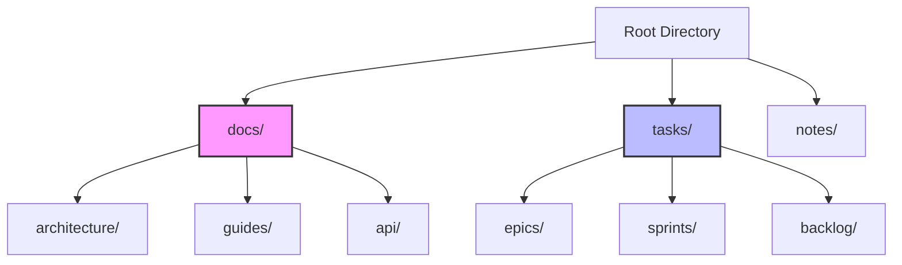

import { AlertCircle, CheckCircle2, Circle, Clock } from "lucide-react";

import { Alert, AlertDescription, AlertTitle } from "@/components/ui/alert";
import { Badge } from "@/components/ui/badge";
import { Button } from "@/components/ui/button";
import { Card, CardContent, CardHeader, CardTitle } from "@/components/ui/card";
import { Tabs, TabsContent, TabsList, TabsTrigger } from "@/components/ui/tabs";

# Getting Started with gition 🚀

<div className="flex items-center gap-2 mb-6">
  <Badge>Beginner Friendly</Badge>
  <Badge variant="secondary">12 min read</Badge>
  <Badge variant="outline">v2.0</Badge>
</div>

Welcome to **gition**! This guide will walk you through setting up and using gition for your documentation and task management needs. By the end of this tutorial, you'll have a fully functional local documentation system with powerful task management capabilities.

<Alert className="mb-6">
  <AlertTitle>🎯 What You'll Learn</AlertTitle>
  <AlertDescription>
    <ul className="list-disc list-inside mt-2 space-y-1">
      <li>Installing and running gition in under 2 minutes</li>
      <li>Creating rich documentation with MDX</li>
      <li>Managing tasks with the Kanban board</li>
      <li>Customizing gition for your workflow</li>
    </ul>
  </AlertDescription>
</Alert>

## What is gition?

gition is a **local-first** documentation and task management tool that transforms your Markdown and MDX files into a beautiful, interactive web interface. Think of it as:

<div className="grid grid-cols-1 md:grid-cols-3 gap-4 my-6">
  <Card>
    <CardHeader>
      <CardTitle className="flex items-center gap-2">
        <span className="text-2xl">📝</span>
        Notion
      </CardTitle>
    </CardHeader>
    <CardContent>Beautiful docs with rich formatting</CardContent>
  </Card>

<Card>
  <CardHeader>
    <CardTitle className="flex items-center gap-2">
      <span className="text-2xl">➕</span>
      Plus
    </CardTitle>
  </CardHeader>
  <CardContent>Combined with</CardContent>
</Card>

  <Card>
    <CardHeader>
      <CardTitle className="flex items-center gap-2">
        <span className="text-2xl">📋</span>
        Jira
      </CardTitle>
    </CardHeader>
    <CardContent>Powerful task management</CardContent>
  </Card>
</div>

**But running entirely on your machine** - no cloud, no external dependencies, just you and your files.

## Prerequisites Checklist

Before we begin, let's make sure you have everything needed:

- [x] **Node.js 18 or higher** - Check with `node --version`
- [x] **npm or pnpm** - Check with `npm --version` or `pnpm --version`
- [ ] **A text editor** - VS Code, Sublime, or your favorite
- [ ] **5 minutes** - That's all it takes to get started!

<Alert variant="warning" className="my-4">
  <AlertTitle>Node.js Version</AlertTitle>
  <AlertDescription>
    gition requires Node.js 18 or higher for optimal performance and security.
    Visit [nodejs.org](https://nodejs.org) to download the latest version.
  </AlertDescription>
</Alert>

## Installation

<Tabs defaultValue="npm" className="mb-6">
  <TabsList>
    <TabsTrigger value="npm">npm</TabsTrigger>
    <TabsTrigger value="pnpm">pnpm</TabsTrigger>
    <TabsTrigger value="yarn">yarn</TabsTrigger>
    <TabsTrigger value="global">Global Install</TabsTrigger>
  </TabsList>

<TabsContent value="npm">
  ```bash # Quick start (recommended) npx gition@latest # Or run in a specific
  directory npx gition@latest ./my-docs ```
</TabsContent>

<TabsContent value="pnpm">
  ```bash # Quick start with pnpm pnpm dlx gition@latest # Or run in a specific
  directory pnpm dlx gition@latest ./my-docs ```
</TabsContent>

<TabsContent value="yarn">
  ```bash # Quick start with yarn yarn dlx gition@latest # Or run in a specific
  directory yarn dlx gition@latest ./my-docs ```
</TabsContent>

  <TabsContent value="global">
    ```bash # Install globally npm install -g gition # Then run anywhere gition
    gition ./my-docs ```
  </TabsContent>
</Tabs>

## Quick Start in 3 Steps

### Step 1: Create Your First Document

Create a new file called `welcome.mdx` in your project directory:

```mdx
---
title: Welcome to My Project
description: This is my first gition document
tags: ["welcome", "getting-started"]
status: "published"
priority: "high"
author: "Your Name"
date: "2024-01-20"
---

# Welcome to My Project

This is my first document in gition! Let's add some tasks:

## Project Setup Tasks

- [ ] Install dependencies @high due:2024-01-25T10:00:00Z
- [ ] Configure environment variables @medium
- [x] Create initial project structure
- [ ] Write documentation @low due:2024-02-01T14:00:00Z

## Next Steps

Let's explore what gition can do!
```

### Step 2: Launch gition

Run gition in your project directory:

```bash
npx gition
```

You'll see output like this:

```
🚀 gition v1.0.0
📁 Watching: /Users/you/my-project
🌐 Server running at http://localhost:3000
✨ Found 1 document and 4 tasks
```

### Step 3: Open Your Browser

Navigate to [http://localhost:3000](http://localhost:3000) and see your documentation come to life!

## Core Features Deep Dive

### 1. Rich Documentation with MDX

MDX allows you to use React components directly in your Markdown. Here's what you can do:

<Tabs defaultValue="components" className="mb-6">
  <TabsList>
    <TabsTrigger value="components">Components</TabsTrigger>
    <TabsTrigger value="diagrams">Diagrams</TabsTrigger>
    <TabsTrigger value="code">Code Blocks</TabsTrigger>
    <TabsTrigger value="math">Math</TabsTrigger>
  </TabsList>
  
  <TabsContent value="components">
    <Card>
      <CardHeader>
        <CardTitle>Interactive Components</CardTitle>
      </CardHeader>
      <CardContent>
        ```mdx
        import { Button } from '@/components/ui/button'
        import { Card } from '@/components/ui/card'
        
        <Card>
          <CardContent>
            <Button onClick={() => alert('Hello!')}>
              Click me!
            </Button>
          </CardContent>
        </Card>
        ```
      </CardContent>
    </Card>
  </TabsContent>
  
  <TabsContent value="diagrams">
    <Card>
      <CardHeader>
        <CardTitle>Mermaid Diagrams</CardTitle>
      </CardHeader>
      <CardContent>
        ```mermaid
        graph TD
            A[Start] --> B{Is it working?}
            B -->|Yes| C[Great!]
            B -->|No| D[Debug]
            D --> A
        ```
      </CardContent>
    </Card>
  </TabsContent>
  
  <TabsContent value="code">
    <Card>
      <CardHeader>
        <CardTitle>Syntax Highlighting</CardTitle>
      </CardHeader>
      <CardContent>
        ```typescript
        interface Task {
          id: string;
          title: string;
          status: 'todo' | 'done';
          priority?: 'low' | 'medium' | 'high';
          due?: string; // ISO 8601
        }
        ```
      </CardContent>
    </Card>
  </TabsContent>
  
  <TabsContent value="math">
    <Card>
      <CardHeader>
        <CardTitle>Mathematical Expressions</CardTitle>
      </CardHeader>
      <CardContent>
        <p>Inline math: $E = mc^2$</p>
        <p>Block math:</p>
        $$\sum_{i=1}^{n} i = \frac{n(n+1)}{2}$$
      </CardContent>
    </Card>
  </TabsContent>
</Tabs>

### 2. Advanced Task Management

gition's task system is incredibly powerful. Here's a comprehensive example:

```markdown
## Q1 2024 Development Tasks

### 🔴 Critical Priority

- [ ] Fix production bug in auth system @john #bug #urgent due:2024-01-21T09:00:00Z
  - [x] Identify root cause
  - [ ] Implement fix
  - [ ] Deploy to staging
  - [ ] Test thoroughly
- [~] Security audit review @sarah #security #blocked

### 🟡 High Priority

- [ ] Implement user dashboard @mike #feature due:2024-01-28T17:00:00Z
  - [x] Design mockups
  - [x] API endpoints
  - [ ] Frontend components
  - [ ] Integration tests
- [>] Performance optimization @lisa #performance

### 🟢 Medium Priority

- [ ] Update documentation @alex #docs due:2024-02-01T12:00:00Z
- [ ] Refactor legacy code @team #tech-debt
- [x] Set up CI/CD pipeline @devops

### 🔵 Low Priority

- [ ] Add dark mode toggle #enhancement
- [ ] Implement keyboard shortcuts #ux
```

#### Task Status Legend

<div className="grid grid-cols-2 md:grid-cols-4 gap-4 my-6">
  <Card>
    <CardContent className="pt-6 text-center">
      <Circle className="w-8 h-8 mx-auto mb-2" />
      <code>- [ ]</code>
      <p className="text-sm mt-1">Todo</p>
    </CardContent>
  </Card>

<Card>
  <CardContent className="pt-6 text-center">
    <CheckCircle2 className="w-8 h-8 mx-auto mb-2 text-green-600" />
    <code>- [x]</code>
    <p className="text-sm mt-1">Done</p>
  </CardContent>
</Card>

<Card>
  <CardContent className="pt-6 text-center">
    <Clock className="w-8 h-8 mx-auto mb-2 text-blue-600" />
    <code>- [>]</code>
    <p className="text-sm mt-1">In Progress</p>
  </CardContent>
</Card>

  <Card>
    <CardContent className="pt-6 text-center">
      <AlertCircle className="w-8 h-8 mx-auto mb-2 text-red-600" />
      <code>- [~]</code>
      <p className="text-sm mt-1">Blocked</p>
    </CardContent>
  </Card>
</div>

#### Task Metadata Syntax

- **Assignee**: `@username`
- **Tags**: `#tag-name`
- **Priority**: `priority:high` or use emoji indicators
- **Due Date**: `due:2024-01-25T10:00:00Z` (ISO 8601 format)

### 3. Project Organization

Organize your content effectively:

```
my-project/
├── docs/                    # Documentation
│   ├── getting-started/
│   │   ├── installation.mdx
│   │   └── quick-start.mdx
│   ├── guides/
│   │   ├── user-guide.mdx
│   │   └── admin-guide.mdx
│   └── api/
│       └── reference.mdx
├── tasks/                   # Task tracking
│   ├── epics/
│   │   └── q1-roadmap.mdx
│   ├── sprints/
│   │   ├── sprint-01.mdx
│   │   └── sprint-02.mdx
│   └── backlog/
│       └── ideas.mdx
└── .gitionrc               # Configuration
```

## Configuration

### Basic Configuration (.gitionrc)

Create a `.gitionrc` file in your project root:

```json
{
  "port": 3000,
  "theme": "system",
  "features": {
    "search": true,
    "kanban": true,
    "darkMode": true
  },
  "watch": {
    "directories": ["docs", "tasks", "notes"],
    "exclude": ["node_modules", ".git", "dist"]
  },
  "plugins": {
    "enabled": ["markdown-lint", "task-analytics"],
    "settings": {
      "task-analytics": {
        "trackTime": true
      }
    }
  }
}
```

### Advanced Configuration Options

<Tabs defaultValue="server" className="mb-6">
  <TabsList>
    <TabsTrigger value="server">Server</TabsTrigger>
    <TabsTrigger value="ui">UI</TabsTrigger>
    <TabsTrigger value="plugins">Plugins</TabsTrigger>
    <TabsTrigger value="ai">AI Mode</TabsTrigger>
  </TabsList>
  
  <TabsContent value="server">
    ```json
    {
      "server": {
        "port": 3000,
        "host": "localhost",
        "https": false,
        "open": true
      }
    }
    ```
  </TabsContent>
  
  <TabsContent value="ui">
    ```json
    {
      "ui": {
        "theme": "system",
        "sidebarWidth": 280,
        "fontSize": "16px",
        "fontFamily": "Inter, system-ui, sans-serif",
        "codeTheme": "github-dark"
      }
    }
    ```
  </TabsContent>
  
  <TabsContent value="plugins">
    ```json
    {
      "plugins": {
        "directory": "./plugins",
        "enabled": ["my-custom-plugin"],
        "autoLoad": true
      }
    }
    ```
  </TabsContent>
  
  <TabsContent value="ai">
    ```json
    {
      "ai": {
        "enabled": false,
        "provider": "openai",
        "features": {
          "summarization": true,
          "taskSuggestions": true,
          "contentEnhancement": false
        }
      }
    }
    ```
  </TabsContent>
</Tabs>

## Real-World Examples

### Example 1: Software Development Project

- [x] Set up development environment @team
  - [x] Install Node.js and npm
  - [x] Clone repository
  - [x] Install dependencies
  - [x] Configure environment variables
- [ ] Implement core features @high due:2024-02-01T17:00:00Z
  - [x] User authentication @john #backend
  - [>] Dashboard UI @sarah #frontend
  - [ ] API integration @mike #backend
  - [~] Payment processing @blocked #waiting-for-approval
- [ ] Testing and QA @medium due:2024-02-15T12:00:00Z
  - [ ] Write unit tests #testing
  - [ ] Integration testing #testing
  - [ ] User acceptance testing #qa

### Example 2: Content Creation Workflow

- [ ] Blog Post: "Getting Started with gition" @writer due:2024-01-22T10:00:00Z
  - [x] Research and outline
  - [x] Write first draft
  - [>] Technical review @tech-lead
  - [ ] Copy editing @editor
  - [ ] Add screenshots and diagrams
  - [ ] SEO optimization
  - [ ] Publish and promote

### Example 3: Event Planning

- [ ] Company Hackathon Planning @events-team
  - [x] Set date and venue
  - [x] Create registration form
  - [ ] Send invitations @high due:2024-01-25T09:00:00Z
  - [>] Arrange catering @medium
  - [ ] Prepare welcome kits @low
  - [ ] Set up judging criteria
  - [~] Book keynote speaker @blocked #waiting-confirmation

## Pro Tips and Best Practices

### 1. Effective Task Management

<Card className="mb-4">
  <CardHeader>
    <CardTitle>📌 Task Writing Guidelines</CardTitle>
  </CardHeader>
  <CardContent>
    <ul className="space-y-2">
      <li>✅ Be specific and actionable</li>
      <li>✅ Include context with tags and assignees</li>
      <li>✅ Set realistic due dates</li>
      <li>✅ Break large tasks into subtasks</li>
      <li>✅ Regular status updates</li>
    </ul>
  </CardContent>
</Card>

### 2. Document Organization



### 3. Keyboard Shortcuts

| Action         | Shortcut               |
| -------------- | ---------------------- |
| Search         | `Cmd/Ctrl + K`         |
| New Document   | `Cmd/Ctrl + N`         |
| Toggle Sidebar | `Cmd/Ctrl + B`         |
| Quick Task     | `Cmd/Ctrl + T`         |
| Toggle Theme   | `Cmd/Ctrl + Shift + L` |

## Troubleshooting Common Issues

### Issue: Server Won't Start

<Alert variant="warning">
  <AlertTitle>Port Already in Use</AlertTitle>
  <AlertDescription>
    If you see "Error: Port 3000 is already in use", try: ```bash # Use a
    different port npx gition --port 3001 # Or kill the process using port 3000
    lsof -ti:3000 | xargs kill -9 ```
  </AlertDescription>
</Alert>

### Issue: Files Not Showing Up

**Checklist:**

- [ ] Files have `.md` or `.mdx` extension
- [ ] Files are in watched directories
- [ ] Valid frontmatter syntax (if present)
- [ ] No syntax errors in MDX files
- [ ] Check `.gitionrc` exclude patterns

### Issue: Tasks Not Appearing

**Common causes:**

1. Incorrect checkbox syntax (use `- [ ]` not `* [ ]`)
2. Tasks in code blocks (they're ignored)
3. Invalid metadata syntax

## Next Steps

### Essential Reading

- [ ] [System Architecture Overview](../architecture/system-overview.mdx) - Understand how gition works
- [ ] [Plugin Development Guide](./plugin-development.mdx) - Extend gition's capabilities
- [ ] [Advanced Configuration](./configuration.mdx) - Customize every aspect
- [ ] [Best Practices](./best-practices.mdx) - Learn from experienced users

### Join the Community

<div className="grid grid-cols-1 md:grid-cols-3 gap-4 my-6">
  <Card>
    <CardHeader>
      <CardTitle>💬 Discord</CardTitle>
    </CardHeader>
    <CardContent>
      Join our Discord for real-time help and discussions
    </CardContent>
  </Card>

<Card>
  <CardHeader>
    <CardTitle>🐙 GitHub</CardTitle>
  </CardHeader>
  <CardContent>Star the repo and contribute to development</CardContent>
</Card>

  <Card>
    <CardHeader>
      <CardTitle>📚 Examples</CardTitle>
    </CardHeader>
    <CardContent>Browse real-world examples and templates</CardContent>
  </Card>
</div>

## Quick Reference Card

<Card className="my-6 bg-gradient-to-r from-blue-50 to-indigo-50 dark:from-blue-950 dark:to-indigo-950">
  <CardHeader>
    <CardTitle>🎯 gition Quick Reference</CardTitle>
  </CardHeader>
  <CardContent>
    <div className="grid grid-cols-1 md:grid-cols-2 gap-6">
      <div>
        <h4 className="font-semibold mb-2">Essential Commands</h4>
        ```bash npx gition # Start in current dir npx gition ./docs # Start in
        specific dir npx gition --port 3001 # Custom port npx gition --help #
        View all options ```
      </div>
      <div>
        <h4 className="font-semibold mb-2">Task Syntax</h4>
        ```markdown - [ ] Todo task - [x] Completed task - [>] In progress - [~]
        Blocked @user #tag due:2024-01-25T10:00:00Z ```
      </div>
    </div>
  </CardContent>
</Card>

---

<Alert className="mt-8">
  <AlertTitle>🚀 Ready to Transform Your Workflow?</AlertTitle>
  <AlertDescription>
    You now have everything you need to start using gition effectively. Begin
    with a simple document, add some tasks, and watch your productivity soar!
  </AlertDescription>
</Alert>
