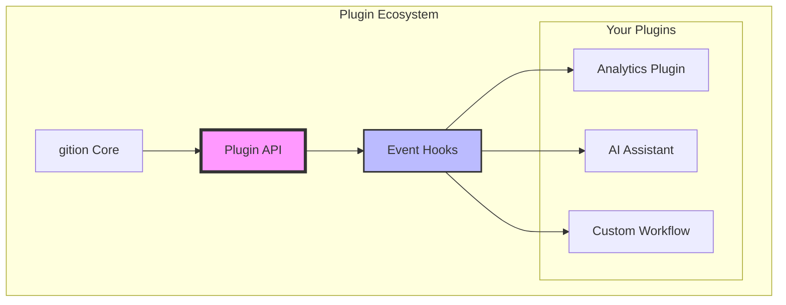
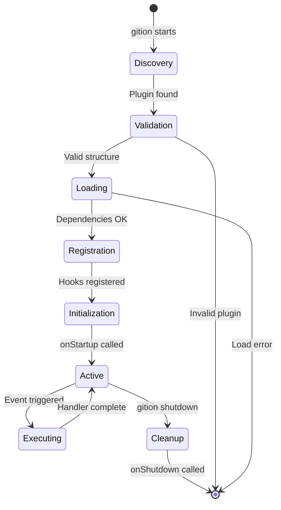

import { Code2, GitBranch, Package, Rocket, TestTube, Zap } from "lucide-react";

import { Alert, AlertDescription, AlertTitle } from "@/components/ui/alert";
import { Badge } from "@/components/ui/badge";
import { Button } from "@/components/ui/button";
import {
  Card,
  CardContent,
  CardDescription,
  CardHeader,
  CardTitle,
} from "@/components/ui/card";
import { Tabs, TabsContent, TabsList, TabsTrigger } from "@/components/ui/tabs";

# Plugin Development Guide

<div className="flex items-center gap-3 mb-6">
  <Badge variant="default">Advanced</Badge>
  <Badge variant="secondary">v2.5</Badge>
  <Badge variant="outline">25 min read</Badge>
  <Badge variant="destructive">Beta API</Badge>
</div>

<Alert className="mb-6">
  <Zap className="h-4 w-4" />
  <AlertTitle>Supercharge Your gition</AlertTitle>
  <AlertDescription>
    Plugins allow you to extend gition with custom functionality, integrate with
    external services, and automate your workflow. This guide covers everything
    from basic hooks to advanced patterns.
  </AlertDescription>
</Alert>

## Overview

gition's plugin system is designed to be **simple**, **powerful**, and **safe**. Plugins are local JavaScript/TypeScript modules that hook into specific system events, giving you complete control over your documentation and task management workflow.



## Quick Start: Your First Plugin

Let's create a simple plugin that logs document statistics:

<Tabs defaultValue="javascript" className="mb-6">
  <TabsList>
    <TabsTrigger value="javascript">JavaScript</TabsTrigger>
    <TabsTrigger value="typescript">TypeScript</TabsTrigger>
  </TabsList>
  
  <TabsContent value="javascript">
    ```javascript
    // plugins/doc-stats.js
    module.exports = {
      name: 'doc-stats',
      version: '1.0.0',
      
      onFileLoad(doc) {
        const wordCount = doc.content?.split(/\s+/).length || 0;
        const readingTime = Math.ceil(wordCount / 200);
        
        console.log(`📄 ${doc.title}`);
        console.log(`   Words: ${wordCount}`);
        console.log(`   Reading time: ${readingTime} min`);
        console.log(`   Tags: ${doc.tags?.join(', ') || 'none'}`);
      },
      
      onStartup(config) {
        console.log('📊 Document Statistics Plugin loaded!');
      }
    };
    ```
  </TabsContent>
  
  <TabsContent value="typescript">
    ```typescript
    // plugins/doc-stats.ts
    import type { Plugin, DocMeta, GitionConfig } from 'gition';
    
    const docStatsPlugin: Plugin = {
      name: 'doc-stats',
      version: '1.0.0',
      
      onFileLoad(doc: DocMeta): void {
        const wordCount = doc.content?.split(/\s+/).length || 0;
        const readingTime = Math.ceil(wordCount / 200);
        
        console.log(`📄 ${doc.title}`);
        console.log(`   Words: ${wordCount}`);
        console.log(`   Reading time: ${readingTime} min`);
        console.log(`   Tags: ${doc.tags?.join(', ') || 'none'}`);
      },
      
      onStartup(config: GitionConfig): void {
        console.log('📊 Document Statistics Plugin loaded!');
      }
    };
    
    export default docStatsPlugin;
    ```
  </TabsContent>
</Tabs>

### Installation Steps

- [x] Create a `plugins/` directory in your project root
- [x] Add your plugin file (e.g., `doc-stats.js`)
- [ ] Update `.gitionrc` to enable the plugin
- [ ] Restart gition to load the plugin

## Plugin Architecture

### Core Concepts

<div className="grid grid-cols-1 md:grid-cols-3 gap-4 my-6">
  <Card>
    <CardHeader>
      <Code2 className="h-8 w-8 mb-2 text-blue-600" />
      <CardTitle>Event-Driven</CardTitle>
    </CardHeader>
    <CardContent>
      React to system events like file changes, task updates, and user actions
    </CardContent>
  </Card>

<Card>
  <CardHeader>
    <Package className="h-8 w-8 mb-2 text-green-600" />
    <CardTitle>Modular</CardTitle>
  </CardHeader>
  <CardContent>
    Each plugin is self-contained with its own dependencies and configuration
  </CardContent>
</Card>

  <Card>
    <CardHeader>
      <GitBranch className="h-8 w-8 mb-2 text-purple-600" />
      <CardTitle>Composable</CardTitle>
    </CardHeader>
    <CardContent>
      Plugins can work together and share data through the plugin context
    </CardContent>
  </Card>
</div>

### Plugin Lifecycle



## Hook Reference

### Document Lifecycle Hooks

<Tabs defaultValue="onFileLoad" className="mb-6">
  <TabsList className="grid w-full grid-cols-2 lg:grid-cols-4">
    <TabsTrigger value="onFileLoad">onFileLoad</TabsTrigger>
    <TabsTrigger value="onFileChange">onFileChange</TabsTrigger>
    <TabsTrigger value="onDocumentCreate">onDocumentCreate</TabsTrigger>
    <TabsTrigger value="onDocumentDelete">onDocumentDelete</TabsTrigger>
  </TabsList>
  
  <TabsContent value="onFileLoad">
    <Card>
      <CardHeader>
        <CardTitle>onFileLoad(doc: DocMeta)</CardTitle>
        <CardDescription>Triggered when a document is loaded or reloaded</CardDescription>
      </CardHeader>
      <CardContent>
        ```typescript
        onFileLoad(doc: DocMeta): void | Promise<void> {
          // Analyze document content
          const hasCode = doc.content?.includes('```');
          const hasTasks = doc.content?.includes('- [ ]');
          
          // Add custom metadata
          if (hasCode && hasTasks) {
            console.log(`📝 Technical doc with tasks: ${doc.title}`);
          }
          
          // Track document views
          await trackView(doc.slug);
        }
        ```
        
        **Use cases:**
        - Document analytics
        - Content validation
        - Metadata enrichment
        - Search indexing
      </CardContent>
    </Card>
  </TabsContent>
  
  <TabsContent value="onFileChange">
    <Card>
      <CardHeader>
        <CardTitle>onFileChange(event: FileChangeEvent)</CardTitle>
        <CardDescription>Triggered when file system changes are detected</CardDescription>
      </CardHeader>
      <CardContent>
        ```typescript
        onFileChange(event: FileChangeEvent): void | Promise<void> {
          console.log(`📁 File ${event.type}: ${event.path}`);
          
          if (event.type === 'change') {
            // Auto-format on save
            await formatMarkdown(event.path);
            
            // Update related documents
            await updateCrossReferences(event.path);
          }
        }
        ```
        
        **Event types:**
        - `add` - New file created
        - `change` - File modified
        - `unlink` - File deleted
      </CardContent>
    </Card>
  </TabsContent>
  
  <TabsContent value="onDocumentCreate">
    <Card>
      <CardHeader>
        <CardTitle>onDocumentCreate(doc: DocMeta)</CardTitle>
        <CardDescription>Triggered when a new document is created</CardDescription>
      </CardHeader>
      <CardContent>
        ```typescript
        onDocumentCreate(doc: DocMeta): void | Promise<void> {
          // Apply templates
          if (!doc.tags?.length) {
            await suggestTags(doc);
          }
          
          // Create related tasks
          if (doc.category === 'feature') {
            await createFeatureTasks(doc);
          }
          
          // Notify team
          await notifyNewDocument(doc);
        }
        ```
        
        **Common patterns:**
        - Template application
        - Default metadata
        - Workflow automation
        - Team notifications
      </CardContent>
    </Card>
  </TabsContent>
  
  <TabsContent value="onDocumentDelete">
    <Card>
      <CardHeader>
        <CardTitle>onDocumentDelete(path: string)</CardTitle>
        <CardDescription>Triggered when a document is deleted</CardDescription>
      </CardHeader>
      <CardContent>
        ```typescript
        onDocumentDelete(path: string): void | Promise<void> {
          // Clean up references
          await removeFromIndex(path);
          
          // Archive related data
          await archiveDocumentData(path);
          
          // Update navigation
          await updateSiteMap();
        }
        ```
        
        **Important tasks:**
        - Cleanup operations
        - Reference updates
        - Data archival
        - Cache invalidation
      </CardContent>
    </Card>
  </TabsContent>
</Tabs>

### Task Management Hooks

```typescript
interface TaskHooks {
  // Task lifecycle
  onTaskCreate?: (task: Task) => void | Promise<void>;
  onTaskToggle?: (
    task: Task,
    previousStatus: TaskStatus
  ) => void | Promise<void>;
  onTaskUpdate?: (task: Task, changes: Partial<Task>) => void | Promise<void>;
  onTaskDelete?: (taskId: string) => void | Promise<void>;

  // Bulk operations
  onTaskBulkUpdate?: (
    tasks: Task[],
    operation: BulkOperation
  ) => void | Promise<void>;
  onTaskMove?: (task: Task, from: string, to: string) => void | Promise<void>;
}
```

#### Example: Task Time Tracking

```typescript
const timeTracker: Plugin = {
  name: 'time-tracker',

  private activeTasks: Map<string, Date> = new Map(),

  async onTaskToggle(task: Task, previousStatus: TaskStatus) {
    // Start tracking when task moves to in-progress
    if (task.status === 'in-progress' && previousStatus !== 'in-progress') {
      this.activeTasks.set(task.id, new Date());
      await this.startTimer(task);
    }

    // Stop tracking when task completes
    if (task.status === 'done' && previousStatus === 'in-progress') {
      const startTime = this.activeTasks.get(task.id);
      if (startTime) {
        const duration = Date.now() - startTime.getTime();
        await this.logTime(task, duration);
        this.activeTasks.delete(task.id);
      }
    }
  }
};
```

### System Hooks

<Alert className="mb-4">
  <AlertTitle>System Integration</AlertTitle>
  <AlertDescription>
    System hooks allow plugins to integrate deeply with gition's core
    functionality
  </AlertDescription>
</Alert>

```typescript
interface SystemHooks {
  // Lifecycle
  onStartup?: (config: GitionConfig) => void | Promise<void>;
  onShutdown?: () => void | Promise<void>;
  onError?: (error: Error, context: ErrorContext) => void | Promise<void>;

  // Configuration
  onConfigChange?: (
    newConfig: GitionConfig,
    oldConfig: GitionConfig
  ) => void | Promise<void>;
  onPluginLoad?: (plugin: Plugin) => void | Promise<void>;
  onPluginUnload?: (pluginName: string) => void | Promise<void>;

  // UI Events
  onRouteChange?: (
    route: string,
    previousRoute?: string
  ) => void | Promise<void>;
  onSearch?: (query: string, results: SearchResult[]) => void | Promise<void>;
  onThemeChange?: (theme: "light" | "dark" | "system") => void | Promise<void>;
}
```

## Real-World Plugin Examples

### 1. GitHub Integration Plugin

<Card className="mb-6">
  <CardHeader>
    <CardTitle>🐙 GitHub Task Sync</CardTitle>
    <CardDescription>Automatically sync tasks with GitHub Issues</CardDescription>
  </CardHeader>
  <CardContent>
    ```typescript
    // plugins/github-sync.ts
    import { Octokit } from '@octokit/rest';
    
    const githubSync: Plugin = {
      name: 'github-sync',
      version: '1.0.0',
      
      private octokit: Octokit,
      private config: GitHubConfig,
      
      async onStartup(config: GitionConfig) {
        this.config = config.plugins?.['github-sync'];
        this.octokit = new Octokit({
          auth: this.config.token
        });
        
        console.log('🐙 GitHub sync enabled for', this.config.repo);
      },
      
      async onTaskToggle(task: Task, previousStatus: TaskStatus) {
        // Only sync tasks with GitHub labels
        if (!task.labels?.includes('github')) return;
        
        const issueNumber = this.extractIssueNumber(task);
        if (!issueNumber) return;
        
        try {
          if (task.status === 'done' && previousStatus !== 'done') {
            // Close GitHub issue
            await this.octokit.issues.update({
              owner: this.config.owner,
              repo: this.config.repo,
              issue_number: issueNumber,
              state: 'closed',
              state_reason: 'completed'
            });
            
            console.log(`✅ Closed GitHub issue #${issueNumber}`);
          }
        } catch (error) {
          console.error('GitHub sync failed:', error);
        }
      },
      
      extractIssueNumber(task: Task): number | null {
        const match = task.title.match(/#(\d+)/);
        return match ? parseInt(match[1]) : null;
      }
    };
    ```
    
    **Configuration:**
    ```json
    {
      "plugins": {
        "github-sync": {
          "token": "$GITHUB_TOKEN",
          "owner": "your-org",
          "repo": "your-repo"
        }
      }
    }
    ```
  </CardContent>
</Card>

### 2. AI Content Assistant

<Card className="mb-6">
  <CardHeader>
    <CardTitle>🤖 AI Writing Assistant</CardTitle>
    <CardDescription>Get AI-powered suggestions and improvements</CardDescription>
  </CardHeader>
  <CardContent>
    ```typescript
    // plugins/ai-assistant.ts
    const aiAssistant: Plugin = {
      name: 'ai-assistant',
      version: '2.0.0',
      
      async onDocumentCreate(doc: DocMeta) {
        // Generate suggested outline
        if (doc.content?.length < 100) {
          const outline = await this.generateOutline(doc.title);
          await this.suggestContent(doc, outline);
        }
      },
      
      async onFileChange(event: FileChangeEvent) {
        if (event.type !== 'change') return;
        
        const doc = await this.loadDocument(event.path);
        
        // Check for improvement opportunities
        const suggestions = await this.analyzeContent(doc);
        if (suggestions.length > 0) {
          await this.showSuggestions(doc, suggestions);
        }
      },
      
      async generateOutline(title: string): Promise<string[]> {
        const response = await this.callAI({
          prompt: `Generate a detailed outline for: "${title}"`,
          maxTokens: 500
        });
        
        return this.parseOutline(response);
      }
    };
    ```
  </CardContent>
</Card>

### 3. Custom Analytics Dashboard

<Card className="mb-6">
  <CardHeader>
    <CardTitle>📊 Analytics & Insights</CardTitle>
    <CardDescription>Track document views, task velocity, and team productivity</CardDescription>
  </CardHeader>
  <CardContent>
    ```typescript
    // plugins/analytics.ts
    const analytics: Plugin = {
      name: 'analytics-dashboard',
      version: '1.5.0',
      
      private metrics: MetricsStore,
      
      async onStartup() {
        this.metrics = await this.loadMetrics();
        this.startDashboardServer();
      },
      
      async onFileLoad(doc: DocMeta) {
        await this.metrics.recordView({
          docId: doc.slug,
          timestamp: new Date(),
          readingTime: doc.readingTime
        });
      },
      
      async onTaskToggle(task: Task, previousStatus: TaskStatus) {
        await this.metrics.recordTaskChange({
          taskId: task.id,
          from: previousStatus,
          to: task.status,
          timestamp: new Date(),
          assignee: task.assignee
        });
        
        // Calculate velocity
        if (task.status === 'done') {
          const velocity = await this.calculateVelocity();
          console.log(`📈 Current velocity: ${velocity} tasks/week`);
        }
      },
      
      registerComponents() {
        return {
          AnalyticsDashboard: () => (
            <DashboardComponent metrics={this.metrics} />
          )
        };
      }
    };
    ```
  </CardContent>
</Card>

## Advanced Plugin Patterns

### 1. Plugin Communication

<Alert className="mb-4" variant="info">
  <AlertTitle>Inter-Plugin Messaging</AlertTitle>
  <AlertDescription>
    Plugins can communicate through a shared event bus or context
  </AlertDescription>
</Alert>

```typescript
// Shared event bus
class PluginEventBus {
  private listeners = new Map<string, Set<Function>>();

  emit(event: string, data: any) {
    this.listeners.get(event)?.forEach((fn) => fn(data));
  }

  on(event: string, handler: Function) {
    if (!this.listeners.has(event)) {
      this.listeners.set(event, new Set());
    }
    this.listeners.get(event)!.add(handler);
  }
}

// Plugin A: Producer
const taskAnalyzer: Plugin = {
  async onTaskToggle(task: Task) {
    const complexity = this.analyzeComplexity(task);
    eventBus.emit("task:complexity", { task, complexity });
  },
};

// Plugin B: Consumer
const workloadBalancer: Plugin = {
  onStartup() {
    eventBus.on("task:complexity", ({ task, complexity }) => {
      if (complexity > 8) {
        this.suggestTaskSplit(task);
      }
    });
  },
};
```

### 2. State Persistence

```typescript
const persistentPlugin: Plugin = {
  name: 'persistent-state',

  private storage: Storage,

  async onStartup() {
    this.storage = new PersistentStorage('plugin-data.json');
    await this.storage.load();
  },

  async onShutdown() {
    await this.storage.save();
  },

  async saveState(key: string, value: any) {
    await this.storage.set(key, value);
  },

  async loadState(key: string): Promise<any> {
    return await this.storage.get(key);
  }
};
```

### 3. Custom UI Components

```typescript
const uiExtension: Plugin = {
  name: "custom-ui",

  registerComponents() {
    return {
      TaskTimer: TaskTimerComponent,
      ProjectStats: ProjectStatsWidget,
      CustomToolbar: ToolbarExtension,
    };
  },

  registerCommands() {
    return [
      {
        id: "quick-task",
        title: "Create Quick Task",
        shortcut: "cmd+shift+t",
        handler: this.createQuickTask,
      },
      {
        id: "export-stats",
        title: "Export Statistics",
        handler: this.exportStatistics,
      },
    ];
  },
};
```

## Plugin Development Workflow

### Development Checklist

- [ ] **Setup Development Environment** @high due:2024-01-25T10:00:00Z
  - [x] Install TypeScript and development dependencies
  - [x] Configure ESLint and Prettier
  - [ ] Set up testing framework
  - [ ] Create plugin template

- [ ] **Implement Core Functionality** @critical due:2024-01-28T14:00:00Z
  - [ ] Define plugin interface
  - [ ] Implement event handlers
  - [ ] Add error handling
  - [ ] Write configuration schema

- [ ] **Testing & Validation** @high due:2024-01-30T16:00:00Z
  - [ ] Unit tests for core logic
  - [ ] Integration tests with gition
  - [ ] Performance profiling
  - [ ] Memory leak detection

- [ ] **Documentation & Release** @medium due:2024-02-01T12:00:00Z
  - [ ] Write plugin documentation
  - [ ] Create usage examples
  - [ ] Publish to npm
  - [ ] Submit to plugin registry

### Testing Your Plugin

<Tabs defaultValue="unit" className="mb-6">
  <TabsList>
    <TabsTrigger value="unit">Unit Tests</TabsTrigger>
    <TabsTrigger value="integration">Integration Tests</TabsTrigger>
    <TabsTrigger value="e2e">E2E Tests</TabsTrigger>
  </TabsList>
  
  <TabsContent value="unit">
    ```typescript
    // __tests__/my-plugin.test.ts
    import { myPlugin } from '../my-plugin';
    
    describe('MyPlugin', () => {
      it('should process documents correctly', async () => {
        const mockDoc = {
          slug: 'test-doc',
          title: 'Test Document',
          content: 'Test content'
        };
        
        const result = await myPlugin.onFileLoad(mockDoc);
        expect(result).toBeDefined();
      });
      
      it('should handle errors gracefully', async () => {
        const invalidDoc = { slug: null };
        
        expect(() => {
          myPlugin.onFileLoad(invalidDoc);
        }).not.toThrow();
      });
    });
    ```
  </TabsContent>
  
  <TabsContent value="integration">
    ```typescript
    // __tests__/integration.test.ts
    import { createTestEnvironment } from 'gition/test';
    
    describe('Plugin Integration', () => {
      let env;
      
      beforeEach(async () => {
        env = await createTestEnvironment({
          plugins: ['my-plugin']
        });
      });
      
      it('should react to file changes', async () => {
        const spy = jest.spyOn(console, 'log');
        
        await env.createFile('test.md', '# Test');
        await env.updateFile('test.md', '# Updated');
        
        expect(spy).toHaveBeenCalledWith(
          expect.stringContaining('File changed')
        );
      });
    });
    ```
  </TabsContent>
  
  <TabsContent value="e2e">
    ```typescript
    // __tests__/e2e.test.ts
    import { test, expect } from '@playwright/test';
    
    test('plugin UI features work', async ({ page }) => {
      await page.goto('http://localhost:3000');
      
      // Check if plugin UI is loaded
      await expect(
        page.locator('[data-plugin="my-plugin"]')
      ).toBeVisible();
      
      // Test plugin functionality
      await page.click('[data-action="plugin-action"]');
      await expect(
        page.locator('.plugin-result')
      ).toContainText('Success');
    });
    ```
  </TabsContent>
</Tabs>

## Performance Best Practices

### 1. Debouncing and Throttling

```typescript
import { debounce, throttle } from "lodash";

const performancePlugin: Plugin = {
  // Debounce rapid file changes
  onFileChange: debounce(async (event: FileChangeEvent) => {
    await this.processFileChange(event);
  }, 300),

  // Throttle expensive operations
  onTaskUpdate: throttle(async (task: Task) => {
    await this.updateAnalytics(task);
  }, 1000),
};
```

### 2. Async Operations

```typescript
const asyncPlugin: Plugin = {
  async onFileLoad(doc: DocMeta) {
    // Don't block the main thread
    setImmediate(async () => {
      await this.heavyComputation(doc);
    });

    // Use worker threads for CPU-intensive tasks
    const worker = new Worker("./analyzer.js");
    worker.postMessage({ doc });
  },
};
```

### 3. Memory Management

```typescript
const memoryEfficientPlugin: Plugin = {
  private cache = new WeakMap(),
  private cleanupInterval: NodeJS.Timer,

  onStartup() {
    // Regular cleanup
    this.cleanupInterval = setInterval(() => {
      this.cleanupOldData();
    }, 60000);
  },

  onShutdown() {
    clearInterval(this.cleanupInterval);
    this.cache = new WeakMap();
  }
};
```

## Security Considerations

<Alert variant="warning" className="mb-6">
  <AlertTitle>⚠️ Security Best Practices</AlertTitle>
  <AlertDescription>
    Always validate inputs, sanitize outputs, and never expose sensitive data
  </AlertDescription>
</Alert>

### Input Validation

```typescript
const securePlugin: Plugin = {
  async onFileChange(event: FileChangeEvent) {
    // Validate file paths
    if (!this.isValidPath(event.path)) {
      throw new Error("Invalid file path");
    }

    // Sanitize content
    const content = await this.loadFile(event.path);
    const sanitized = this.sanitizeContent(content);

    // Process safely
    await this.processContent(sanitized);
  },

  isValidPath(path: string): boolean {
    // Prevent directory traversal
    return (
      !path.includes("..") &&
      !path.includes("~") &&
      path.startsWith(this.allowedRoot)
    );
  },
};
```

## Publishing Your Plugin

### 1. Package Structure

```
my-gition-plugin/
├── src/
│   ├── index.ts        # Main plugin file
│   ├── types.ts        # TypeScript definitions
│   └── utils.ts        # Helper functions
├── dist/               # Compiled output
├── __tests__/          # Test files
├── package.json
├── tsconfig.json
├── README.md
└── LICENSE
```

### 2. Package.json Configuration

```json
{
  "name": "gition-plugin-example",
  "version": "1.0.0",
  "description": "Example plugin for gition",
  "main": "dist/index.js",
  "types": "dist/index.d.ts",
  "keywords": ["gition", "plugin", "extension"],
  "peerDependencies": {
    "gition": "^1.0.0"
  },
  "scripts": {
    "build": "tsc",
    "test": "jest",
    "prepublishOnly": "npm run build && npm test"
  }
}
```

### 3. Publishing Checklist

- [ ] Write comprehensive README @high
- [ ] Add usage examples @high
- [ ] Include TypeScript definitions @critical
- [ ] Add license file @critical
- [ ] Test in multiple environments @high
- [ ] Version appropriately @medium
- [ ] Publish to npm @medium
- [ ] Submit to gition plugin registry @low

## Plugin Ideas & Inspiration

<div className="grid grid-cols-1 md:grid-cols-2 gap-4 my-6">
  <Card>
    <CardHeader>
      <CardTitle>🔍 Search Enhancement</CardTitle>
    </CardHeader>
    <CardContent>
      - Elasticsearch integration - Fuzzy search - Search analytics - Custom
      ranking
    </CardContent>
  </Card>

<Card>
  <CardHeader>
    <CardTitle>📈 Productivity Tools</CardTitle>
  </CardHeader>
  <CardContent>
    - Pomodoro timer - Time tracking - Focus mode - Daily summaries
  </CardContent>
</Card>

<Card>
  <CardHeader>
    <CardTitle>🔗 Integrations</CardTitle>
  </CardHeader>
  <CardContent>
    - Slack notifications - Calendar sync - Email reports - Webhook triggers
  </CardContent>
</Card>

  <Card>
    <CardHeader>
      <CardTitle>🎨 UI Enhancements</CardTitle>
    </CardHeader>
    <CardContent>
      - Custom themes - Layout options - Widget system - Keyboard shortcuts
    </CardContent>
  </Card>
</div>

## Community Resources

### Getting Help

- [ ] Check the [Plugin API Reference](./api-reference.mdx)
- [ ] Browse [Example Plugins](https://github.com/gition/plugins)
- [ ] Join our [Discord Community](https://discord.gg/gition)
- [ ] Search [Stack Overflow](https://stackoverflow.com/questions/tagged/gition)

### Contributing

<Alert className="mb-6">
  <Rocket className="h-4 w-4" />
  <AlertTitle>Join the Plugin Ecosystem!</AlertTitle>
  <AlertDescription>
    Share your plugins with the community and help make gition even better.
    Visit our [Plugin Registry](https://gition.dev/plugins) to submit your
    creation.
  </AlertDescription>
</Alert>

## Summary

You now have all the knowledge needed to create powerful gition plugins:

✅ **Understood** the event-driven architecture  
✅ **Learned** all available hooks and their use cases  
✅ **Explored** real-world plugin examples  
✅ **Mastered** advanced patterns and best practices  
✅ **Know** how to test and publish plugins

### Next Steps

1. **Start Small**: Create a simple plugin that solves one problem
2. **Iterate**: Add features based on your needs
3. **Share**: Publish your plugin for others to use
4. **Contribute**: Help improve the plugin ecosystem

---

<Card className="mt-8 bg-gradient-to-r from-purple-50 to-pink-50 dark:from-purple-950 dark:to-pink-950">
  <CardContent className="pt-6">
    <div className="flex items-center justify-between">
      <div>
        <h3 className="font-semibold text-lg mb-2">Ready to Build?</h3>
        <p className="text-sm">
          Start with our [plugin
          template](https://github.com/gition/plugin-template) and create
          something amazing!
        </p>
      </div>
      <Button>Get Started →</Button>
    </div>
  </CardContent>
</Card>
