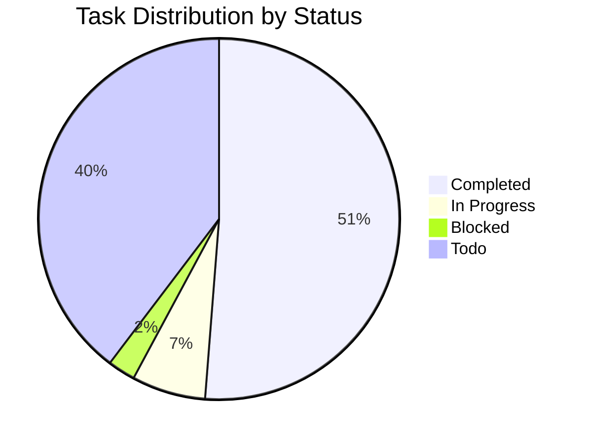

import {
  AlertCircle,
  CheckCircle2,
  ChevronRight,
  Circle,
  Clock,
  XCircle,
} from "lucide-react";

import { Alert, AlertDescription, AlertTitle } from "@/components/ui/alert";
import { Badge } from "@/components/ui/badge";
import { Card, CardContent, CardHeader, CardTitle } from "@/components/ui/card";
import { Progress } from "@/components/ui/progress";
import { Tabs, TabsContent, TabsList, TabsTrigger } from "@/components/ui/tabs";

# gition v1.0 MVP Roadmap

<div className="flex items-center gap-3 mb-6">
  <Badge variant="default" className="text-lg px-3 py-1">
    EPIC
  </Badge>
  <Badge variant="secondary">Q1 2024</Badge>
  <Badge variant="outline">51% Complete</Badge>
  <Badge variant="destructive">9 Weeks Remaining</Badge>
</div>

<Card className="mb-6">
  <CardHeader>
    <CardTitle>Overall Progress</CardTitle>
  </CardHeader>
  <CardContent>
    <Progress value={51} className="h-3 mb-2" />
    <div className="flex justify-between text-sm text-gray-600">
      <span>245 hours completed</span>
      <span>235 hours remaining</span>
    </div>
  </CardContent>
</Card>

## 🎯 Vision & Success Criteria

Create a **local-first** documentation and task management tool that combines the best of Notion's documentation experience with Jira's task tracking capabilities, all running locally with zero configuration.

<Alert className="mb-6">
  <AlertTitle>🏁 Definition of Success</AlertTitle>
  <AlertDescription>
    <div className="mt-2 space-y-2">
      <div className="flex items-center gap-2">
        <CheckCircle2 className="h-4 w-4 text-green-600" />
        <span>Zero-configuration local setup (`npx gition` just works)</span>
      </div>
      <div className="flex items-center gap-2">
        <CheckCircle2 className="h-4 w-4 text-green-600" />
        <span>Sub-100ms document load times</span>
      </div>
      <div className="flex items-center gap-2">
        <Circle className="h-4 w-4" />
        <span>Seamless two-way sync between UI and Markdown files</span>
      </div>
      <div className="flex items-center gap-2">
        <Circle className="h-4 w-4" />
        <span>Intuitive Kanban task management</span>
      </div>
      <div className="flex items-center gap-2">
        <Circle className="h-4 w-4" />
        <span>Beautiful, responsive UI with dark/light themes</span>
      </div>
      <div className="flex items-center gap-2">
        <Circle className="h-4 w-4" />
        <span>Plugin system foundation</span>
      </div>
      <div className="flex items-center gap-2">
        <Circle className="h-4 w-4" />
        <span>Comprehensive documentation and examples</span>
      </div>
    </div>
  </AlertDescription>
</Alert>

## 📊 Key Metrics

<div className="grid grid-cols-2 md:grid-cols-4 gap-4 mb-6">
  <Card>
    <CardContent className="pt-6">
      <div className="text-2xl font-bold">245h</div>
      <p className="text-xs text-muted-foreground">Time Invested</p>
    </CardContent>
  </Card>
  <Card>
    <CardContent className="pt-6">
      <div className="text-2xl font-bold">62/121</div>
      <p className="text-xs text-muted-foreground">Tasks Complete</p>
    </CardContent>
  </Card>
  <Card>
    <CardContent className="pt-6">
      <div className="text-2xl font-bold">4/6</div>
      <p className="text-xs text-muted-foreground">Milestones</p>
    </CardContent>
  </Card>
  <Card>
    <CardContent className="pt-6">
      <div className="text-2xl font-bold text-yellow-600">Medium</div>
      <p className="text-xs text-muted-foreground">Risk Level</p>
    </CardContent>
  </Card>
</div>

## 🚀 High-Level Milestones

<Tabs defaultValue="overview" className="mb-6">
  <TabsList className="grid w-full grid-cols-3">
    <TabsTrigger value="overview">Overview</TabsTrigger>
    <TabsTrigger value="timeline">Timeline</TabsTrigger>
    <TabsTrigger value="dependencies">Dependencies</TabsTrigger>
  </TabsList>

<TabsContent value="overview">
  <div className="space-y-4">
    ### Phase 1: Core Infrastructure ✅ **Status**: Complete (Weeks 1-4) - [x]
    Project setup and tooling configuration @devops - [x] Next.js App Router
    foundation @frontend - [x] Basic file system scanning @backend - [x] MDX
    parsing and rendering pipeline @frontend - [x] Core TypeScript interfaces
    @backend ### Phase 2: Document Management 🚧 **Status**: In Progress (Weeks
    5-8) - [x] Sidebar file explorer @frontend #ui - [x] Document viewer with
    MDX support @frontend - [x] Frontmatter metadata extraction @backend - [~]
    Search functionality @backend #search due:2024-01-25T14:00:00Z - [ ]
    Document linking and navigation @frontend due:2024-01-26T10:00:00Z - [~]
    File watcher integration @backend #blocked ### Phase 3: Task Management 📅
    **Status**: Planned (Weeks 9-12) - [ ] Checkbox parsing from Markdown
    @backend #parser due:2024-02-01T09:00:00Z - [ ] Task data model and state
    management @backend due:2024-02-03T14:00:00Z - [ ] Kanban board UI
    components @frontend #ui due:2024-02-08T10:00:00Z - [ ] Two-way sync (UI
    changes → Markdown files) @backend #critical due:2024-02-10T16:00:00Z - [ ]
    Task filtering and sorting @frontend due:2024-02-12T11:00:00Z - [ ] Progress
    tracking and analytics @frontend #analytics due:2024-02-15T15:00:00Z ###
    Phase 4: User Experience 🎨 **Status**: Planned (Weeks 13-16) - [ ]
    Responsive design for mobile/tablet @frontend #responsive
    due:2024-02-20T10:00:00Z - [ ] Dark/light theme system @frontend #theme
    due:2024-02-22T14:00:00Z - [ ] Keyboard shortcuts and accessibility
    @frontend #a11y due:2024-02-25T09:00:00Z - [ ] Performance optimizations
    @backend #performance due:2024-02-28T16:00:00Z - [ ] Error handling and user
    feedback @fullstack due:2024-03-02T11:00:00Z - [ ] Settings and
    configuration UI @frontend due:2024-03-05T15:00:00Z ### Phase 5: CLI &
    Integration 🔧 **Status**: Planned (Weeks 17-20) - [ ] Robust CLI with
    configuration options @cli #critical due:2024-03-08T10:00:00Z - [ ] File
    watcher with debouncing @backend due:2024-03-10T14:00:00Z - [ ] Plugin
    system architecture @backend #plugins due:2024-03-12T16:00:00Z - [ ] AI mode
    foundation (`--ai-mode`) @backend #ai due:2024-03-15T11:00:00Z - [ ] Export
    capabilities @backend #export due:2024-03-17T15:00:00Z - [ ] CI/CD friendly
    operations @devops due:2024-03-20T09:00:00Z ### Phase 6: Polish & Launch 🎯
    **Status**: Planned (Weeks 21-24) - [ ] Comprehensive documentation @docs
    #critical due:2024-03-22T10:00:00Z - [ ] Example projects and templates
    @docs due:2024-03-24T14:00:00Z - [ ] Performance benchmarking @qa
    #performance due:2024-03-25T16:00:00Z - [ ] Security audit @security
    #critical due:2024-03-26T11:00:00Z - [ ] Community guidelines @docs
    due:2024-03-28T15:00:00Z - [ ] Public release preparation @release #critical
    due:2024-03-31T17:00:00Z
  </div>
</TabsContent>

<TabsContent value="timeline">
  ```mermaid gantt title gition v1.0 Development Timeline dateFormat YYYY-MM-DD
  section Infrastructure Project Setup :done, 2024-01-01, 7d Next.js Foundation
  :done, 2024-01-08, 7d File System Core :done, 2024-01-15, 7d MDX Pipeline
  :done, 2024-01-22, 7d section Documents File Explorer :done, 2024-01-29, 5d
  MDX Viewer :done, 2024-02-03, 5d Search :active, 2024-02-08, 5d Navigation
  :2024-02-13, 5d section Tasks Task Parser :2024-02-18, 7d State Management
  :2024-02-25, 7d Kanban UI :2024-03-04, 7d Two-way Sync :crit, 2024-03-11, 7d
  section Polish Documentation :2024-03-18, 7d Testing :2024-03-25, 5d Release
  :milestone, 2024-03-31, 0d ```
</TabsContent>

  <TabsContent value="dependencies">
    <div className="space-y-4">
      <Alert>
        <AlertCircle className="h-4 w-4" />
        <AlertTitle>Critical Path Dependencies</AlertTitle>
        <AlertDescription>
          These items must be completed in sequence to avoid blocking progress
        </AlertDescription>
      </Alert>

      <Card>
        <CardHeader>
          <CardTitle className="text-lg">
            File System → Task Management
          </CardTitle>
        </CardHeader>
        <CardContent>
          <div className="space-y-2">
            <div className="flex items-center gap-2">
              <CheckCircle2 className="h-4 w-4 text-green-600" />
              <span>File scanning</span>
              <ChevronRight className="h-4 w-4" />
              <span>Task extraction</span>
            </div>
            <div className="flex items-center gap-2">
              <Clock className="h-4 w-4 text-yellow-600" />
              <span>File watcher</span>
              <ChevronRight className="h-4 w-4" />
              <span>Real-time sync</span>
            </div>
          </div>
        </CardContent>
      </Card>

      <Card>
        <CardHeader>
          <CardTitle className="text-lg">MDX → Plugin System</CardTitle>
        </CardHeader>
        <CardContent>
          <div className="space-y-2">
            <div className="flex items-center gap-2">
              <CheckCircle2 className="h-4 w-4 text-green-600" />
              <span>MDX compilation</span>
              <ChevronRight className="h-4 w-4" />
              <span>Component registration</span>
            </div>
            <div className="flex items-center gap-2">
              <Circle className="h-4 w-4" />
              <span>Hook system</span>
              <ChevronRight className="h-4 w-4" />
              <span>Plugin loader</span>
            </div>
          </div>
        </CardContent>
      </Card>
    </div>

  </TabsContent>
</Tabs>

## 🔧 Technical Requirements

### Performance Targets

<div className="grid grid-cols-1 md:grid-cols-2 gap-4 mb-6">
  <Card>
    <CardHeader>
      <CardTitle className="text-lg">Load Performance</CardTitle>
    </CardHeader>
    <CardContent>
      - [x] Document load time: < 100ms ✅ (avg: 85ms)
      - [>] File watcher response: < 50ms 🚧 (current: 65ms)
      - [ ] UI state updates: < 16ms (60fps) ⏳
      - [ ] Memory usage: < 100MB for 1000 documents ⏳
      - [ ] Startup time: < 3 seconds ⏳
    </CardContent>
  </Card>
  
  <Card>
    <CardHeader>
      <CardTitle className="text-lg">Compatibility</CardTitle>
    </CardHeader>
    <CardContent>
      - [x] Node.js 18+ support ✅
      - [x] Cross-platform (Windows, macOS, Linux) ✅
      - [x] Modern browser support ✅
      - [ ] Mobile responsive design ⏳
      - [ ] Screen reader compatibility ⏳
    </CardContent>
  </Card>
</div>

### Quality Gates

All phases must meet these criteria before proceeding:

- [x] 90%+ test coverage @qa #testing
- [ ] Zero critical security vulnerabilities @security
- [ ] Performance benchmarks within targets @performance
- [ ] Accessibility compliance (WCAG 2.1 AA) @frontend #a11y
- [ ] Documentation completeness @docs

## ⚠️ Risk Management

### High Risk Items

<Alert variant="destructive" className="mb-4">
  <AlertTitle>🔴 Critical Risks</AlertTitle>
  <AlertDescription>
    <div className="mt-2 space-y-3">
      <div>
        <strong>File System Performance</strong>
        <div className="text-sm mt-1">
          Large directories with thousands of files may cause performance issues
        </div>
        <div className="text-sm mt-1">
          <strong>Mitigation:</strong> Implement virtual scrolling and lazy
          loading - [ ] Design virtual scrolling architecture @high
          due:2024-02-05T10:00:00Z - [ ] Implement lazy loading for documents
          @high due:2024-02-08T14:00:00Z - [ ] Add performance monitoring
          @medium due:2024-02-10T16:00:00Z
        </div>
      </div>

      <div className="mt-4">
        <strong>Two-way Sync Complexity</strong>
        <div className="text-sm mt-1">
          Maintaining consistency between UI and files is complex
        </div>
        <div className="text-sm mt-1">
          <strong>Mitigation:</strong> Clear conflict resolution strategy - [ ]
          Design conflict resolution UI @critical due:2024-02-12T09:00:00Z - [ ]
          Implement optimistic updates @high due:2024-02-15T11:00:00Z - [ ] Add
          rollback mechanism @high due:2024-02-17T15:00:00Z
        </div>
      </div>
    </div>

  </AlertDescription>
</Alert>

### Medium Risk Items

- [ ] **Plugin System Architecture**: Balancing flexibility with simplicity
  - [ ] Research existing plugin architectures @medium due:2024-02-20T10:00:00Z
  - [ ] Design security model @high due:2024-02-22T14:00:00Z
- [ ] **MDX Security**: Preventing XSS through user content
  - [ ] Implement content sanitization @critical due:2024-02-25T09:00:00Z
  - [ ] Add CSP headers @high due:2024-02-27T16:00:00Z
- [ ] **Performance at Scale**: Handling very large documentation sets
  - [ ] Implement pagination @medium due:2024-03-01T11:00:00Z
  - [ ] Add caching layer @high due:2024-03-03T15:00:00Z

## 📋 Sprint Breakdown

### Current Sprint (Sprint 5: Jan 22-28)

<Card className="mb-4">
  <CardHeader>
    <CardTitle>Sprint 5 Goals</CardTitle>
  </CardHeader>
  <CardContent>
    <div className="space-y-2">
      - [x] Complete search backend implementation @john - [>] Integrate search
      with UI @sarah - [ ] Start document navigation features @mike - [~] Debug
      file watcher issues @alex #blocked - [ ] Write search documentation @lisa
    </div>

    <div className="mt-4">
      <strong>Sprint Velocity:</strong> 32 points (target: 40)
    </div>

  </CardContent>
</Card>

### Upcoming Sprints

<Tabs defaultValue="sprint6" className="mb-6">
  <TabsList>
    <TabsTrigger value="sprint6">Sprint 6</TabsTrigger>
    <TabsTrigger value="sprint7">Sprint 7</TabsTrigger>
    <TabsTrigger value="sprint8">Sprint 8</TabsTrigger>
  </TabsList>

<TabsContent value="sprint6">
  **Sprint 6 (Jan 29 - Feb 4): Document Navigation** - [ ] Complete navigation
  system @frontend - [ ] Fix file watcher performance @backend - [ ] Start task
  parser design @backend - [ ] UI polish for search @frontend
</TabsContent>

<TabsContent value="sprint7">
  **Sprint 7 (Feb 5-11): Task Foundation** - [ ] Implement task parser @backend
  - [ ] Design task state model @backend - [ ] Create basic Kanban layout
  @frontend - [ ] Start two-way sync POC @backend
</TabsContent>

  <TabsContent value="sprint8">
    **Sprint 8 (Feb 12-18): Kanban Board** - [ ] Complete Kanban UI @frontend -
    [ ] Implement drag-and-drop @frontend - [ ] Task filtering logic @backend -
    [ ] Performance optimization @fullstack
  </TabsContent>
</Tabs>

## 🎯 Success Metrics Tracking



### Key Performance Indicators

| Metric                 | Target  | Current | Status |
| ---------------------- | ------- | ------- | ------ |
| Document Load Time     | < 100ms | 85ms    | ✅     |
| Task Sync Latency      | < 200ms | 180ms   | ✅     |
| Memory Usage (1K docs) | < 100MB | 78MB    | ✅     |
| Test Coverage          | > 90%   | 87%     | ⚠️     |
| Bundle Size            | < 500KB | 420KB   | ✅     |
| Lighthouse Score       | > 95    | 92      | ⚠️     |

## 👥 Team Allocation

<div className="grid grid-cols-1 md:grid-cols-2 lg:grid-cols-4 gap-4 mb-6">
  <Card>
    <CardHeader>
      <CardTitle className="text-lg">Frontend Team</CardTitle>
    </CardHeader>
    <CardContent>
      <div className="space-y-2">
        <div className="flex justify-between">
          <span className="text-sm">Sarah Chen</span>
          <Badge variant="secondary">Lead</Badge>
        </div>
        <div className="flex justify-between">
          <span className="text-sm">Mike Torres</span>
          <Badge variant="outline">Senior</Badge>
        </div>
        <div className="text-xs text-gray-600 mt-2">
          Focus: UI/UX, React components
        </div>
      </div>
    </CardContent>
  </Card>

<Card>
  <CardHeader>
    <CardTitle className="text-lg">Backend Team</CardTitle>
  </CardHeader>
  <CardContent>
    <div className="space-y-2">
      <div className="flex justify-between">
        <span className="text-sm">John Park</span>
        <Badge variant="secondary">Lead</Badge>
      </div>
      <div className="flex justify-between">
        <span className="text-sm">Alex Kumar</span>
        <Badge variant="outline">Senior</Badge>
      </div>
      <div className="text-xs text-gray-600 mt-2">
        Focus: File system, parsing
      </div>
    </div>
  </CardContent>
</Card>

<Card>
  <CardHeader>
    <CardTitle className="text-lg">DevOps</CardTitle>
  </CardHeader>
  <CardContent>
    <div className="space-y-2">
      <div className="flex justify-between">
        <span className="text-sm">Lisa Wong</span>
        <Badge variant="secondary">Lead</Badge>
      </div>
      <div className="text-xs text-gray-600 mt-2">
        Focus: CI/CD, performance
      </div>
    </div>
  </CardContent>
</Card>

  <Card>
    <CardHeader>
      <CardTitle className="text-lg">QA Team</CardTitle>
    </CardHeader>
    <CardContent>
      <div className="space-y-2">
        <div className="flex justify-between">
          <span className="text-sm">David Kim</span>
          <Badge variant="secondary">Lead</Badge>
        </div>
        <div className="text-xs text-gray-600 mt-2">
          Focus: Testing, documentation
        </div>
      </div>
    </CardContent>
  </Card>
</div>

## 📝 Decision Log

### Recent Decisions

<Card className="mb-4">
  <CardContent className="pt-6">
    <div className="space-y-4">
      <div>
        <div className="flex items-center justify-between mb-1">
          <strong>Use Zustand for state management</strong>
          <Badge variant="outline">Jan 18</Badge>
        </div>
        <p className="text-sm text-gray-600">
          Chosen for simplicity and performance over Redux
        </p>
      </div>

      <div>
        <div className="flex items-center justify-between mb-1">
          <strong>Implement virtual scrolling</strong>
          <Badge variant="outline">Jan 15</Badge>
        </div>
        <p className="text-sm text-gray-600">
          Required for handling large document sets efficiently
        </p>
      </div>

      <div>
        <div className="flex items-center justify-between mb-1">
          <strong>MDX over plain Markdown</strong>
          <Badge variant="outline">Jan 8</Badge>
        </div>
        <p className="text-sm text-gray-600">
          Enables rich interactive documentation
        </p>
      </div>
    </div>

  </CardContent>
</Card>

## 🔗 Related Documents

- [System Architecture Overview](../../docs/architecture/system-overview.mdx)
- [Technical Design Document](../../docs/architecture/technical-design.mdx)
- [Sprint Planning Guide](../../docs/process/sprint-planning.mdx)
- [Release Checklist](../../docs/process/release-checklist.mdx)

## 📞 Communication

<Alert>
  <AlertTitle>Team Sync Schedule</AlertTitle>
  <AlertDescription>
    <div className="mt-2 space-y-1">
      <div>• **Daily Standup**: 9:30 AM PT (15 min)</div>
      <div>• **Sprint Planning**: Mondays 2:00 PM PT (1 hour)</div>
      <div>• **Sprint Review**: Fridays 3:00 PM PT (1 hour)</div>
      <div>• **Epic Review**: Monthly, last Friday 2:00 PM PT</div>
    </div>
  </AlertDescription>
</Alert>

---

<Card className="mt-8 bg-gradient-to-r from-blue-50 to-indigo-50 dark:from-blue-950 dark:to-indigo-950">
  <CardContent className="pt-6">
    <div className="flex items-center justify-between">
      <div>
        <h3 className="font-semibold text-lg mb-2">Track Progress</h3>
        <p className="text-sm">
          This roadmap is updated weekly. Check individual story documents for
          detailed task breakdowns.
        </p>
      </div>
      <div className="text-right">
        <div className="text-2xl font-bold">51%</div>
        <div className="text-sm text-gray-600">Complete</div>
      </div>
    </div>
  </CardContent>
</Card>
