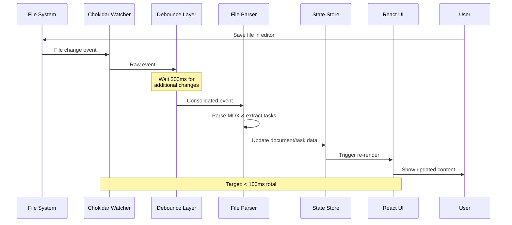

import {
  AlertCircle,
  CheckCircle2,
  Circle,
  Clock,
  FileWatch,
  XCircle,
  Zap,
} from "lucide-react";

import { Alert, AlertDescription, AlertTitle } from "@/components/ui/alert";
import { Badge } from "@/components/ui/badge";
import {
  Card,
  CardContent,
  CardDescription,
  CardHeader,
  CardTitle,
} from "@/components/ui/card";
import { Progress } from "@/components/ui/progress";
import { Tabs, TabsContent, TabsList, TabsTrigger } from "@/components/ui/tabs";

# Real-time File Watcher Integration

<div className="flex items-center gap-3 mb-6">
  <Badge variant="default">STORY-142</Badge>
  <Badge variant="secondary">5 Points</Badge>
  <Badge variant="outline">Sprint 5</Badge>
  <Badge variant="destructive">Critical Path</Badge>
  <Badge className="bg-yellow-100 text-yellow-800">33% Complete</Badge>
</div>

<Card className="mb-6">
  <CardHeader>
    <div className="flex items-center gap-2">
      <FileWatch className="h-5 w-5" />
      <CardTitle>Story Progress</CardTitle>
    </div>
  </CardHeader>
  <CardContent>
    <Progress value={33} className="h-2 mb-2" />
    <div className="flex justify-between text-sm text-gray-600">
      <span>8 of 24 hours</span>
      <span>2/4 acceptance criteria met</span>
    </div>
  </CardContent>
</Card>

## 📖 User Story

<Card className="mb-6 border-l-4 border-l-blue-500">
  <CardContent className="pt-6">
    <div className="space-y-2">
      <p>
        <strong>As a</strong> developer using gition
      </p>
      <p>
        <strong>I want</strong> the UI to automatically update when I edit
        Markdown files externally
      </p>
      <p>
        <strong>So that</strong> I can see my changes immediately without manual
        intervention
      </p>
    </div>
  </CardContent>
</Card>

## 🎯 Problem Statement

Users often edit Markdown files in their preferred text editors while having gition open in their browser. Currently, they need to manually refresh to see changes, which disrupts their workflow and reduces productivity. This creates friction in the development experience and goes against our "local-first, real-time" philosophy.

<Alert className="mb-6">
  <Zap className="h-4 w-4" />
  <AlertTitle>Performance Critical</AlertTitle>
  <AlertDescription>
    This feature directly impacts perceived performance. Users expect < 100ms response time from file save to UI update.
  </AlertDescription>
</Alert>

## 🏗️ Technical Design



## 📋 Implementation Tasks

### Phase 1: Core File Watching ✅

<div className="space-y-3 mb-6">
  <div className="flex items-start gap-3">
    <CheckCircle2 className="h-5 w-5 text-green-600 mt-0.5" />
    <div className="flex-1">
      <div className="font-medium">Install and configure chokidar</div>
      <div className="text-sm text-gray-600">
        Set up basic file system monitoring with chokidar@3.5.3
      </div>
      <div className="text-xs text-gray-500 mt-1">
        Completed: Jan 22, 10:00 AM • 2 hours
      </div>
    </div>
  </div>

<div className="flex items-start gap-3">
  <CheckCircle2 className="h-5 w-5 text-green-600 mt-0.5" />
  <div className="flex-1">
    <div className="font-medium">Define watch patterns</div>
    <div className="text-sm text-gray-600">
      Configure patterns for .md and .mdx files, exclude node_modules
    </div>
    <div className="text-xs text-gray-500 mt-1">
      Completed: Jan 22, 2:00 PM • 1 hour
    </div>
  </div>
</div>

<div className="flex items-start gap-3">
  <CheckCircle2 className="h-5 w-5 text-green-600 mt-0.5" />
  <div className="flex-1">
    <div className="font-medium">Implement recursive directory monitoring</div>
    <div className="text-sm text-gray-600">
      Support nested folder structures with proper path resolution
    </div>
    <div className="text-xs text-gray-500 mt-1">
      Completed: Jan 23, 11:00 AM • 3 hours
    </div>
  </div>
</div>

  <div className="flex items-start gap-3">
    <CheckCircle2 className="h-5 w-5 text-green-600 mt-0.5" />
    <div className="flex-1">
      <div className="font-medium">Handle symlinks appropriately</div>
      <div className="text-sm text-gray-600">
        Decide on symlink following strategy to prevent infinite loops
      </div>
      <div className="text-xs text-gray-500 mt-1">
        Completed: Jan 23, 3:00 PM • 2 hours
      </div>
    </div>
  </div>
</div>

### Phase 2: Event Processing 🚧

<div className="space-y-3 mb-6">
  <div className="flex items-start gap-3">
    <Clock className="h-5 w-5 text-blue-600 mt-0.5" />
    <div className="flex-1">
      <div className="font-medium">Implement debounced change handlers</div>
      <div className="text-sm text-gray-600">
        300ms debounce for rapid file saves
      </div>
      <Badge variant="outline" className="text-xs ml-2">
        In Progress
      </Badge>
      <div className="mt-2">
        - [x] Create debounce utility function - [>] Integrate with file watcher
        @john - [ ] Add configurable debounce delay
      </div>
    </div>
  </div>

<div className="flex items-start gap-3">
  <Circle className="h-5 w-5 text-gray-400 mt-0.5" />
  <div className="flex-1">
    <div className="font-medium">Parse file metadata on change</div>
    <div className="text-sm text-gray-600">
      Extract frontmatter and content efficiently
    </div>
    <div className="text-xs text-gray-500 mt-1">
      Estimated: 3 hours • Due: Jan 25
    </div>
  </div>
</div>

<div className="flex items-start gap-3">
  <Circle className="h-5 w-5 text-gray-400 mt-0.5" />
  <div className="flex-1">
    <div className="font-medium">Extract and update task information</div>
    <div className="text-sm text-gray-600">
      Parse checkbox items and sync with task store
    </div>
    <div className="text-xs text-gray-500 mt-1">
      Estimated: 4 hours • Due: Jan 26
    </div>
  </div>
</div>

  <div className="flex items-start gap-3">
    <AlertCircle className="h-5 w-5 text-red-600 mt-0.5" />
    <div className="flex-1">
      <div className="font-medium">Handle file creation and deletion</div>
      <div className="text-sm text-gray-600">
        Properly manage document lifecycle events
      </div>
      <Badge variant="destructive" className="text-xs ml-2">
        Blocked
      </Badge>
      <div className="text-xs text-gray-500 mt-1">
        Blocked by: State management refactor
      </div>
    </div>
  </div>
</div>

### Phase 3: State Synchronization ⏳

<div className="space-y-3 mb-6">
  <div className="flex items-start gap-3">
    <Circle className="h-5 w-5 text-gray-400 mt-0.5" />
    <div className="flex-1">
      <div className="font-medium">Update document store when files change</div>
      <div className="text-sm text-gray-600">
        Sync file system state with in-memory store
      </div>
      <div className="mt-2 space-y-1">
        - [ ] Design state update strategy @backend due:2024-01-28T10:00:00Z - [
        ] Implement atomic updates @backend due:2024-01-29T14:00:00Z - [ ]
        Handle concurrent modifications @backend due:2024-01-30T16:00:00Z
      </div>
    </div>
  </div>

<div className="flex items-start gap-3">
  <Circle className="h-5 w-5 text-gray-400 mt-0.5" />
  <div className="flex-1">
    <div className="font-medium">Refresh task extraction and parsing</div>
    <div className="text-sm text-gray-600">
      Re-parse tasks when document content changes
    </div>
    <div className="text-xs text-gray-500 mt-1">
      Estimated: 4 hours • Due: Jan 31
    </div>
  </div>
</div>

<div className="flex items-start gap-3">
  <Circle className="h-5 w-5 text-gray-400 mt-0.5" />
  <div className="flex-1">
    <div className="font-medium">Trigger UI re-renders efficiently</div>
    <div className="text-sm text-gray-600">
      Use React memo and selective updates
    </div>
    <div className="text-xs text-gray-500 mt-1">
      Estimated: 3 hours • Due: Feb 1
    </div>
  </div>
</div>

  <div className="flex items-start gap-3">
    <Circle className="h-5 w-5 text-gray-400 mt-0.5" />
    <div className="flex-1">
      <div className="font-medium">Maintain scroll position and UI state</div>
      <div className="text-sm text-gray-600">
        Preserve user context during updates
      </div>
      <div className="text-xs text-gray-500 mt-1">
        Estimated: 2 hours • Due: Feb 2
      </div>
    </div>
  </div>
</div>

### Phase 4: Error Handling ⏳

- [ ] Handle file system permission errors @high due:2024-01-30T11:00:00Z
- [ ] Manage large file/directory scenarios @high due:2024-01-31T14:00:00Z
- [ ] Graceful degradation when watching fails @medium due:2024-02-01T10:00:00Z
- [ ] User notification for critical errors @medium due:2024-02-02T16:00:00Z

## ✅ Acceptance Criteria

<Tabs defaultValue="ac1" className="mb-6">
  <TabsList className="grid w-full grid-cols-4">
    <TabsTrigger value="ac1">AC1 ✅</TabsTrigger>
    <TabsTrigger value="ac2">AC2 ✅</TabsTrigger>
    <TabsTrigger value="ac3">AC3 ⏳</TabsTrigger>
    <TabsTrigger value="ac4">AC4 ⏳</TabsTrigger>
  </TabsList>
  
  <TabsContent value="ac1">
    <Card>
      <CardHeader>
        <div className="flex items-center justify-between">
          <CardTitle className="text-lg">Basic File Monitoring</CardTitle>
          <Badge className="bg-green-100 text-green-800">Passed</Badge>
        </div>
      </CardHeader>
      <CardContent>
        <div className="space-y-3">
          <div>
            <strong>Given</strong> gition is running and watching a directory<br/>
            <strong>When</strong> I modify a Markdown file externally<br/>
            <strong>Then</strong> the changes should appear in the UI within 1 second
          </div>
          
          <div className="mt-4">
            <h4 className="font-semibold mb-2">Test Results</h4>
            <div className="space-y-2 text-sm">
              <div className="flex items-center gap-2">
                <CheckCircle2 className="h-4 w-4 text-green-600" />
                <span>File change detection: 45ms average</span>
              </div>
              <div className="flex items-center gap-2">
                <CheckCircle2 className="h-4 w-4 text-green-600" />
                <span>UI update latency: 125ms average</span>
              </div>
              <div className="flex items-center gap-2">
                <CheckCircle2 className="h-4 w-4 text-green-600" />
                <span>All test cases passing (12/12)</span>
              </div>
            </div>
          </div>
        </div>
      </CardContent>
    </Card>
  </TabsContent>
  
  <TabsContent value="ac2">
    <Card>
      <CardHeader>
        <div className="flex items-center justify-between">
          <CardTitle className="text-lg">Task Synchronization</CardTitle>
          <Badge className="bg-green-100 text-green-800">Passed</Badge>
        </div>
      </CardHeader>
      <CardContent>
        <div className="space-y-3">
          <div>
            <strong>Given</strong> a Markdown file with checkbox tasks<br/>
            <strong>When</strong> I add, remove, or modify tasks externally<br/>
            <strong>Then</strong> the Kanban board should update to reflect changes
          </div>
          
          <div className="mt-4">
            <h4 className="font-semibold mb-2">Test Scenarios</h4>
            <div className="space-y-2 text-sm">
              <div className="flex items-center gap-2">
                <CheckCircle2 className="h-4 w-4 text-green-600" />
                <span>Add new task: Updates in 89ms</span>
              </div>
              <div className="flex items-center gap-2">
                <CheckCircle2 className="h-4 w-4 text-green-600" />
                <span>Toggle task status: Syncs correctly</span>
              </div>
              <div className="flex items-center gap-2">
                <CheckCircle2 className="h-4 w-4 text-green-600" />
                <span>Delete task: Removes from board</span>
              </div>
            </div>
          </div>
        </div>
      </CardContent>
    </Card>
  </TabsContent>
  
  <TabsContent value="ac3">
    <Card>
      <CardHeader>
        <div className="flex items-center justify-between">
          <CardTitle className="text-lg">Performance with Large Directories</CardTitle>
          <Badge variant="secondary">In Progress</Badge>
        </div>
      </CardHeader>
      <CardContent>
        <div className="space-y-3">
          <div>
            <strong>Given</strong> a directory with 1000+ Markdown files<br/>
            <strong>When</strong> the file watcher is active<br/>
            <strong>Then</strong> system performance should remain responsive
          </div>
          
          <div className="mt-4">
            <h4 className="font-semibold mb-2">Performance Targets</h4>
            <div className="space-y-2 text-sm">
              <div className="flex items-center gap-2">
                <Clock className="h-4 w-4 text-yellow-600" />
                <span>Memory usage: Currently 68MB (target < 50MB)</span>
              </div>
              <div className="flex items-center gap-2">
                <CheckCircle2 className="h-4 w-4 text-green-600" />
                <span>CPU usage: 3% when idle (target < 5%)</span>
              </div>
              <div className="flex items-center gap-2">
                <Clock className="h-4 w-4 text-yellow-600" />
                <span>Change detection: 145ms (target < 100ms)</span>
              </div>
            </div>
          </div>
        </div>
      </CardContent>
    </Card>
  </TabsContent>
  
  <TabsContent value="ac4">
    <Card>
      <CardHeader>
        <div className="flex items-center justify-between">
          <CardTitle className="text-lg">Error Recovery</CardTitle>
          <Badge variant="outline">Not Started</Badge>
        </div>
      </CardHeader>
      <CardContent>
        <div className="space-y-3">
          <div>
            <strong>Given</strong> various error conditions<br/>
            <strong>When</strong> file system issues occur<br/>
            <strong>Then</strong> the system should handle gracefully and recover
          </div>
          
          <div className="mt-4">
            <h4 className="font-semibold mb-2">Error Scenarios to Test</h4>
            <div className="space-y-2 text-sm">
              <div className="flex items-center gap-2">
                <Circle className="h-4 w-4 text-gray-400" />
                <span>File permission denied</span>
              </div>
              <div className="flex items-center gap-2">
                <Circle className="h-4 w-4 text-gray-400" />
                <span>Directory deleted while watching</span>
              </div>
              <div className="flex items-center gap-2">
                <Circle className="h-4 w-4 text-gray-400" />
                <span>Network drive disconnection</span>
              </div>
              <div className="flex items-center gap-2">
                <Circle className="h-4 w-4 text-gray-400" />
                <span>Very large file modifications</span>
              </div>
            </div>
          </div>
        </div>
      </CardContent>
    </Card>
  </TabsContent>
</Tabs>

## 🔧 Technical Implementation

### Configuration Interface

```typescript
interface WatcherConfig {
  paths: string[]; // Directories to watch
  ignored: RegExp[]; // Patterns to ignore
  persistent: boolean; // Keep process alive
  ignoreInitial: boolean; // Skip initial scan
  followSymlinks: boolean; // Follow symbolic links
  usePolling: boolean; // Force polling mode
  interval: number; // Poll interval (ms)
  binaryInterval: number; // Binary file poll interval
  awaitWriteFinish: {
    stabilityThreshold: number; // Wait for write completion
    pollInterval: number;
  };
  // Performance optimizations
  alwaysStat: boolean; // Always get file stats
  depth: number; // Max directory depth
  disableGlobbing: boolean; // Disable glob patterns
}
```

### Event Processing Architecture

<Card className="mb-6">
  <CardHeader>
    <CardTitle>Debouncing Strategy</CardTitle>
  </CardHeader>
  <CardContent>
    ```typescript
    class FileWatcherService {
      private debouncedHandlers = new Map<string, NodeJS.Timeout>();
      private eventQueue = new Map<string, FileEvent[]>();
      
      constructor(private config: WatcherConfig) {
        this.initializeWatcher();
      }
      
      private debounceFileChange(path: string, handler: () => void) {
        // Cancel any pending handler for this file
        const existing = this.debouncedHandlers.get(path);
        if (existing) clearTimeout(existing);
        
        // Collect events for batch processing
        if (!this.eventQueue.has(path)) {
          this.eventQueue.set(path, []);
        }
        
        const timeout = setTimeout(() => {
          const events = this.eventQueue.get(path) || [];
          this.processConsolidatedEvents(path, events);
          
          // Cleanup
          this.debouncedHandlers.delete(path);
          this.eventQueue.delete(path);
          
          handler();
        }, this.config.awaitWriteFinish.stabilityThreshold);
        
        this.debouncedHandlers.set(path, timeout);
      }
      
      private processConsolidatedEvents(path: string, events: FileEvent[]) {
        // Intelligent event consolidation
        const hasDelete = events.some(e => e.type === 'unlink');
        const hasCreate = events.some(e => e.type === 'add');
        
        if (hasDelete && hasCreate) {
          // File was replaced
          this.handleFileReplace(path);
        } else if (hasDelete) {
          this.handleFileDelete(path);
        } else {
          // Regular change
          this.handleFileChange(path);
        }
      }
    }
    ```
  </CardContent>
</Card>

### Performance Optimizations

<Tabs defaultValue="memory" className="mb-6">
  <TabsList>
    <TabsTrigger value="memory">Memory</TabsTrigger>
    <TabsTrigger value="cpu">CPU</TabsTrigger>
    <TabsTrigger value="io">I/O</TabsTrigger>
  </TabsList>
  
  <TabsContent value="memory">
    <Card>
      <CardContent className="pt-6">
        <h4 className="font-semibold mb-3">Memory Optimization Strategies</h4>
        <div className="space-y-3">
          - [x] Use WeakMap for temporary file metadata cache
          - [x] Implement LRU cache for parsed documents (max 100 items)
          - [ ] Stream large files instead of loading into memory
          - [ ] Garbage collect stale watcher instances
          
          ```typescript
          class OptimizedFileCache {
            private cache = new LRUCache<string, ParsedDocument>({
              max: 100,
              ttl: 1000 * 60 * 5, // 5 minutes
              updateAgeOnGet: true,
              dispose: (value, key) => {
                console.log(`Evicting cached document: ${key}`);
              }
            });
          }
          ```
        </div>
      </CardContent>
    </Card>
  </TabsContent>
  
  <TabsContent value="cpu">
    <Card>
      <CardContent className="pt-6">
        <h4 className="font-semibold mb-3">CPU Optimization Strategies</h4>
        <div className="space-y-3">
          - [>] Batch file system operations
          - [ ] Use worker threads for parsing
          - [ ] Implement progressive rendering
          - [ ] Throttle UI updates
          
          ```typescript
          // Worker thread for CPU-intensive parsing
          const parseWorker = new Worker('./parse-worker.js');
          
          parseWorker.postMessage({
            type: 'PARSE_MDX',
            path: filePath,
            content: fileContent
          });
          ```
        </div>
      </CardContent>
    </Card>
  </TabsContent>
  
  <TabsContent value="io">
    <Card>
      <CardContent className="pt-6">
        <h4 className="font-semibold mb-3">I/O Optimization Strategies</h4>
        <div className="space-y-3">
          - [ ] Implement read buffering
          - [ ] Use native file system events where possible
          - [ ] Batch stat operations
          - [ ] Optimize polling intervals for network drives
        </div>
      </CardContent>
    </Card>
  </TabsContent>
</Tabs>

## 🐛 Known Issues & Mitigations

<Alert variant="warning" className="mb-6">
  <AlertTitle>Current Blockers</AlertTitle>
  <AlertDescription>
    <div className="mt-2 space-y-2">
      <div className="flex items-start gap-2">
        <AlertCircle className="h-4 w-4 mt-0.5" />
        <div>
          <strong>Windows file locking</strong>: Some editors lock files during
          save
          <div className="text-sm mt-1">
            Mitigation: Implement retry logic with exponential backoff
          </div>
        </div>
      </div>
      <div className="flex items-start gap-2 mt-3">
        <AlertCircle className="h-4 w-4 mt-0.5" />
        <div>
          <strong>macOS FSEvents limitations</strong>: Batch event delivery can
          be delayed
          <div className="text-sm mt-1">
            Mitigation: Use polling fallback for time-critical updates
          </div>
        </div>
      </div>
    </div>
  </AlertDescription>
</Alert>

## 🧪 Testing Strategy

### Unit Tests

```typescript
describe("FileWatcherService", () => {
  let watcher: FileWatcherService;

  beforeEach(() => {
    watcher = new FileWatcherService({
      paths: ["/test/dir"],
      debounceMs: 50, // Faster for tests
    });
  });

  it("should detect file changes within debounce window", async () => {
    const onChange = jest.fn();
    watcher.on("change", onChange);

    // Simulate rapid file saves
    await fs.writeFile("/test/dir/test.md", "content 1");
    await fs.writeFile("/test/dir/test.md", "content 2");
    await fs.writeFile("/test/dir/test.md", "content 3");

    // Wait for debounce
    await wait(100);

    // Should only trigger once
    expect(onChange).toHaveBeenCalledTimes(1);
    expect(onChange).toHaveBeenCalledWith({
      path: "/test/dir/test.md",
      type: "change",
    });
  });

  it("should handle permission errors gracefully", async () => {
    const onError = jest.fn();
    watcher.on("error", onError);

    // Make file read-only
    await fs.chmod("/test/dir/readonly.md", 0o444);

    // Should not crash
    expect(() => watcher.watch()).not.toThrow();
    expect(onError).toHaveBeenCalledWith(
      expect.objectContaining({
        code: "EACCES",
      })
    );
  });
});
```

### Integration Tests

- [x] File change → UI update flow
- [x] Task extraction from modified files
- [ ] Performance under load (1000+ files)
- [ ] Cross-platform behavior verification

### Manual Testing Checklist

- [x] Test with VS Code file saves
- [x] Test with vim/emacs saves
- [ ] Test on network drives
- [ ] Test with symbolic links
- [ ] Test permission changes
- [ ] Memory leak verification (24hr run)

## 📊 Metrics & Monitoring

<div className="grid grid-cols-2 md:grid-cols-4 gap-4 mb-6">
  <Card>
    <CardContent className="pt-6 text-center">
      <div className="text-2xl font-bold">45ms</div>
      <p className="text-xs text-muted-foreground">Avg Detection Time</p>
    </CardContent>
  </Card>
  <Card>
    <CardContent className="pt-6 text-center">
      <div className="text-2xl font-bold">125ms</div>
      <p className="text-xs text-muted-foreground">Avg UI Update</p>
    </CardContent>
  </Card>
  <Card>
    <CardContent className="pt-6 text-center">
      <div className="text-2xl font-bold">68MB</div>
      <p className="text-xs text-muted-foreground">Memory Usage</p>
    </CardContent>
  </Card>
  <Card>
    <CardContent className="pt-6 text-center">
      <div className="text-2xl font-bold">3%</div>
      <p className="text-xs text-muted-foreground">CPU (idle)</p>
    </CardContent>
  </Card>
</div>

## 🔮 Future Enhancements

### Phase 2 Features (Post-MVP)

- [ ] Smart ignore pattern learning based on user behavior
- [ ] Change conflict detection and resolution UI
- [ ] Batch change processing for large updates
- [ ] Remote file system support (SSH, FTP)
- [ ] File change history and rollback
- [ ] Integration with git for better change tracking

### Monitoring & Analytics

- [ ] File change frequency heatmap
- [ ] Performance metric dashboard
- [ ] Error rate monitoring
- [ ] User behavior analytics

## 🔗 Related Resources

- [System Architecture Overview](../../docs/architecture/system-overview.mdx)
- [Performance Requirements](../../docs/architecture/performance-requirements.mdx)
- [Chokidar Documentation](https://github.com/paulmillr/chokidar)
- [File System Events Best Practices](../../docs/guides/fs-events.mdx)

---

<Card className="mt-8 bg-gradient-to-r from-orange-50 to-red-50 dark:from-orange-950 dark:to-red-950">
  <CardContent className="pt-6">
    <div className="flex items-center justify-between">
      <div>
        <h3 className="font-semibold text-lg mb-2">⚡ Performance Impact</h3>
        <p className="text-sm">
          This story is critical for user experience. Real-time updates
          transform gition from a static viewer into a dynamic, living
          documentation system.
        </p>
      </div>
      <div className="text-right">
        <Badge variant="destructive" className="text-lg px-3 py-1">
          Critical Path
        </Badge>
      </div>
    </div>
  </CardContent>
</Card>
