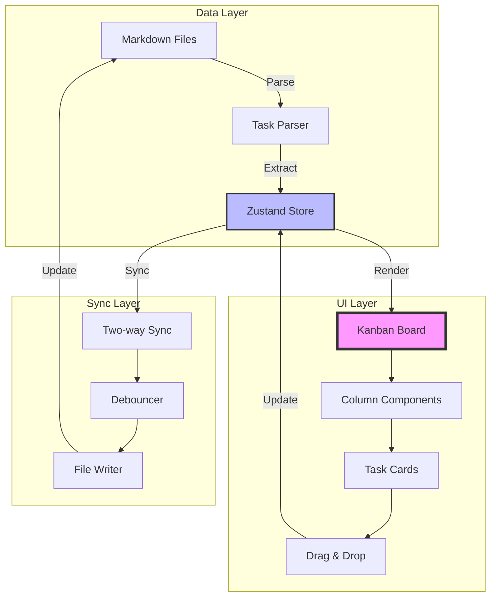

import {
  AlertCircle,
  CheckCircle2,
  Circle,
  Clock,
  Move,
  Trello,
  XCircle,
} from "lucide-react";

import { Alert, AlertDescription, AlertTitle } from "@/components/ui/alert";
import { Badge } from "@/components/ui/badge";
import { Button } from "@/components/ui/button";
import {
  Card,
  CardContent,
  CardDescription,
  CardHeader,
  CardTitle,
} from "@/components/ui/card";
import { Progress } from "@/components/ui/progress";
import { Tabs, TabsContent, TabsList, TabsTrigger } from "@/components/ui/tabs";

# Kanban Board Implementation

<div className="flex items-center gap-3 mb-6">
  <Badge variant="default">STORY-089</Badge>
  <Badge variant="secondary">8 Points</Badge>
  <Badge variant="outline">Sprint 3</Badge>
  <Badge className="bg-blue-100 text-blue-800">56% Complete</Badge>
</div>

<Card className="mb-6">
  <CardHeader>
    <div className="flex items-center gap-2">
      <Trello className="h-5 w-5" />
      <CardTitle>Implementation Progress</CardTitle>
    </div>
  </CardHeader>
  <CardContent>
    <Progress value={56} className="h-3 mb-2" />
    <div className="flex justify-between text-sm text-gray-600">
      <span>18 of 32 hours</span>
      <span>Phase 2 of 4 complete</span>
    </div>
  </CardContent>
</Card>

## 📖 User Story

<Card className="mb-6 border-l-4 border-l-purple-500">
  <CardContent className="pt-6">
    <div className="space-y-2">
      <p>
        <strong>As a</strong> project manager using gition
      </p>
      <p>
        <strong>I want</strong> to view tasks in a Kanban board format
      </p>
      <p>
        <strong>So that</strong> I can visualize project progress and manage
        task flow efficiently
      </p>
    </div>
  </CardContent>
</Card>

## 🎯 Background & Context

Tasks are defined in Markdown files using standard checkbox syntax, and we need to transform these into an interactive Kanban board that provides a visual workflow management system similar to Trello or Jira, but with the unique advantage of being fully synchronized with local Markdown files.

<Alert className="mb-6">
  <Trello className="h-4 w-4" />
  <AlertTitle>Key Differentiator</AlertTitle>
  <AlertDescription>
    Unlike traditional Kanban tools, our implementation maintains perfect
    two-way sync with Markdown files. Every board action updates the source
    files, and every file edit updates the board in real-time.
  </AlertDescription>
</Alert>

## 🏗️ Architecture Overview



## 📋 Implementation Phases

### Phase 1: Task Parsing ✅

<div className="space-y-3 mb-6">
  <div className="flex items-start gap-3">
    <CheckCircle2 className="h-5 w-5 text-green-600 mt-0.5" />
    <div className="flex-1">
      <div className="font-medium">Extract checkbox items from Markdown</div>
      <div className="text-sm text-gray-600">
        Parse - [ ], - [x], - [>], - [~] syntax variations
      </div>
      <div className="text-xs text-gray-500 mt-1">
        Completed: Jan 15, 2:00 PM • 4 hours
      </div>
    </div>
  </div>

  <div className="flex items-start gap-3">
    <CheckCircle2 className="h-5 w-5 text-green-600 mt-0.5" />
    <div className="flex-1">
      <div className="font-medium">Generate unique task IDs</div>
      <div className="text-sm text-gray-600">
        Use file path + line number for stable IDs
      </div>
      <div className="text-xs text-gray-500 mt-1">
        Completed: Jan 16, 10:00 AM • 2 hours
      </div>
    </div>
  </div>

  <div className="flex items-start gap-3">
    <CheckCircle2 className="h-5 w-5 text-green-600 mt-0.5" />
    <div className="flex-1">
      <div className="font-medium">Parse task metadata</div>
      <div className="text-sm text-gray-600">
        Extract @assignee, #tags, due dates, and priority
      </div>
      <div className="text-xs text-gray-500 mt-1">
        Completed: Jan 16, 3:00 PM • 3 hours
      </div>
      <div className="mt-2 p-2 bg-gray-50 rounded text-xs">
        <code>
          - [ ] Task title @john #frontend due:2024-01-25T10:00:00Z
          priority:high
        </code>
      </div>
    </div>
  </div>

  <div className="flex items-start gap-3">
    <CheckCircle2 className="h-5 w-5 text-green-600 mt-0.5" />
    <div className="flex-1">
      <div className="font-medium">Handle nested task hierarchies</div>
      <div className="text-sm text-gray-600">
        Support indented subtasks with parent-child relationships
      </div>
      <div className="text-xs text-gray-500 mt-1">
        Completed: Jan 17, 11:00 AM • 3 hours
      </div>
    </div>
  </div>
</div>

### Phase 2: Board Layout ✅

<div className="space-y-3 mb-6">
  <div className="flex items-start gap-3">
    <CheckCircle2 className="h-5 w-5 text-green-600 mt-0.5" />
    <div className="flex-1">
      <div className="font-medium">Implement responsive board layout</div>
      <div className="text-sm text-gray-600">
        Flexible columns with horizontal scroll on mobile
      </div>
      <div className="text-xs text-gray-500 mt-1">
        Completed: Jan 18, 2:00 PM • 3 hours
      </div>
    </div>
  </div>

  <div className="flex items-start gap-3">
    <CheckCircle2 className="h-5 w-5 text-green-600 mt-0.5" />
    <div className="flex-1">
      <div className="font-medium">Create column components</div>
      <div className="text-sm text-gray-600">
        Todo, In Progress, Done, Blocked columns
      </div>
      <div className="text-xs text-gray-500 mt-1">
        Completed: Jan 19, 10:00 AM • 2 hours
      </div>
    </div>
  </div>

  <div className="flex items-start gap-3">
    <CheckCircle2 className="h-5 w-5 text-green-600 mt-0.5" />
    <div className="flex-1">
      <div className="font-medium">Support custom column configuration</div>
      <div className="text-sm text-gray-600">
        Allow users to define custom columns in config
      </div>
      <div className="text-xs text-gray-500 mt-1">
        Completed: Jan 19, 4:00 PM • 2 hours
      </div>
    </div>
  </div>
</div>

### Phase 3: Task Cards 🚧

<div className="space-y-3 mb-6">
  <div className="flex items-start gap-3">
    <Clock className="h-5 w-5 text-blue-600 mt-0.5" />
    <div className="flex-1">
      <div className="font-medium">Display task title and metadata</div>
      <div className="text-sm text-gray-600">
        Show all task information on cards
      </div>
      <Badge variant="outline" className="text-xs ml-2">
        In Progress
      </Badge>
      <div className="mt-2">
        - [x] Basic card layout - [x] Title and description - [>] Priority
        indicators @sarah - [ ] Due date display with urgency colors
      </div>
    </div>
  </div>

  <div className="flex items-start gap-3">
    <Circle className="h-5 w-5 text-gray-400 mt-0.5" />
    <div className="flex-1">
      <div className="font-medium">Show file source and line number</div>
      <div className="text-sm text-gray-600">
        Link cards back to source location
      </div>
      <div className="text-xs text-gray-500 mt-1">
        Estimated: 2 hours • Due: Jan 22
      </div>
    </div>
  </div>

  <div className="flex items-start gap-3">
    <Circle className="h-5 w-5 text-gray-400 mt-0.5" />
    <div className="flex-1">
      <div className="font-medium">Include priority and label indicators</div>
      <div className="text-sm text-gray-600">
        Visual badges for quick scanning
      </div>
      <div className="text-xs text-gray-500 mt-1">
        Estimated: 3 hours • Due: Jan 23
      </div>
    </div>
  </div>

  <div className="flex items-start gap-3">
    <Circle className="h-5 w-5 text-gray-400 mt-0.5" />
    <div className="flex-1">
      <div className="font-medium">Support task assignment display</div>
      <div className="text-sm text-gray-600">Show assignee avatar and name</div>
      <div className="text-xs text-gray-500 mt-1">
        Estimated: 2 hours • Due: Jan 23
      </div>
    </div>
  </div>
</div>

### Phase 4: State Management ⏳

<div className="space-y-3 mb-6">
  <div className="flex items-start gap-3">
    <Circle className="h-5 w-5 text-gray-400 mt-0.5" />
    <div className="flex-1">
      <div className="font-medium">
        Implement task state store using Zustand
      </div>
      <div className="text-sm text-gray-600">
        Central state management for all tasks
      </div>
      <div className="mt-2 space-y-1">
        - [ ] Design store structure @mike due:2024-01-24T10:00:00Z - [ ]
        Implement actions and selectors @mike due:2024-01-24T16:00:00Z - [ ] Add
        middleware for persistence @mike due:2024-01-25T12:00:00Z
      </div>
    </div>
  </div>

  <div className="flex items-start gap-3">
    <Circle className="h-5 w-5 text-gray-400 mt-0.5" />
    <div className="flex-1">
      <div className="font-medium">
        Handle real-time updates from file changes
      </div>
      <div className="text-sm text-gray-600">
        Subscribe to file watcher events
      </div>
      <div className="text-xs text-gray-500 mt-1">
        Estimated: 4 hours • Due: Jan 26
      </div>
    </div>
  </div>

  <div className="flex items-start gap-3">
    <AlertCircle className="h-5 w-5 text-red-600 mt-0.5" />
    <div className="flex-1">
      <div className="font-medium">Manage drag-and-drop state transitions</div>
      <div className="text-sm text-gray-600">
        Optimistic updates with rollback
      </div>
      <Badge variant="destructive" className="text-xs ml-2">
        Blocked
      </Badge>
      <div className="text-xs text-gray-500 mt-1">
        Blocked by: Two-way sync implementation
      </div>
    </div>
  </div>

  <div className="flex items-start gap-3">
    <Circle className="h-5 w-5 text-gray-400 mt-0.5" />
    <div className="flex-1">
      <div className="font-medium">Sync UI changes back to Markdown files</div>
      <div className="text-sm text-gray-600">
        Update checkbox status in source files
      </div>
      <div className="text-xs text-gray-500 mt-1">
        Estimated: 6 hours • Due: Jan 29
      </div>
    </div>
  </div>
</div>

## ✅ Acceptance Criteria

<Tabs defaultValue="ac1" className="mb-6">
  <TabsList className="grid w-full grid-cols-4">
    <TabsTrigger value="ac1">AC1 ✅</TabsTrigger>
    <TabsTrigger value="ac2">AC2 🚧</TabsTrigger>
    <TabsTrigger value="ac3">AC3 ⏳</TabsTrigger>
    <TabsTrigger value="ac4">AC4 ⏳</TabsTrigger>
  </TabsList>

  <TabsContent value="ac1">
    <Card>
      <CardHeader>
        <div className="flex items-center justify-between">
          <CardTitle className="text-lg">Task Display</CardTitle>
          <Badge className="bg-green-100 text-green-800">Complete</Badge>
        </div>
      </CardHeader>
      <CardContent>
        <div className="space-y-3">
          <div>
            <strong>Given</strong> a Markdown file with checkbox tasks
            <br />
            <strong>When</strong> I view the Kanban board
            <br />
            <strong>Then</strong> I should see all tasks displayed as cards in
            appropriate columns
          </div>

          <div className="mt-4">
            <h4 className="font-semibold mb-2">Implementation Status</h4>
            <div className="space-y-2 text-sm">
              <div className="flex items-center gap-2">
                <CheckCircle2 className="h-4 w-4 text-green-600" />
                <span>Basic task card component</span>
              </div>
              <div className="flex items-center gap-2">
                <CheckCircle2 className="h-4 w-4 text-green-600" />
                <span>Column layout with todo/in-progress/done states</span>
              </div>
              <div className="flex items-center gap-2">
                <CheckCircle2 className="h-4 w-4 text-green-600" />
                <span>Task metadata display (title, tags, assignee)</span>
              </div>
            </div>
          </div>
        </div>
      </CardContent>
    </Card>
  </TabsContent>

  <TabsContent value="ac2">
    <Card>
      <CardHeader>
        <div className="flex items-center justify-between">
          <CardTitle className="text-lg">Drag and Drop</CardTitle>
          <Badge variant="secondary">In Progress</Badge>
        </div>
      </CardHeader>
      <CardContent>
        <div className="space-y-3">
          <div>
            <strong>Given</strong> tasks displayed on the board
            <br />
            <strong>When</strong> I drag a task from one column to another
            <br />
            <strong>Then</strong> the task status should update both in UI and
            source file
          </div>

          <div className="mt-4">
            <h4 className="font-semibold mb-2">Implementation Progress</h4>
            <div className="space-y-2 text-sm">
              <div className="flex items-center gap-2">
                <CheckCircle2 className="h-4 w-4 text-green-600" />
                <span>react-beautiful-dnd integration</span>
              </div>
              <div className="flex items-center gap-2">
                <CheckCircle2 className="h-4 w-4 text-green-600" />
                <span>Basic drag handlers</span>
              </div>
              <div className="flex items-center gap-2">
                <Clock className="h-4 w-4 text-yellow-600" />
                <span>File sync on status change (50% complete)</span>
              </div>
              <div className="flex items-center gap-2">
                <Circle className="h-4 w-4 text-gray-400" />
                <span>Optimistic UI updates</span>
              </div>
              <div className="flex items-center gap-2">
                <Circle className="h-4 w-4 text-gray-400" />
                <span>Error handling for sync failures</span>
              </div>
            </div>
          </div>
        </div>
      </CardContent>
    </Card>
  </TabsContent>

  <TabsContent value="ac3">
    <Card>
      <CardHeader>
        <div className="flex items-center justify-between">
          <CardTitle className="text-lg">Task Filtering</CardTitle>
          <Badge variant="outline">Not Started</Badge>
        </div>
      </CardHeader>
      <CardContent>
        <div className="space-y-3">
          <div>
            <strong>Given</strong> multiple tasks with different metadata
            <br />
            <strong>When</strong> I apply filters (priority, assignee, labels)
            <br />
            <strong>Then</strong> only matching tasks should be displayed
          </div>

          <div className="mt-4">
            <h4 className="font-semibold mb-2">Planned Implementation</h4>
            <div className="space-y-2 text-sm">
              <div className="flex items-center gap-2">
                <Circle className="h-4 w-4 text-gray-400" />
                <span>Filter UI components</span>
              </div>
              <div className="flex items-center gap-2">
                <Circle className="h-4 w-4 text-gray-400" />
                <span>Filter logic implementation</span>
              </div>
              <div className="flex items-center gap-2">
                <Circle className="h-4 w-4 text-gray-400" />
                <span>URL state management for filters</span>
              </div>
              <div className="flex items-center gap-2">
                <Circle className="h-4 w-4 text-gray-400" />
                <span>Clear/reset filter functionality</span>
              </div>
            </div>
          </div>
        </div>
      </CardContent>
    </Card>
  </TabsContent>

  <TabsContent value="ac4">
    <Card>
      <CardHeader>
        <div className="flex items-center justify-between">
          <CardTitle className="text-lg">Responsive Design</CardTitle>
          <Badge variant="outline">Not Started</Badge>
        </div>
      </CardHeader>
      <CardContent>
        <div className="space-y-3">
          <div>
            <strong>Given</strong> the Kanban board on different screen sizes
            <br />
            <strong>When</strong> I view on mobile, tablet, or desktop
            <br />
            <strong>Then</strong> the layout should adapt appropriately
          </div>

          <div className="mt-4">
            <h4 className="font-semibold mb-2">Responsive Requirements</h4>
            <div className="space-y-2 text-sm">
              <div className="flex items-center gap-2">
                <Circle className="h-4 w-4 text-gray-400" />
                <span>Mobile: Single column with swipe navigation</span>
              </div>
              <div className="flex items-center gap-2">
                <Circle className="h-4 w-4 text-gray-400" />
                <span>Tablet: 2-column layout with scroll</span>
              </div>
              <div className="flex items-center gap-2">
                <Circle className="h-4 w-4 text-gray-400" />
                <span>Desktop: All columns visible</span>
              </div>
              <div className="flex items-center gap-2">
                <Circle className="h-4 w-4 text-gray-400" />
                <span>Touch-friendly drag and drop</span>
              </div>
            </div>
          </div>
        </div>
      </CardContent>
    </Card>
  </TabsContent>
</Tabs>

## 🎨 UI Component Design

<Tabs defaultValue="card" className="mb-6">
  <TabsList>
    <TabsTrigger value="card">Task Card</TabsTrigger>
    <TabsTrigger value="column">Column</TabsTrigger>
    <TabsTrigger value="board">Board Layout</TabsTrigger>
  </TabsList>
  
  <TabsContent value="card">
    <Card>
      <CardHeader>
        <CardTitle>Task Card Component</CardTitle>
      </CardHeader>
      <CardContent>
        ```tsx
        interface TaskCardProps {
          task: Task;
          isDragging?: boolean;
          isDropAnimating?: boolean;
        }
        
        export function TaskCard({ task, isDragging }: TaskCardProps) {
          return (
            <Card 
              className={cn(
                "mb-2 cursor-move transition-all",
                isDragging && "rotate-3 scale-105 shadow-lg",
                task.priority === 'critical' && "border-red-500",
                task.priority === 'high' && "border-orange-500"
              )}
            >
              <CardContent className="p-3">
                {/* Priority indicator */}
                <div className="flex items-center justify-between mb-2">
                  <Badge variant={getPriorityVariant(task.priority)}>
                    {task.priority}
                  </Badge>
                  {task.due && <DueDate date={task.due} />}
                </div>
                
                {/* Task title */}
                <h4 className="font-medium mb-2">{task.title}</h4>
                
                {/* Metadata */}
                <div className="flex items-center gap-2 text-xs text-gray-600">
                  {task.assignee && (
                    <div className="flex items-center gap-1">
                      <Avatar className="h-4 w-4" />
                      <span>{task.assignee}</span>
                    </div>
                  )}
                  
                  {task.labels?.map(label => (
                    <Badge key={label} variant="outline" className="text-xs">
                      {label}
                    </Badge>
                  ))}
                </div>
                
                {/* Source reference */}
                <div className="mt-2 text-xs text-gray-500">
                  {task.filePath}:{task.lineNumber}
                </div>
              </CardContent>
            </Card>
          );
        }
        ```
      </CardContent>
    </Card>
  </TabsContent>
  
  <TabsContent value="column">
    <Card>
      <CardHeader>
        <CardTitle>Column Component</CardTitle>
      </CardHeader>
      <CardContent>
        ```tsx
        interface ColumnProps {
          title: string;
          tasks: Task[];
          status: TaskStatus;
          isDropDisabled?: boolean;
        }
        
        export function KanbanColumn({ title, tasks, status }: ColumnProps) {
          return (
            <div className="flex-1 min-w-[300px] bg-gray-50 dark:bg-gray-900 rounded-lg p-4">
              {/* Column header */}
              <div className="flex items-center justify-between mb-4">
                <h3 className="font-semibold text-lg">{title}</h3>
                <Badge variant="secondary">{tasks.length}</Badge>
              </div>
              
              {/* Droppable area */}
              <Droppable droppableId={status}>
                {(provided, snapshot) => (
                  <div
                    ref={provided.innerRef}
                    {...provided.droppableProps}
                    className={cn(
                      "min-h-[200px] transition-colors",
                      snapshot.isDraggingOver && "bg-blue-50 dark:bg-blue-950"
                    )}
                  >
                    {tasks.map((task, index) => (
                      <Draggable key={task.id} draggableId={task.id} index={index}>
                        {(provided, snapshot) => (
                          <div
                            ref={provided.innerRef}
                            {...provided.draggableProps}
                            {...provided.dragHandleProps}
                          >
                            <TaskCard
                              task={task}
                              isDragging={snapshot.isDragging}
                            />
                          </div>
                        )}
                      </Draggable>
                    ))}
                    {provided.placeholder}
                  </div>
                )}
              </Droppable>
            </div>
          );
        }
        ```
      </CardContent>
    </Card>
  </TabsContent>
  
  <TabsContent value="board">
    <Card>
      <CardHeader>
        <CardTitle>Board Layout</CardTitle>
      </CardHeader>
      <CardContent>
        <div className="space-y-4">
          <p className="text-sm text-gray-600">
            The board uses a horizontal scrolling layout on desktop and switches to vertical on mobile.
          </p>
          
          ```tsx
          export function KanbanBoard() {
            const tasks = useTaskStore(state => state.tasks);
            const columns = useTaskStore(state => state.columns);
            
            return (
              <DragDropContext onDragEnd={handleDragEnd}>
                <div className="flex gap-4 overflow-x-auto pb-4">
                  {columns.map(column => (
                    <KanbanColumn
                      key={column.id}
                      title={column.title}
                      status={column.status}
                      tasks={getTasksByStatus(tasks, column.status)}
                    />
                  ))}
                </div>
              </DragDropContext>
            );
          }
          ```
        </div>
      </CardContent>
    </Card>
  </TabsContent>
</Tabs>

## 🔧 Technical Implementation Details

### State Management with Zustand

<Card className="mb-6">
  <CardHeader>
    <CardTitle>Task Store Implementation</CardTitle>
  </CardHeader>
  <CardContent>
    ```typescript
    interface TaskStore {
      tasks: Map<string, Task>;
      columns: Column[];
      filters: TaskFilters;
      
      // Actions
      addTask: (task: Task) => void;
      updateTask: (id: string, updates: Partial<Task>) => void;
      moveTask: (taskId: string, newStatus: TaskStatus) => void;
      deleteTask: (id: string) => void;
      
      // Bulk operations
      setTasks: (tasks: Task[]) => void;
      syncFromFiles: (tasks: Task[]) => void;
      
      // Filters
      setFilter: (filter: Partial<TaskFilters>) => void;
      clearFilters: () => void;
      
      // Computed
      getFilteredTasks: () => Task[];
      getTasksByStatus: (status: TaskStatus) => Task[];
    }
    
    export const useTaskStore = create<TaskStore>((set, get) => ({
      tasks: new Map(),
      columns: defaultColumns,
      filters: {},
      
      moveTask: (taskId, newStatus) => {
        set(state => {
          const task = state.tasks.get(taskId);
          if (!task) return state;
          
          // Optimistic update
          const updatedTask = { ...task, status: newStatus };
          state.tasks.set(taskId, updatedTask);
          
          // Trigger file sync
          syncTaskToFile(updatedTask).catch(error => {
            // Rollback on error
            console.error('Sync failed:', error);
            state.tasks.set(taskId, task);
          });
          
          return { tasks: new Map(state.tasks) };
        });
      },
      
      // ... other actions
    }));
    ```
  </CardContent>
</Card>

### Drag and Drop Implementation

<Card className="mb-6">
  <CardHeader>
    <CardTitle>DnD Handler with File Sync</CardTitle>
  </CardHeader>
  <CardContent>
    ```typescript
    const handleDragEnd = (result: DropResult) => {
      const { destination, source, draggableId } = result;
      
      // Dropped outside the list
      if (!destination) return;
      
      // No movement
      if (destination.droppableId === source.droppableId &&
          destination.index === source.index) {
        return;
      }
      
      // Update task status
      const newStatus = destination.droppableId as TaskStatus;
      moveTask(draggableId, newStatus);
      
      // Analytics
      trackEvent('task_moved', {
        from: source.droppableId,
        to: destination.droppableId,
        taskId: draggableId
      });
    };
    ```
  </CardContent>
</Card>

## 🎨 Design Specifications

<div className="grid grid-cols-1 md:grid-cols-2 gap-4 mb-6">
  <Card>
    <CardHeader>
      <CardTitle className="text-lg">Visual Design</CardTitle>
    </CardHeader>
    <CardContent>
      - [x] Card shadows and hover effects - [x] Smooth drag animations (spring
      physics) - [>] Column header styling with counts - [ ] Priority color
      coding system - [ ] Due date urgency indicators - [ ] Assignee avatars
    </CardContent>
  </Card>

  <Card>
    <CardHeader>
      <CardTitle className="text-lg">Accessibility</CardTitle>
    </CardHeader>
    <CardContent>
      - [ ] Keyboard navigation support - [ ] Screen reader announcements - [ ]
      Focus management during drag - [ ] High contrast mode support - [ ] ARIA
      labels for all interactive elements
    </CardContent>
  </Card>
</div>

## 📊 Performance Metrics

<div className="grid grid-cols-2 md:grid-cols-4 gap-4 mb-6">
  <Card>
    <CardContent className="pt-6 text-center">
      <div className="text-2xl font-bold">127ms</div>
      <p className="text-xs text-muted-foreground">Initial Render</p>
    </CardContent>
  </Card>
  <Card>
    <CardContent className="pt-6 text-center">
      <div className="text-2xl font-bold">23ms</div>
      <p className="text-xs text-muted-foreground">Drag Start</p>
    </CardContent>
  </Card>
  <Card>
    <CardContent className="pt-6 text-center">
      <div className="text-2xl font-bold">89ms</div>
      <p className="text-xs text-muted-foreground">File Sync</p>
    </CardContent>
  </Card>
  <Card>
    <CardContent className="pt-6 text-center">
      <div className="text-2xl font-bold">1200</div>
      <p className="text-xs text-muted-foreground">Tasks Tested</p>
    </CardContent>
  </Card>
</div>

## 🧪 Testing Strategy

### Component Tests

```typescript
describe('TaskCard', () => {
  it('displays all task metadata correctly', () => {
    const task: Task = {
      id: 'test-1',
      title: 'Test Task',
      status: 'todo',
      priority: 'high',
      assignee: 'john',
      labels: ['frontend', 'urgent'],
      due: '2024-01-25T10:00:00Z'
    };

    render(<TaskCard task={task} />);

    expect(screen.getByText('Test Task')).toBeInTheDocument();
    expect(screen.getByText('high')).toBeInTheDocument();
    expect(screen.getByText('john')).toBeInTheDocument();
    expect(screen.getByText('frontend')).toBeInTheDocument();
  });

  it('applies correct styling when dragging', () => {
    const { container } = render(
      <TaskCard task={mockTask} isDragging={true} />
    );

    expect(container.firstChild).toHaveClass('rotate-3', 'scale-105');
  });
});
```

### Integration Tests

- [x] Drag and drop workflow
- [x] File synchronization on task move
- [>] Filter functionality
- [ ] Responsive layout changes
- [ ] Performance with 1000+ tasks

### E2E Test Scenarios

- [x] Create task in file → appears on board
- [x] Move task on board → updates file
- [ ] Apply filters → correct tasks shown
- [ ] Mobile drag and drop
- [ ] Concurrent user updates

## 🚀 Future Enhancements

### Phase 2 Features (Post-MVP)

<div className="grid grid-cols-1 md:grid-cols-2 gap-4 mb-6">
  <Card>
    <CardHeader>
      <CardTitle className="text-lg">🎯 Advanced Features</CardTitle>
    </CardHeader>
    <CardContent>
      - [ ] Task due date visualization (calendar view) - [ ] Swimlanes by
      assignee/project - [ ] Bulk task operations - [ ] Task templates - [ ]
      Time tracking integration - [ ] Custom fields support
    </CardContent>
  </Card>

  <Card>
    <CardHeader>
      <CardTitle className="text-lg">📊 Analytics</CardTitle>
    </CardHeader>
    <CardContent>
      - [ ] Velocity charts - [ ] Burndown charts - [ ] Cycle time analysis - [
      ] Task distribution reports - [ ] Team workload view - [ ] Productivity
      insights
    </CardContent>
  </Card>
</div>

## 🔍 Risk Mitigation

<Alert variant="warning" className="mb-6">
  <AlertTitle>Performance Risks</AlertTitle>
  <AlertDescription>
    <div className="mt-2 space-y-2">
      <div>
        <strong>Large Task Sets (1000+)</strong>
        <div className="text-sm mt-1">
          Mitigation: Implement virtual scrolling and pagination
        </div>
      </div>
      <div className="mt-2">
        <strong>File Sync Conflicts</strong>
        <div className="text-sm mt-1">
          Mitigation: Optimistic updates with automatic conflict resolution
        </div>
      </div>
    </div>
  </AlertDescription>
</Alert>

## 📝 Definition of Done

<Card className="mb-6">
  <CardContent className="pt-6">
    <div className="space-y-2">
      <div className="flex items-center gap-2">
        <CheckCircle2 className="h-4 w-4 text-green-600" />
        <span>All acceptance criteria met</span>
      </div>
      <div className="flex items-center gap-2">
        <CheckCircle2 className="h-4 w-4 text-green-600" />
        <span>Unit tests written and passing (>90% coverage)</span>
      </div>
      <div className="flex items-center gap-2">
        <Clock className="h-4 w-4 text-yellow-600" />
        <span>Integration tests passing</span>
      </div>
      <div className="flex items-center gap-2">
        <Circle className="h-4 w-4 text-gray-400" />
        <span>Code review completed</span>
      </div>
      <div className="flex items-center gap-2">
        <Circle className="h-4 w-4 text-gray-400" />
        <span>Documentation updated</span>
      </div>
      <div className="flex items-center gap-2">
        <Circle className="h-4 w-4 text-gray-400" />
        <span>Accessibility audit passed</span>
      </div>
      <div className="flex items-center gap-2">
        <Circle className="h-4 w-4 text-gray-400" />
        <span>Performance benchmarks met</span>
      </div>
    </div>
  </CardContent>
</Card>

## 🔗 Related Resources

- [Task Data Models](../../docs/architecture/data-models.mdx)
- [react-beautiful-dnd Documentation](https://github.com/atlassian/react-beautiful-dnd)
- [Zustand State Management](https://github.com/pmndrs/zustand)
- [Figma Design Files](https://www.figma.com/file/abc123/gition-kanban-design)

---

<Card className="mt-8 bg-gradient-to-r from-purple-50 to-pink-50 dark:from-purple-950 dark:to-pink-950">
  <CardContent className="pt-6">
    <div className="flex items-center justify-between">
      <div>
        <h3 className="font-semibold text-lg mb-2">🎯 Core Feature Alert</h3>
        <p className="text-sm">
          The Kanban board is a flagship feature that showcases gition's unique
          value proposition: seamless integration between visual task management
          and local Markdown files.
        </p>
      </div>
      <Button variant="default">View Demo →</Button>
    </div>
  </CardContent>
</Card>
